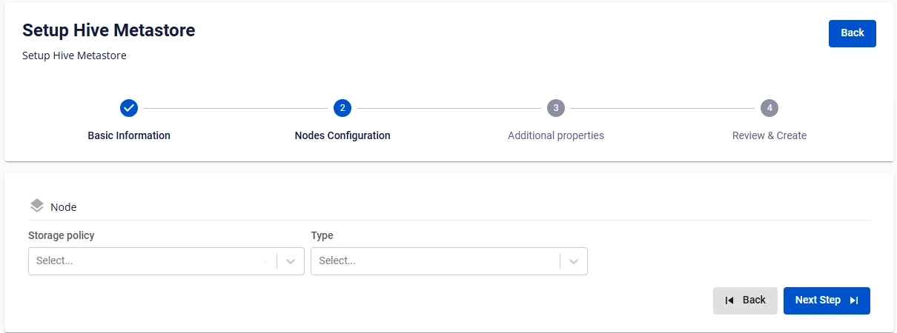
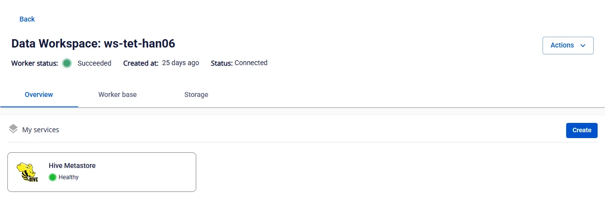

# Tạo Hive Metastore

**Hive Metastore** là thành phần cốt lõi để lưu trữ metadata trong kiến trúc Lakehouse. Nó cung cấp thông tin về các bảng, schema, phân vùng, và vị trí dữ liệu, giúp các công cụ như **Apache Spark**, **Trino**, hoặc **Presto** hiểu và truy cập dữ liệu một cách hiệu quả.

Để tạo **Hive Metastore**, người dùng thực hiện các bước sau:

**Bước 1:** Tại thanh menu chọn **Data Platform** > chọn **Workspace Management** > chọn **Workspace name**

**Bước 2:** Tại phần **My services** nhấn **Create** > hiển thị popup **New Service** chọn **Hive Metastore** > **Create**

**Bước 3:** Trong form tạo **Hive metastore**, nhập thông tin màn **Basic Information**:

 * **Name** (required): Tên dịch vụ

Chú ý: Tên dịch vụ phải từ 1 đến 30 kí tự. Có thể chứa các kí tự chữ cái thường a-z hoặc chữ cái in hoa A-Z hoặc các kí tự số 0-9.

 * **Description** (optional): Mô tả

 * **Version** (required): chọn version

**Bước 4.** Nhấn **Next** để chuyển qua màn **Node configuration**

Nhập các thông tin sau:

 * **Storage policy** (required): chọn **Storage Policy**

 * **Type** (required): chọn cấu hình tài nguyên

**Bước 5.** Nhấn **Next** để chuyển qua màn **Additional properties**

 * **Database** (thông tin Database lưu dữ liệu cho Hive Metastore, người dùng có thể sử dụng Database đã tạo trên dịch vụ **FPT Database Engine** hoặc các **Database** khác của người dùng)

 * Trường hợp chọn **type** là **PostgreSQL**

 * **Host name(required)**: hostname hoặc IP của **Postgres**

 * **Port (required)**: cổng kết nối, mặc định là 5432

 * **Database name (required)**: tên database

 * **Username (required)**: tên tài khoản

 * **Password (required)**: mật khẩu

 * Trường hợp chọn **type** là MySQL

 * **Host name(required)**: hostname hoặc IP của **MySQL**

 * **Port (required)**: cổng kết nối, mặc định là 3306

 * **Database name (required)**: tên database

 * **Username (required)**: tên tài khoản

 * **Password (required)**: mật khẩu

Sau khi nhập đầy đủ thông tin **Database**, người dùng ấn **Test connection** để kiểm tra kết nối từ **Workspace** đến **Database** đã nhập

 * Nhập thông tin **Storage**

 * **Bucket name (required)**: tên bucket

 * **Endpoint (required)**: địa chỉ truy cập

 * **Access key (required)**: khóa truy cập

 * **Secret (required)**: mật khẩu truy cập

 * **Path (required)**: thư mục lưu dữ liệu

Nhấn **Test connection** để kiểm tra kết nối từ **Workspace** tới **Storage**

**Bước 6:** Nhấn **Next** để chuyển qua màn **Review & Create**

**Bước 7.** Kiểm tra thông tin sau đó nhấn **Create** để hoàn thành khởi tạo **Hive Metastore**

**Hive Metastore** hoàn thành khởi tạo khi **Worker Status** là **Succeeded** và **Status** của **Hive Metastore** là **Healthy** (~10 phút)

