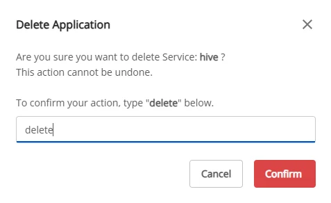

# Xóa Hive Metastore

Để xóa **Hive Metastore**, người dùng thực hiện các bước sau:

**Bước 1:** Tại thanh menu chọn **Data Platform** > chọn **Workspace Management** > chọn **Workspace name**

**Bước 2:** Tại phần **My serivces** chọn **Hive Metastore** > nhấn vào nút A**ction** góc phải màn hình chọn **delete**

**Bước 3.** Hiển thị hộp thoại **Delete application** > nhập **delete** > nhấn **Confirm** để xóa hoàn thành việc xóa app

