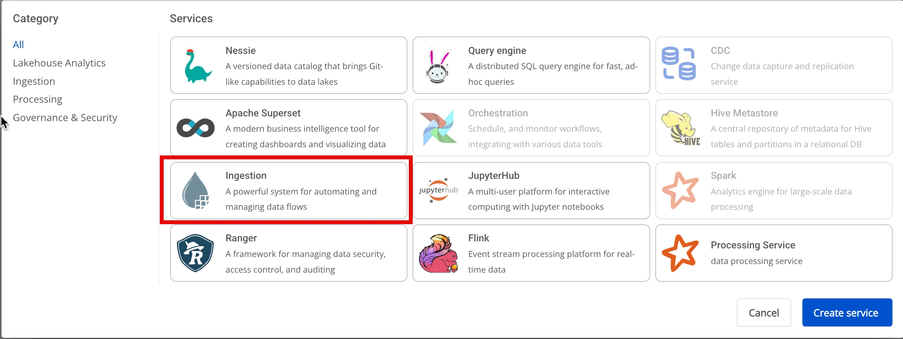
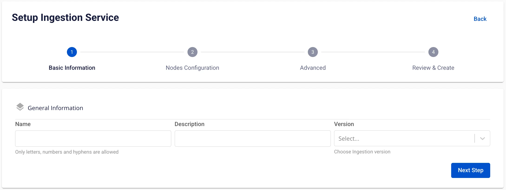
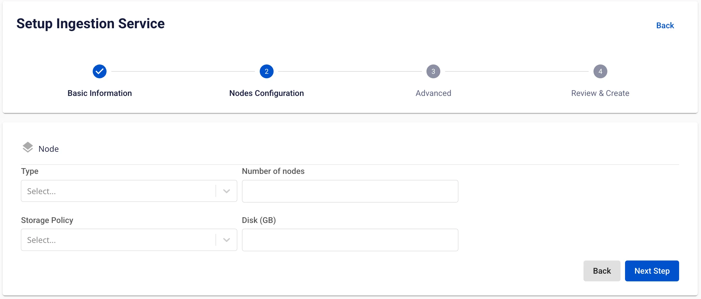
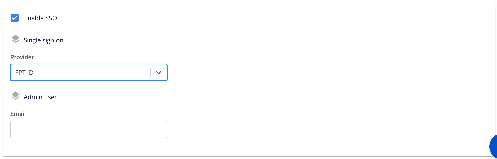
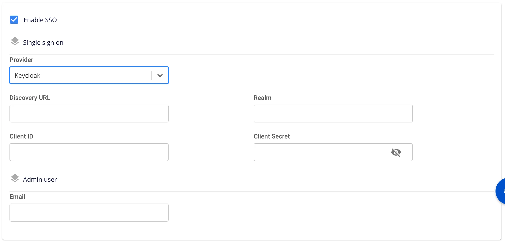

# Tạo Ingestion

**Ingestion servicer** được xây dựng để tự động hóa luồng dữ liệu giữa các hệ thống. Giúp quản lý, điều phối và tự động hóa việc di chuyển dữ liệu giữa các hệ thống khác nhau một cách dễ dàng và hiệu quả. Cung cấp khả năng theo dõi, giám sát và quản lý luồng dữ liệu.

Để tạo **Ingestion service**, người dùng thực hiện các bước sau:

**Bước 1:** Tại thanh menu chọn **Data Platform** > chọn **Workspace Management** > chọn **Workspace name**

Chú ý: Người dùng có thể vào trực tiếp dịch vụ Ingestion service bằng cách: Tại thanh menu chọn Data Platform > chọn Ingestion service

**Bước 2:** Tại phần **My Services** nhấn **Create** > hiển thị popup **New service** chọn **Ingestion service** > **create**

**Bước 3:** Trong form tạo **Ingestion service**, nhập thông tin màn **Basic Information**:

 * **Name** (required): Tên dịch vụ

Chú ý: Tên dịch vụ phải từ 1 đến 30 kí tự. Có thể chứa các kí tự chữ cái thường a-z hoặc chữ cái in hoa A-Z hoặc các kí tự số 0-9.

 * **Description** (optional): Mô tả dịch vụ

 * **Version** (required): chọn version

**Bước 4:** Nhấn **Next Step** để chuyển sang màn nhập thông tin **Node Configuration**

 * **Type**: Chọn type cấu hình cho dịch vụ

 * **Number of node:** chọn số node phù hợp

:::warning
số node phải lớn hơn hoặc bằng 1 và nhỏ hơn hoặc bằng 10
:::

 * **Storage policy**: chọn storage policy

 * **Disk (GB**): nhập số disk

:::warning
số disk phải lớn hơn hoặc bằng 100 và nhỏ hơn hoặc bằng 1000
:::

**Bước 5:** Nhấn **Next Step** để chuyển sang màn nhập thông tin **Advance**

 * Nhập thông tin **Mount storage**

 * **Name**: tên Storage
 * **Path**: đường dẫn tới thư mục trong storage

Người dùng có thể thêm **Mount storage** bằng cách nhấn vào dấu “+”

:::warning
tối đa thêm được **5 Mount storage**:::

 * Nhập thông tin **Nars storage**

 * **Bucket name (required)**: tên bucket

 * **Endpoint (required)**: địa chỉ truy cập

 * **Access key (required)**: khóa truy cập

 * **Secret (required)**: mật khẩu truy cập

 * **Path (required)**: thư mục của storage

 * **Single Sign On**

 * Nếu không tích chọn Single Sign On, Superset được khởi tạo xác thực bằng **Basic authen**

 * Nếu tích chọn **Single Sign On:**

 * **Provider: FPT ID**

 * Người dùng nhập các thông tin sau:

 * **Username**: tên username

 * **Email**: địa chỉ email FPT

 * **Provider: Google**

 * Người dùng nhập các thông tin sau:

 * **Client ID**: một đoạn mã ID được sử dụng để xác thực client với google

 * **Client Secret**: mật khẩu được sử dụng để xác thực client với google

 * **Email**: địa chỉ email

 * **Provider: Keycloak**

 * Người dùng nhập các thông tin sau:

 * **Auth Provider name**: Tên provider

 * **Realm**: là một không gian quản lý mà trong đó, tất cả người dùng, nhóm, vai trò, khách hàng (clients) và các đối tượng khác đều được quản lý và bảo mật một cách độc lập

 * **Auth server url**: là URL cơ bản của máy chủ Keycloak, được sử dụng bởi các clients để thực hiện xác thực

 * **Client ID**: một đoạn mã ID được sử dụng để xác thực client với Keycloak

 * **Client Secret**: mật khẩu được sử dụng để xác thực client với Keycloak

 * **Username**: Tên username trong keycloak

 * **Email**: địa chỉ email trong keycloak

**Bước 6:** Nhấn **Next Step** để chuyển qua màn **Review & Create**

 * **Custom Domain**

 * **Mục đích:** Cho phép cấu hình domain tùy chỉnh để truy cập services.

 * **Với Workspace Public:** Dùng để gán domain và certificate mà không cần bật/tắt TLS (HTTPS luôn khả dụng).

 * **Với Workspace Private:** Ngoài domain và certificate, người dùng có thể tùy chọn bật hoặc tắt TLS/SSL để quyết định dùng HTTPS hay HTTP.

 * **Workspace là Public**

 * **Custom domain**: Tích để bật domain tùy chỉnh.

 * **Domain**: Nhập tên miền (VD: abc.local, jupyter.example.com).

 * **Certificate name**: Chọn từ danh sách certificate đã import trong **Certificate Manager**.

 * **Nút**:

 * **Manage certificate**: Mở màn hình quản lý certificate.

 * **Validate**: Kiểm tra chứng chỉ hợp lệ với domain.

 * 
:::note
Ở Workspace Public **không hiển thị** tùy chọn **TLS/SSL certificate** — hệ thống mặc định hỗ trợ HTTPS.
:::

 * **Workspace là Private**

 * **Custom domain**: Tích để bật domain tùy chỉnh.

 * **Domain**: Nhập tên miền.

 * **TLS/SSL certificate**: Tích để bật HTTPS cho services.

 * **Certificate name**: Chọn từ danh sách certificate.

 * **Nút**:

 * **Manage certificate**: Mở quản lý certificate.

 * **Validate**: Kiểm tra chứng chỉ.

 * 
:::note
Nếu bỏ tích **TLS/SSL certificate**, dịch vụ sẽ chạy HTTP và không yêu cầu certificate.
:::

**Bước 7.** Kiểm tra thông tin nhập sau đó nhấn **Create** để hoàn thành việc khởi tạo Ingestion service.

**Ingestion service** hoàn thành khởi tạo khi **Worker Status** là **Succeeded** và **Status** của **Ingestion service** là **Healthy** ( ~10 phút)
