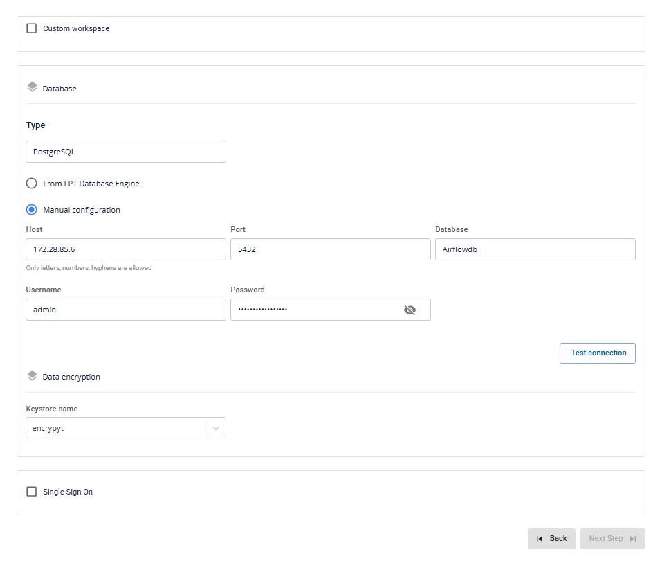

# Tạo Jupyterhub

Để tạo **Jupyterhub**, người dùng thực hiện các bước sau:

**Bước 1:** Tại thanh menu chọn **Data Platform** > chọn chọn **Workspace Management** > chọn **Workspace name**

**Bước 2:** Tại phần **Workspace Details** nhấn **Create** > hiển thị popup **Services** chọn **Jupyterhub service** > **Create Service**

**Bước 3.** Trong form tạo **Jupyterhub**, người dùng nhập thông tin màn **Basic Information**

 * **Name** (required): Tên dịch vụ

Chú ý: Tên có thể chứa các kí tự chữ cái thường a-z hoặc chữ cái in hoa A-Z hoặc các kí tự số 0-9. Đặc biệt không dùng dấu cách có thể thay dấu cách bằng dấu “-” hoặc “_”.

 * **Description** (optional): mô tả

 * **Version** (required): chọn phiên bản Jupyterhub

**Bước 4:** Nhấn **Next Step** để chuyển qua màn **Nodes Configuration**

Nhập các thông tin sau:

 * **Storage policy**: chọn storage policy

 * **Type**: chọn loại flavor

 * **Number of nodes**: nhập số node cấu hình cho Jupyterhub

:::warning
số Node phải lớn hơn hoặc bằng 2 nhỏ hơn hoặc bằng 10
:::

**Bước 5:** Nhấn **Next Step** để chuyển qua màn **Advanced Properties**

Chọn các thông tin sau:

**Custom workspace**: Tích để lưu dữ liệu của người dùng vào S3

**Mount S3 storage** (thư mục lưu Workspace code của người dùng)

 * **Storage nam** e: chọn tên storage

 * **S3 worksapce path:** nhập path storage

**Database**

 * **Type**: mặc định PostgreSQL

 * **Host name(required)**: hostname hoặc IP của Postgres

 * **Port (required)**: cổng kết nối, mặc định là 5432

 * **Database name (required)**: tên database

 * **Username (required)**: tên tài khoản truy cập

 * **Password (required)**: mật khẩu truy cập

**Data encryption**

 * **Keystore name:** Lựa chọn từ danh mục Keystore của Workspace để mã hoá dữ liệu nhảy cảm khi sử dụng Jupyterhub vào Database

**Single Sign On**: Tích để sử dụng SSO cho xác thực với Jupyterhub

 * **Provider: Fpt ID**

 * **Username**: tên username

 * **Email**: địa chỉ email FPT

 * **Provider: Google**

 * **Client ID**: thông tin Client ID

 * **Client Secret**: thông tin Secret

 * **Email**: địa chỉ email

 * **Provider: Keycloak**

 * **Auth Provider name**: Tên Provider

 * **Realm**: thông tin Realm

 * **Auth server url**: địa chỉ auth URL

 * **Client ID**:thông tin client ID

 * **Client Secret**: thông tin Secret

 * **Username**: tên tài khoản

 * **Email**: địa chỉ email

 * **Custom Domain**

 * **Mục đích:** Cho phép cấu hình domain tùy chỉnh để truy cập services.

 * **Với Workspace Public:** Dùng để gán domain và certificate mà không cần bật/tắt TLS (HTTPS luôn khả dụng).

 * **Với Workspace Private:** Ngoài domain và certificate, người dùng có thể tùy chọn bật hoặc tắt TLS/SSL để quyết định dùng HTTPS hay HTTP.

 * **Workspace là Public**

 * **Custom domain**: Tích để bật domain tùy chỉnh.

 * **Domain**: Nhập tên miền (VD: abc.local, jupyter.example.com).

 * **Certificate name**: Chọn từ danh sách certificate đã import trong **Certificate Manager**.

 * **Nút**:

 * **Manage certificate**: Mở màn hình quản lý certificate.

 * **Validate**: Kiểm tra chứng chỉ hợp lệ với domain.

 * 
:::note
Ở Workspace Public **không hiển thị** tùy chọn **TLS/SSL certificate** — hệ thống mặc định hỗ trợ HTTPS.
:::

 * **Workspace là Private**

 * **Custom domain**: Tích để bật domain tùy chỉnh.

 * **Domain**: Nhập tên miền.

 * **TLS/SSL certificate**: Tích để bật HTTPS cho services.

 * **Certificate name**: Chọn từ danh sách certificate.

 * **Nút**:

 * **Manage certificate**: Mở quản lý certificate.

 * **Validate**: Kiểm tra chứng chỉ.

 * 
:::note
Nếu bỏ tích **TLS/SSL certificate**, dịch vụ sẽ chạy HTTP và không yêu cầu certificate.
:::

**Bước 6.** Nhấn **Next Step** để chuyển qua màn **Review & Create**

**Bước 7.** Kiểm tra thông tin, sau đó nhấn **Create** để hoàn thành việc tạo **Jupyterhub**

**Jupyterhub** hoàn thành khởi tạo khi **Worker Status** là **Succeeded** và **Status** của Jupyterhub là **Healthy** (~10 phút)
