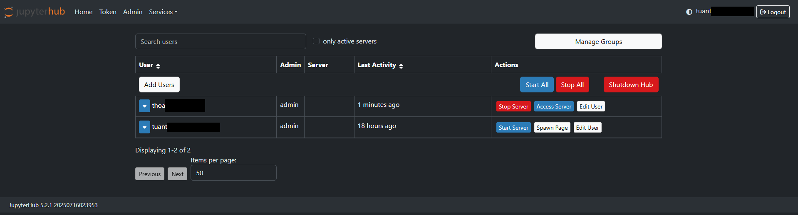
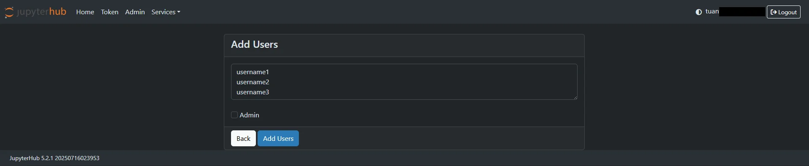

# Thêm người dùng

**_Hướng dẫn truy cập JupyterHub và tạo tài khoản đầu tiên_**

(Trường hợp JupyterHub được tạo bằng Basic authen)

 1. Mở trình duyệt và truy cập vào URL JupyterHub được cung cấp.

 2. Tại màn hình hiển thị, nhấn vào nút **Create User** (Tạo tài khoản mới).

 3. Nhập tên đăng nhập (**Username**) và mật khẩu (**Password**).

**Lưu ý:** Tài khoản đầu tiên cần tạo phải có **username** là **admin** để làm tài khoản quản trị hệ thống.

 4. Xác nhận thông tin và hoàn tất việc tạo tài khoản.

 5. Đăng nhập bằng tài khoản **admin** vừa tạo để thực hiện các chức năng quản trị.

**_Thêm người dùng vào hệ thống_**

 1. Sau khi đăng nhập Jupyterhub, người dùng có vai trò **Admin** lựa chọn Menu **Admin**, ấn Add Users để thêm mới người dùng vào hệ thống

 2. Tại giao diện **Add Users**, người dùng nhập tên user (hệ thống hỗ trợ thêm mới nhiều người dùng bằng cách nhập mỗi username 1 dòng)

 3. Tích **Admin** nếu để gán vai trò **Admin** cho người dùng. Nếu không tích chọn, người dùng mặc định vai trò **User**

**_Trường hợp JupyterHub được tạo bằng Basic authen - người dùng tự đăng ký – Admin cấp quyền truy cập_**

Trong một số trường hợp, người dùng tự nhấn **Create User** để tạo tài khoản trước.

Khi đó, tài khoản đã được tạo nhưng **chưa có quyền truy cập JupyterHub** cho đến khi admin phê duyệt.

Để cấp quyền, admin thực hiện như sau:

 1. Đăng nhập bằng tài khoản **admin**.

 2. Truy cập vào đường dẫn: **/hub/authorize**

 3. Tại đây hiển thị danh sách toàn bộ người dùng đã tạo, kèm theo các thao tác quản lý:

 * **Authorize**

 * Cho phép người dùng được truy cập vào JupyterHub.

 * Nếu chưa được Authorize, người dùng sẽ không đăng nhập được vào giao diện.

 * **Unauthorize**

 * Thu hồi quyền truy cập đã cấp trước đó.

 * Người dùng vẫn tồn tại trong hệ thống nhưng không thể đăng nhập.

 * **Change password**

 * Cho phép admin đặt lại mật khẩu cho người dùng.

 * Dùng trong trường hợp người dùng quên mật khẩu hoặc cần reset theo yêu cầu.

 * **Discard**

 * Xóa người dùng khỏi danh sách quản lý.

 * Sau khi Discard, người dùng cần tự tạo lại tài khoản hoặc được admin thêm lại nếu muốn sử dụng tiếp.
