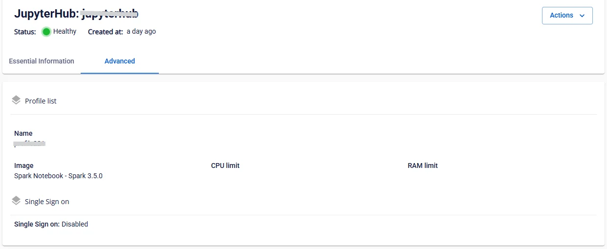

# Xem thông tin JuperterHub

**Bước 1:** Tại thanh menu chọn **Data Platform** > chọn chọn **Workspace Management** > chọn **Workspace name**

**Bước 2:** Tại phần **My service** chọn Jupyterhub

 * **Tab Essential information**

Hiển thị thông tin chi tiết, thông tin cấu hình **Jupyterhub**

 * **Hướng dẫn truy cập JupyterHub và tạo tài khoản admin**

 1. Mở trình duyệt và truy cập vào URL JupyterHub được cung cấp.

 2. Trên trang hiển thị, nhấn vào nút **Create User** (Tạo tài khoản mới).

 3. Nhập tên đăng nhập (Username = admin) và mật khẩu (Password) theo yêu cầu.

 4. Xác nhận thông tin và hoàn tất tạo tài khoản.

 5. Dùng tài khoản vừa tạo để đăng nhập vào JupyterHub và bắt đầu sử dụng.

 * **Tab Advanced**

Hiển thị thông tin **Profile list** và **SSO**

