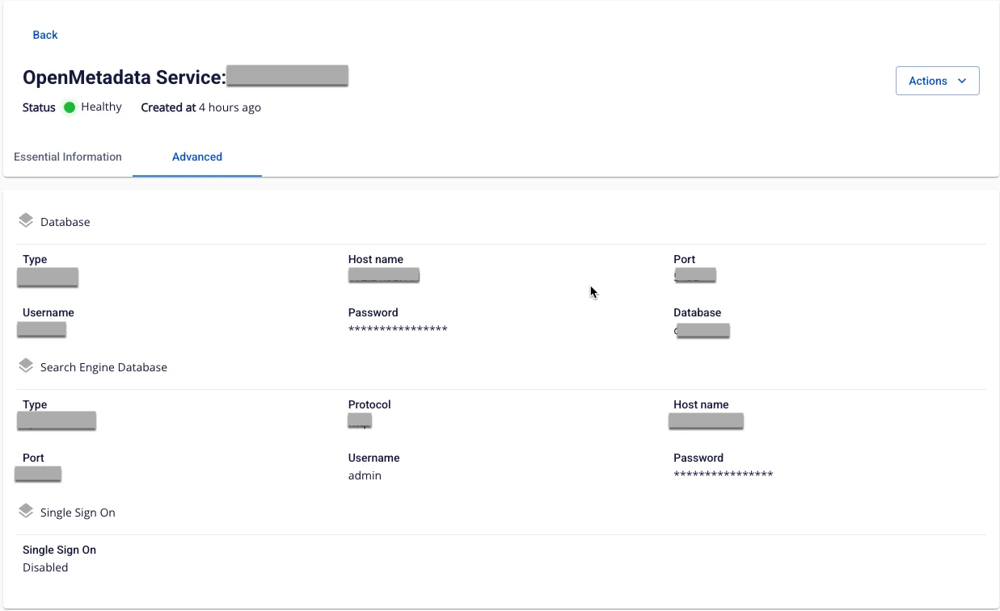

# Xem thông tin Open Metadata service

Để xem thông tin **Open Metadata** người dùng thực hiện các bước sau:

**Bước 1:** Tại thanh menu chọn **Data Platform** > chọn **Workspace Management** > chọn **Workspace name**

**Bước 2:** Tại phần chi tiết **Workspace** chọn **Open Metadata**

 * **Tab Essential Information**

 * Hiển thị thông tin chi tiết của **Open Metadata** mà người dùng đã thiết lập, sử dụng **Open Metadata** thông qua **URL/Username/Password** hiển thị thị trên màn hình

 * **Advanced**

 * Hiển thị thông tin **Database** và **Search Engine Database**

