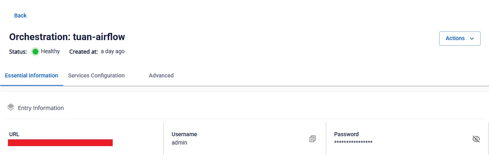

# Hướng dẫn Airflow & dbt

**Bước 1.** Upload project dbt vào thư mục mount path đã cấu hình cho Orchestration service


**Bước 2.** Tạo DAG theo mẫu để thực hiện job dbt

dbt_clickhouse_example.py

Thay đổi đường dẫn trỏ đến thư mục chứa project dbt:

```
DBT_PROJECT_DIR = "/mnt/<WORKSPACE-STORAGE-NAME>/<DBT-PROJECT-DIRECTORY>" |
```

**Bước 3.** Upload file DAG chạy job dbt vào thư mục dags tại dịch vụ Orchestration


**Bước 4.** Truy cập, đăng nhập theo đường dẫn Airflow của dịch vụ Orchestration Service để tiến hành chạy DAG




