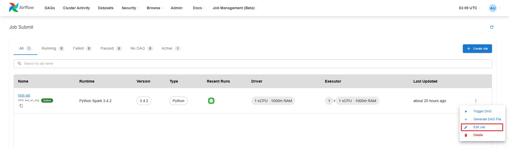
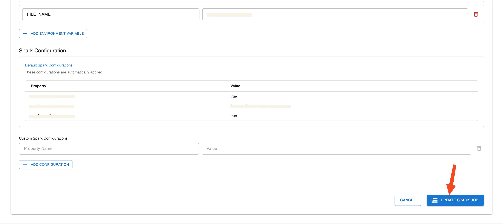
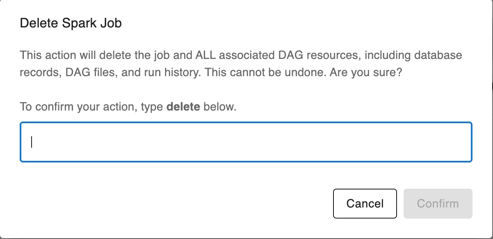

# Hướng dẫn Airflow & Job Submit

**Job Submit** là tính năng cho phép người dùng tạo và gửi các job xử lý dữ liệu (ví dụ: Spark job) trực tiếp trên giao diện Airflow UI mà không cần tạo DAG thủ công. Chức năng này đặc biệt hữu ích trong các trường hợp thử nghiệm, chạy nhanh các script phân tích, hoặc kiểm thử pipeline xử lý dữ liệu.

Giao diện Job Submit hỗ trợ các chức năng chính như:

 * Lựa chọn loại job (ví dụ: Spark Python job)

 * Cấu hình tài nguyên cho driver và executor

 * Chỉ định script chính, dependency, argument, và biến môi trường

 * Thêm script khởi tạo và cấu hình Spark tùy chỉnh

**Truy cập Job Submit**

 * **Bước 1:** Truy cập vào **Airflow UI** từ màn hình dịch vụ Orchestration đã tạo

 * **Bước 2:** Trên thanh menu, chọn **Job Management (Beta)** > **Job Submit**

### 1\. Tạo Job mới trên Airflow (Job Submit)

**Bước 1:** Truy cập Airflow UI, chọn **Job Management (Beta) > Job Submit**.

**Bước 2:** Nhấn nút **Create Job** để mở giao diện tạo job mới.

**Bước 3:** Điền đầy đủ thông tin cấu hình cho job:

 * **Runtime Image**: chọn Image phù hợp với mục đích chạy Job

Image | Mô tả
---|---
Python Spark 3.4.2 (ID: 1) | Hỗ trợ thư viện Spark version 3.4.2 ngôn ngữ Python version 3
Scala Spark 3.4.2 (ID: 2) | Hỗ trợ thư viện Spark version 3.4.2 ngôn ngữ Scala
Spark 3.5.0 with Python 3.10 (ID: 3) | Hỗ trợ thư viện Spark version 3.5.0 ngôn ngữ Python version 3.10
Spark 3.5.0 with Scala 2.12 (ID: 4) | Hỗ trợ thư viện Spark version 3.5.0 ngôn ngữ Scala version 2.12
DBT Core 1.9 (ID: 5) | Hỗ trợ chạy thư viện Dbt core version 1.9 ngôn ngư Python version 3
RAPIDS Spark GPU Accelerated (ID: 7) | Hỗ trợ thư viện RAPIDS Spark GPU Accelerated ngôn ngữ Python version 3

 * **Job Name**: đặt tên job (viết thường, không chứa khoảng trắng, chỉ dùng chữ cái, số và dấu “-” )

 * **Dependency Type**:

 * **PyPi Requirements**: Chọn tệp requirements.txt từ My Workspace

 * **Packaged Virtual Environment**: Chọn tệp *.tar.gz

 * **No Additional Dependencies**: Không cài đặt dependency

 * **Kubernetes Connection**: chọn kubernetes_default (environment)

 * **Compute Name**: chọn compute

 * Tick chọn **Spark Job**

 * **Path to main application file**: chọn file .py chính trong My Workspace

 * **Driver Configuration**:

 * CPU: 1

 * RAM: 1000m

 * **Executor Configuration**:

 * CPU: 1

 * RAM: 1000m

 * Number of Executors: 1

 * **Init Scripts (optional)**: thêm file .sh nếu có bước khởi tạo trước khi chạy job

 * **Arguments (optional)**: thêm tham số dòng lệnh, ví dụ --input /mnt/data/input.csv

 * **Environment Variables(optional)**: thêm biến môi trường nếu cần

 * **Custom Spark Configurations(optional)**: thêm các key-value cấu hình Spark nếu muốn ghi đè mặc định

**Bước 4:** Kiểm tra lại toàn bộ thông tin, sau đó nhấn **Create Spark Job** để submit job lên hệ thống.

### 2\. Edit Job trên Airflow

**Bước 1:** Truy cập Airflow UI, chọn **Job Management (Beta) > Job Submit**.

**Bước 2:** Nhấn nút **Action** của Job cần cập nhật thông tin

**Bước 3:** Chọn **Edit Job** để mở giao diện Edit job.

**Bước 4:** Cập nhật thông tin **Job**

**Bước 5:** Kiểm tra lại toàn bộ thông tin, sau đó nhấn **Update Spark Job** để cập nhật thông tin Job lên hệ thống.

### 3\. Xóa Job trên Airflow

**Bước 1:** Truy cập Airflow UI, chọn **Job Management (Beta) > Job Submit**.

**Bước 2:** Nhấn nút **Action** của Job cần cập nhật thông tin

**Bước 3:** Chọn **Delete**

**Bước 4.** Nhập "delete" tại popup **Confirm Delete Spark Job - Delete job**

**Bước 5.** Nhập "delete" tại popup Confirm Delete Spark Job - delete the job and ALL associated DAG resources, including database records, DAG files, and run history

### 4\. Config DAG

**Bước 1:** Trong trang danh sách Job, nhấn vào biểu tượng ba chấm ở bên phải Job bạn muốn cấu hình. Chọn **Configure DAG**

**Bước 2: Nhập thông tin DAG**

 * **DAG ID**: đặt tên DAG

 * **Spark Job**: chọn Job tương ứng

 * **Description**: mô tả ngắn gọn cho DAG

 * **Schedule Type**: chọn kiểu chạy

 * Nếu muốn chạy thủ công, chọn None (Manual Trigger)

**Bước 3: Thiết lập cấu hình chi tiết**

 * **Timing**:

 * **Start Date**: chọn ngày bắt đầu chạy DAG

 * **End Date (Optional)**: có thể để trống nếu không giới hạn

 * Tick chọn:

 * Paused on creation: nếu muốn DAG không ở trạng thái hoạt động ngay sau khi tạo

 * Bỏ chọn Catchup và Depends on past nếu không cần chạy bù hay phụ thuộc lịch sử

 * **Concurrency Settings**:

 * **Max Active Runs**: số DAG có thể chạy song song

 * **Concurrency**: số task cho phép chạy đồng thời

 * **Retry Settings**:

 * **Retries**: số lần thử lại nếu thất bại

 * **Retry Delay (seconds)**: thời gian chờ giữa các lần retry (tính bằng giây)

 * **Owner & Tags**:

 * **Owner**: tên người sở hữu DAG

 * **Add Tag**: thêm tag để phân loại (ví dụ: spark submit)

**Bước 4:** Kiểm tra lại toàn bộ thông tin. Nhấn nút **Create DAG** để hoàn tất việc tạo DAG

### 5\. Trigger DAG

**Bước 1:** Trong trang danh sách Job, nhấn vào biểu tượng ba chấm ở bên phải Job bạn muốn cấu hình. Chọn **Trigger DAG**

**Bước 2:** Trên thanh menu, chọn **Job Management (Beta)** > **Spark UI**

**Bước 3:** Tại màn hình **Spark UI**, chọn **View Logs** của Job vừa **Trigger DAG**

**Mục đích xem logs:**

 * Theo dõi chi tiết quá trình thực thi của Job

 * Kiểm tra trạng thái các bước xử lý của Spark (ví dụ: nạp dữ liệu, thực thi transformation, ghi kết quả...)

 * Phân tích và khắc phục lỗi nếu Job thất bại

 * Xác nhận Job đã chạy thành công và trả kết quả đúng như mong muốn
