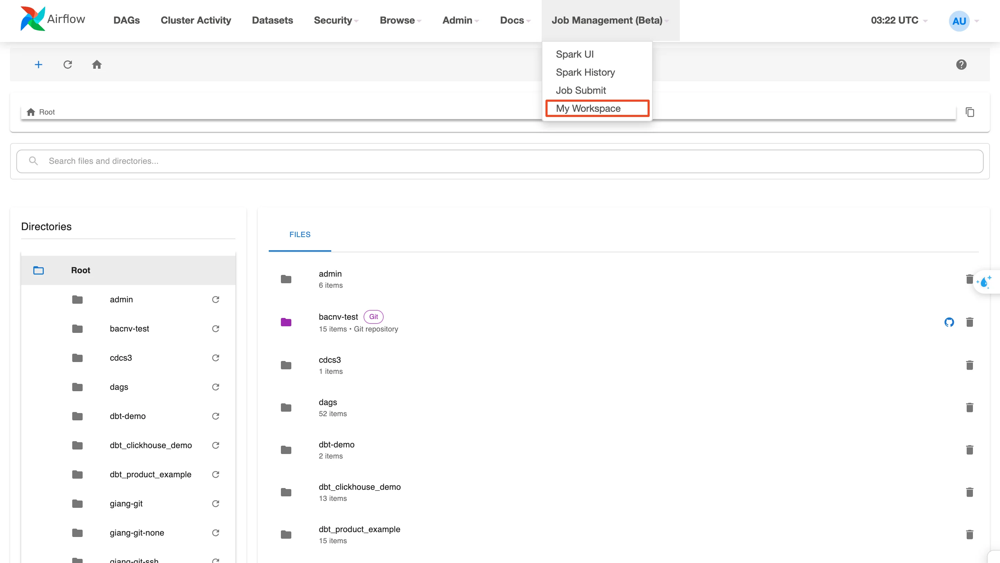
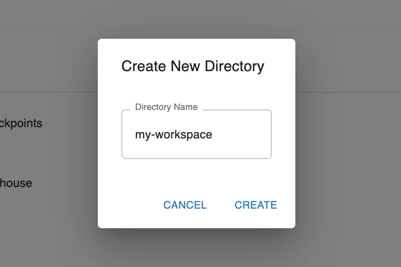
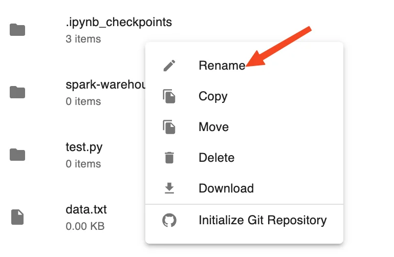
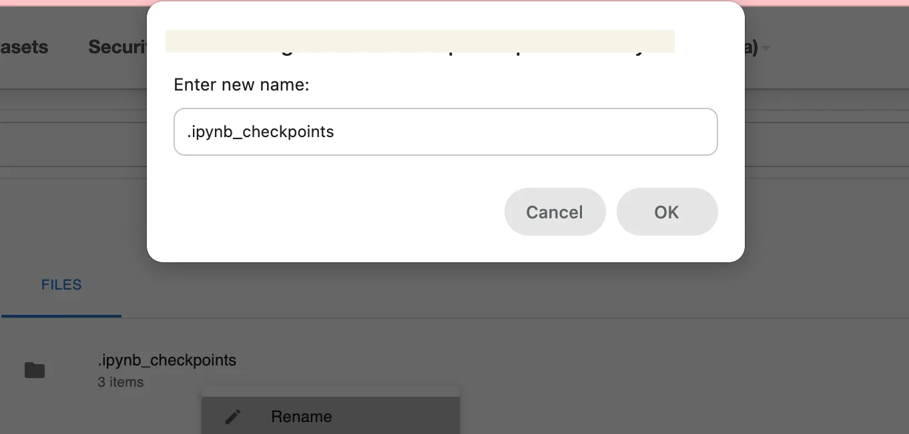
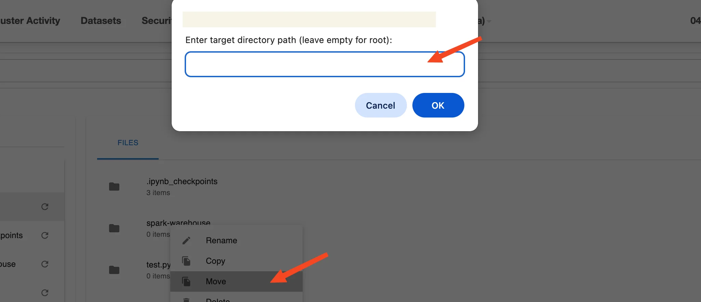
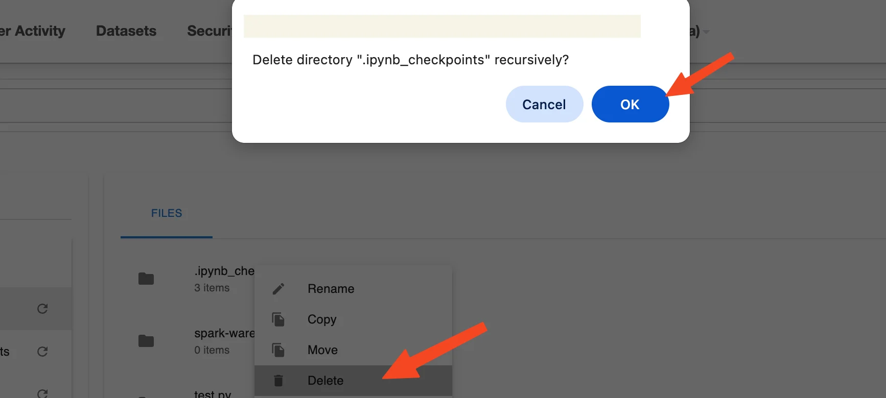
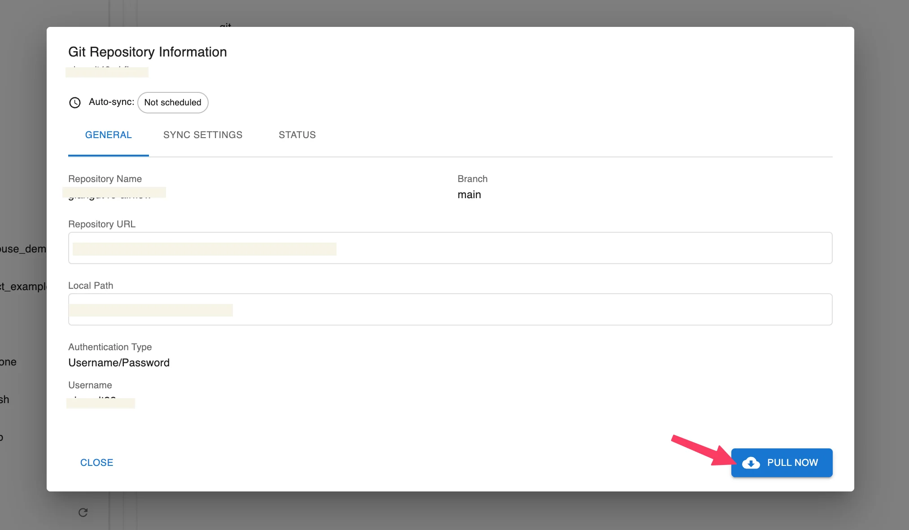
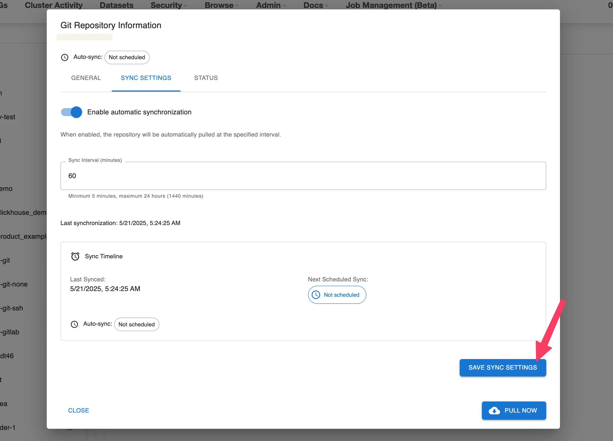

# Hướng dẫn Airflow & My Workspace

**My Workspace** là khu vực làm việc cá nhân được cung cấp sẵn trong hệ thống Orchestration Service (Airflow UI), cho phép người dùng dễ dàng quản lý mã nguồn DAG, script, file cấu hình, dữ liệu mẫu,... tại cùng một nơi.

Toàn bộ file và thư mục trong My Workspace được tổ chức theo dạng cây thư mục tại Root và có thể tích hợp với Git để tiện quản lý phiên bản và đồng bộ mã nguồn.

Giao diện Workspace hỗ trợ đầy đủ các chức năng cơ bản như:

 * Tạo mới file, thư mục, upload file

 * Sửa nội dung file trực tiếp

 * Tìm kiếm nhanh

 * Xoá file hoặc thư mục

 * Kết nối Git repository và đồng bộ mã nguồn

### 1\. Truy cập My Workspace

Bước 1: Truy cập Airflow UI từ màn hình service Orchestration đã tạo

Bước 2: Chọn mục **Browse > My Workspace** trên thanh menu

**Lưu ý: Workspace** của từng người dùng sẽ được hiển thị riêng biệt trong thư mục Root. Mỗi thư mục tương ứng với một workspace, ví dụ giang-git, cdcs3, dbt-demo,...

### 2\. Bố cục trong My Workspace

Bố cục màn hình My Workspace gồm 3 khu vực chính:

 * **Breadcrumb navigation**: hiển thị đường dẫn thư mục hiện tại

 * **Sidebar trái (Directories)**: hiển thị cấu trúc cây thư mục gốc Root

 * **Bảng chính (Files)**: hiển thị nội dung file và thư mục của workspace hiện tại

### 3\. Quản lý tài nguyên trong My Workspace

#### a. Tạo mới File/Thư mục/ Upload file

 * **Tạo file mới:** Để tạo một file mới:

 * **Bước 1:** Chọn thư mục đích cần tạo file bằng cách nhấn vào tên thư mục trong danh sách Directories hoặc bảng Files

 * **Bước 2:** Nhấn biểu tượng + ở góc trên cùng > chọn **New File**

 * **Bước 3:** Nhập tên file và nhấn **Create** để lưu

**Lưu ý:** Nên tạo file có đuôi .py trong thư mục dags/ nếu bạn muốn khai báo DAG cho Orchestration service.

 * **Tạo thư mục mới:** Để tạo một thư mục mới:

 * **Bước 1:** Chọn thư mục đích cần tạo Thư mục bằngbằng cách nhấn vào tên thư mục trong danh sách Directories hoặc bảng Files

 * **Bước 2:** Nhấn biểu tượng + > chọn **New Directory**

 * **Bước 3:** Nhập tên thư mục và nhấn Create để lưu

 * **Upload file từ máy tính**

 * **Bước 1:** Chọn thư mục đích để upload file vào bằng cách nhấn vào tên thư mục trong danh sách Directories hoặc bảng Files

 * **Bước 2:** Nhấn biểu tượng + > chọn Upload File

 * **Bước 3:** Chọn file từ máy tính để tải lên

File sẽ được lưu vào thư mục hiện tại. Kiểm tra kỹ thư mục đích trước khi thực hiện.

#### b. Đổi tên file/ Thư mục

 * Bước 1: Nhấp chuột phải vào file hoặc thư mục muốn đổi tên

 * Bước 2: Chọn **Rename**

 * Bước 3: Nhập tên mới và nhấn **Enter** để xác nhận

#### c. Sao chép (copy) file/thư mục sang vị trí khác

 * **Bước 1:** Nhấp chuột phải vào file hoặc thư mục cần sao chép

 * **Bước 2:** Chọn **Copy**

 * **Bước 3:** Nhập đường dẫn thư mục đích tại ô _Enter target directory path_ (để trống nếu muốn sao chép vào thư mục gốc)

 * **Bước 4:** Nhấn **OK** để thực hiện sao chép

#### d. Di chuyển (Move) file/thư mục sang vị trí khác:

 * **Bước 1:** Nhấp chuột phải vào file hoặc thư mục cần di chuyển

 * **Bước 2:** Chọn **Move**

 * **Bước 3:** Nhập đường dẫn thư mục đích tại ô Enter target directory path (để trống nếu muốn di chuyển vào thư mục gốc)

 * **Bước 4:** Nhấn **OK** để thực hiện di chuyển

#### e. Xóa (Delete) file/thư mục:

 * **Bước 1:** Nhấp chuột phải vào file hoặc thư mục cần xóa

 * **Bước 2:** Chọn **Delete**

 * **Bước 3:** Xác nhận hành động nếu hệ thống hiển thị popup xác nhận với nội dung như: Delete directory "" recursively?

 * **Bước 4:** Nhấn **OK** để xác nhận hoặc **Cancel** để hủy bỏ

**Lưu ý:** File/thư mục sau khi xóa sẽ không thể khôi phục.

#### f. Xóa (Delete) file/thư mục

 * **Bước 1:** Nhấp chuột phải vào file/ thư muc muốn tải về

 * **Bước 2.** Chọn **Download**

 * **Bước 3:** File/Thư muc sẽ được tải xuống thiết bị với định dạng gốc

#### g. Khởi tạo Git Repository (Initialize Git Repository)

**Chỉ áp dụng với thư mục**

 * **Bước 1:** Nhấp chuột phải vào thư mục muốn khởi tạo Git Repository

 * **Bước 2:** Chọn **Initialize Git Repository**

 * **Bước 3:** Cửa sổ cấu hình sẽ hiển thị, bao gồm:

 * **Repository URL** (bắt buộc): Nhập đường dẫn đến Git repository

 * **Authentication Type**: Chọn phương thức xác thực cho repository

 * **None**

 * Không yêu cầu xác thực

 * Áp dụng với các Git repository công khai (public)

 * Không cần nhập thêm bất kỳ thông tin đăng nhập nào

 * **SSH Key**

 * Sử dụng cặp SSH key để xác thực với repository

 * Cần đảm bảo SSH key đã được cấu hình sẵn trên hệ thống

 * Khi chọn loại này:

 * Không yêu cầu nhập thêm username hoặc password

 * Hệ thống sẽ tự sử dụng SSH key mặc định (nếu có)

 * **Username & Password**

 * Sử dụng tên người dùng và mật khẩu để xác thực

 * Áp dụng cho các repository riêng tư (private) hoặc khi Git yêu cầu xác thực

 * Có thể dùng **Personal Access Token** thay vì mật khẩu (đối với GitHub, GitLab…)

 * Khi chọn loại này:

 * Nhập **Username**

 * Nhập **Password** hoặc **Access Token**

 * **Bước 4:** Chọn brand pull git

 * **Bước 5:** Nhấn **Test connection** để kiểm tra kết nối với repository

 * **Bước 6:** Nếu kết nối thành công, nút Initialize sẽ được bật

 * **Bước 7:** Nhấn Initialize để khởi tạo Git repository cho thư mục đã chọn

#### h. Git Pull

**Chỉ áp dụng thư mục đã khởi tạo Git**

 * **Bước 1:** Nhấp chuột phải vào thư mục muốn Git Pull

 * **Bước 2:** Chọn **Initialize Git Repository**

Hệ thống sẽ thực hiện pull các thay đổi về thư muc

#### i. Git Repository Settings

Tính năng Git Repository Settings chỉ hiển thị và áp dụng cho các thư mục đã được khởi tạo Git (.git). Người dùng có thể xem và cấu hình các thiết lập đồng bộ (sync) giữa thư mục local và Git repository từ giao diện.

Chỉ áp dụng cho thư mục đã khởi tạo Git

** A. Pull thủ công (Pull Now – giống Git Pull)**

 * **Bước 1:** Nhấp chuột phải vào thư mục đã khởi tạo Git

 * **Bước 2:** Chọn **Git Repository Settings**

 * **Bước 3:** Tại tab **Sync Settings**, có 2 cách để thực hiện đồng bộ:

 * **Bước 4:** Nhấn nút **Pull Now** ở góc dưới bên phải cửa sổ

 * **Bước 5:** Hệ thống sẽ pull các thay đổi mới nhất từ repository về thư mục local

** B. Bật tự động đồng bộ (Auto Sync)**

 * **Bước 1:** Nhấp chuột phải vào thư mục đã khởi tạo Git

 * **Bước 2:** Chọn **Git Repository Settings**

 * **Bước 3:** Tại tab **Sync Settings**, có 2 cách để thực hiện đồng bộ:

 * **Bước 4:** Gạt công tắc **Enable automatic synchronization** sang ON

 * **Bước 5:** Nhập giá trị thời gian đồng bộ vào ô **Sync Interval (minutes)**
_– Giá trị tối thiểu: 5 phút; tối đa: 1440 phút (24 giờ)_

 * **Bước 6:** Nhấn **Save Sync Settings** để lưu cấu hình

 * **Bước 7:** Hệ thống sẽ tự động đồng bộ theo thời gian đã thiết lập

