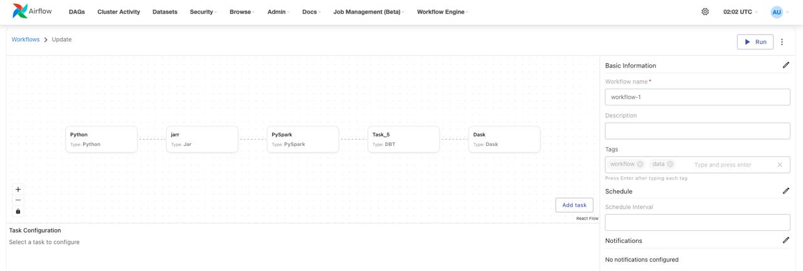
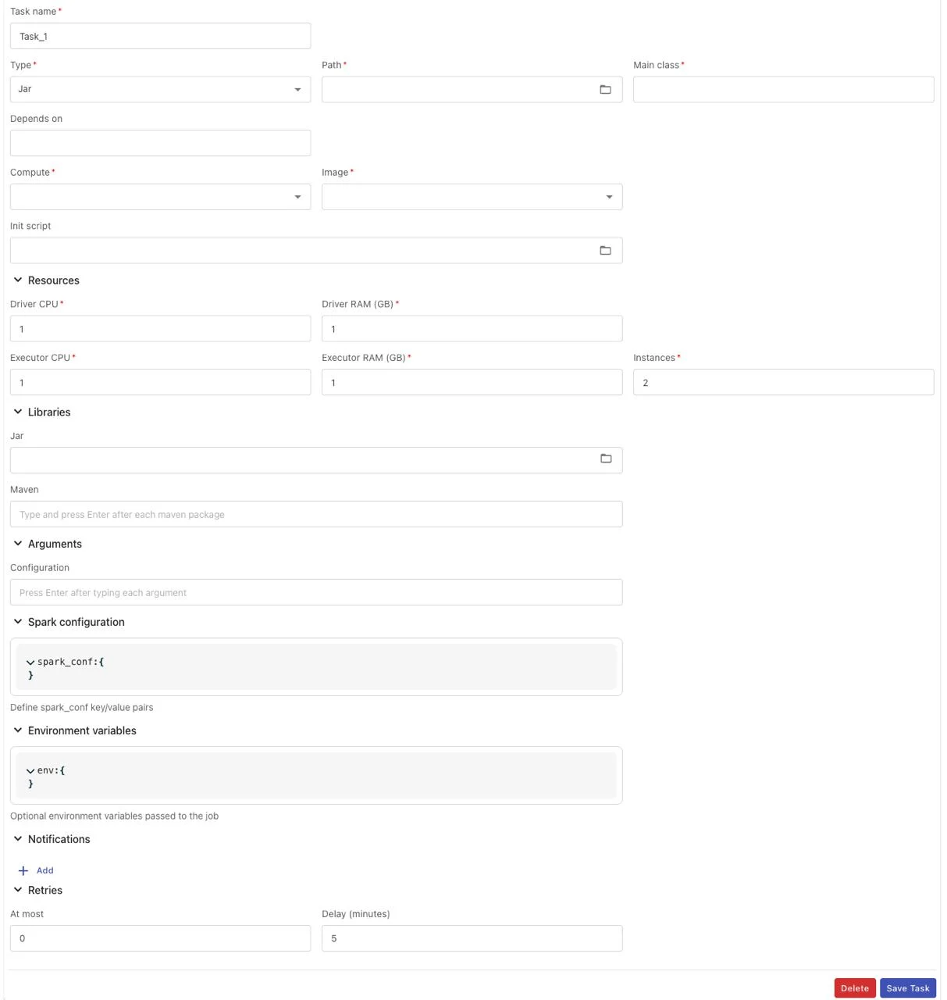
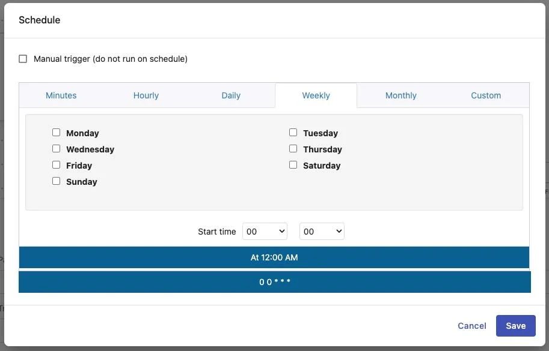
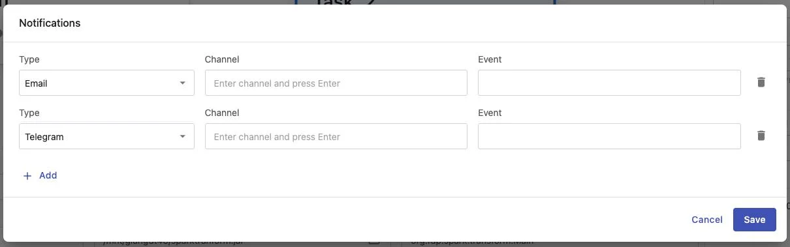
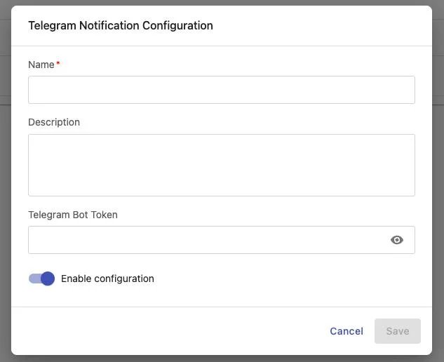

# Hướng dẫn Airflow Workflow

Workflow Engine là thành phần lõi của nền tảng Data Platform, cho phép người dùng định nghĩa, quản lý và thực thi các quy trình xử lý dữ liệu dưới dạng workflow. Mỗi workflow bao gồm nhiều task có quan hệ phụ thuộc lẫn nhau, được mô hình hóa theo dạng DAG (Directed Acyclic Graph).

Hướng dẫn này sẽ giúp :

 * Truy cập và quản lý danh sách workflow

 * Tạo mới và cấu hình workflow

 * Thiết lập các task với nhiều loại khác nhau (Python, PySpark, Jar, DBT, Dask)

 * Cấu hình lịch chạy và thông báo

 * Quản lý và xóa workflow

### 1\. Truy cập Workflow Engine
Để truy cập vào chức năng Workflow Engine, thực hiện các bước sau:

**Bước 1:** Trên thanh menu chính của Data Platform, chọn **Workflow Engine**

**Bước 2:** Dropdown menu hiển thị 2 tùy chọn:

 * **Jobs**: Quản lý danh sách workflow

 * **Notifications**: Cấu hình kênh thông báo (Email, Telegram)

**Bước 3:** Chọn **Jobs** để truy cập vào danh sách workflow

### 2\. Danh sách Workflow

Giao diện danh sách workflow hiển thị toàn bộ các workflow trong hệ thống với các thông tin tổng quan.

### Các chức năng chính

**Chức năng** | **Mô tả**
---|---
**Create Workflow** | Tạo mới một workflow
**Trigger workflow** | Kích hoạt chạy workflow thủ công
**View graph** | Xem chi tiết và lịch sử chạy của workflow
**Delete workflow** | Xóa workflow khỏi hệ thống
**Sort** | Sắp xếp danh sách theo Name, Description, Number of tasks (tăng dần/giảm dần)
**Filter** | Lọc kết quả theo các điều kiện: contains, equals, starts with, ends with, is empty, is any of
**Hide column** | Ẩn các cột không cần thiết
**Manage columns** | Tùy chỉnh các cột hiển thị trên danh sách
**Rows per page** | Chọn số lượng workflow hiển thị mỗi trang (10, 25, 50)

### Thông tin hiển thị

Mỗi workflow trong danh sách hiển thị các thông tin sau:

 * **Name**: Tên workflow (có thể click để xem chi tiết)

 * **Description**: Mô tả ngắn gọn về workflow

 * **Number of tasks**: Số lượng task trong workflow

 * **Actions**: Các thao tác nhanh (Run, View graph, Delete)

### 3\. Tạo mới Workflow
### Khởi tạo Workflow

**Bước 1:** Tại giao diện danh sách workflow, click vào nút **Create Workflow**

**Bước 2:** Hệ thống tự động khởi tạo workflow với thông tin mặc định:

 * **Workflow ID**: Tự động tạo theo thứ tự tăng dần (duy nhất trong hệ thống)

 * **Workflow name**: Tự động tạo theo pattern workflow- + 8 ký tự ngẫu nhiên (chữ cái và số)

 * **Description**: Trống (có thể bổ sung sau)

 * **Tag**: Trống (có thể thêm sau)

 * **Schedule**: Mặc định là "Manual trigger"

**Bước 3:** Hệ thống hiển thị thông báo:

 * Subject: **Success**

 * Message: **Workflow initialized successfully!**

**Bước 4:** Chuyển sang giao diện chi tiết workflow để cấu hình task

### Giao diện chi tiết Workflow

Giao diện chi tiết workflow bao gồm 2 phần chính:

**Phần 1: Khu vực Graph View (bên trái)**

 * Hiển thị sơ đồ DAG của các task

 * Cho phép zoom in/zoom out để xem chi tiết

 * Click vào task để xem hoặc chỉnh sửa cấu hình

 * Nút **Add task** để thêm task mới

**Phần 2: Khu vực thông tin (bên phải)**

 * **Basic Information**: Tên, mô tả, tags của workflow

 * **Schedule**: Lịch chạy tự động

 * **Notifications**: Cấu hình thông báo khi workflow chạy

### Các nút chức năng
**Nút** | **Chức năng**
---|---
**Run** | Kích hoạt chạy workflow ngay lập tức
**History** | Xem lịch sử các lần chạy workflow
**Delete** | Xóa workflow và toàn bộ dữ liệu liên quan
**Zoom in** | Phóng to graph view
**Zoom out** | Thu nhỏ graph view
**Add task** | Thêm task mới vào workflow

### 4\. Cấu hình Task
Workflow Engine hỗ trợ 5 loại task khác nhau, mỗi loại phù hợp với một mục đích xử lý cụ thể.

#### Thêm Task mới vào Workflow

**Bước 1:** Tại giao diện chi tiết workflow, tìm nút **Add task** trên Graph View

**Bước 2:** Click vào nút **Add task**

**Bước 3:** Hệ thống hiển thị form cấu hình task ở phía dưới với Type mặc định là "Python"

**Bước 4:** Chọn loại task phù hợp từ dropdown **Type**:

 * **Python**: Script Python đơn giản

 * **PySpark**: Spark job viết bằng Python

 * **Jar**: Ứng dụng Java/Scala đã đóng gói

 * **DBT**: DBT (Data Build Tool) project

 * **Dask**: Dask distributed computing job

**Bước 5:** Form cấu hình sẽ thay đổi tương ứng với loại task đã chọn

**Bước 6:** Điền đầy đủ thông tin bắt buộc (xem chi tiết từng loại task bên dưới)

**Bước 7:** Click **Save Task** để lưu cấu hình

**Bước 8:** Task mới sẽ xuất hiện trên Graph View

**Lưu ý:**

 * Nếu form task hiện tại đang ở trạng thái chỉnh sửa và chưa lưu, khi click **Add task** hệ thống sẽ hiển thị cảnh báo:

`o` Subject: **Warning**

`o` Message: **Please save the current task before creating a new one**

 * Task mới sẽ không có dependencies mặc định, cần cấu hình phần "Depends on" nếu muốn task chạy sau các task khác

 * Có thể thêm nhiều task vào workflow, không giới hạn số lượng

#### Task Type: Python

Task Python cho phép thực thi các script Python đơn giản, phù hợp cho các tác vụ xử lý dữ liệu nhỏ, automation script, hoặc logic nghiệp vụ đơn giản.

#### Các trường cấu hình

**Thông tin cơ bản:**

 * **Task name** (bắt buộc): Tên task, chỉ chứa chữ cái, số, dấu gạch dưới (_), dấu gạch ngang (-), tối đa 100 ký tự

 * **Type** (bắt buộc): Chọn "Python" từ dropdown list

 * **Path** (bắt buộc): Chọn đường dẫn file Python (*.py) từ thư mục

 * **Depends on**: Chọn các task mà task hiện tại phụ thuộc (có thể chọn nhiều)

 * **Trigger rule**: Quy tắc kích hoạt task dựa trên trạng thái của upstream tasks

**Môi trường thực thi:**

 * **Compute** (bắt buộc):

`o` Lựa chọn Compute thực thi script

`o` Lựa chọn từ danh sách compute của Processing service

`o` Lựa chọn là duy nhất

 * **Image** (bắt buộc): Chọn runtime image phù hợp:

`o` Python Spark 3.4.2

`o` Spark 3.5.0 with Python 3.10

`o` DBT Core 1.9

`o` Spark 3.5.0 with Python3 for Openmetadata with Lakehouse

`o` RAPIDS Spark GPU Accelerated

`o` Python Dask 2025.4.1 (Beta)

 * **Init scripts**: Script thực thi trước khi chạy Python script (tùy chọn)

**Tài nguyên:**

 * **CPU** (bắt buộc): Số lượng CPU core (Min: 1, Max: 64)

 * **RAM (GB)** (bắt buộc): Dung lượng RAM (Min: 1, Max: 128)

**Thư viện:**

 * **Pypi**: File requirements.txt chứa danh sách thư viện Python cần cài đặt

 * **Wheel**: Các file .whl (có thể chọn nhiều file)

**Arguments:**

 * **Arguments**: Các tham số truyền vào khi thực thi script (tối đa 255 ký tự)

**Notifications:**

 * **Type**: Chọn loại thông báo (Telegram hoặc Email)

 * **Channel**: Kênh Telegram hoặc địa chỉ email nhận thông báo (5-254 ký tự, format email hợp lệ)

 * **Event**: Chọn trạng thái để gửi thông báo (running, success, failed) - có thể chọn nhiều

**Retry Policy:**

 * **At most** (bắt buộc): Số lần thử lại khi script chạy thất bại (Min: 0, Max: 10)

 * **Delay** (bắt buộc): Thời gian chờ giữa các lần thử lại, đơn vị phút (Min: 1, Max: 10)

#### Trigger Rules

**Trigger Rule** | **Mô tả**
---|---
**all_success** | Task chỉ chạy khi tất cả upstream tasks đều thành công
**all_failed** | Task chỉ chạy khi tất cả upstream tasks đều FAILED
**all_done** | Task chạy khi tất cả upstream tasks kết thúc (ở bất kỳ trạng thái nào: success, failed, skipped)
**all_done_setup_success** | Task chỉ chạy khi tất cả upstream tasks đã kết thúc và tất cả SETUP tasks thành công
**one_success** | Task chạy nếu ít nhất một upstream task SUCCESS
**one_fail** | Task chạy nếu ít nhất một upstream task FAILED
**one_done** | Task chạy nếu ít nhất một upstream task DONE (đã kết thúc, bất kể trạng thái gì)
**none_failed** | Task chạy khi không có upstream nào FAILED, nhưng có thể có SKIPPED
**none_failed_or_skipped** | Task chạy khi không có FAILED và cũng không có SKIPPED. Chỉ chấp nhận SUCCESS
**none_skipped** | Task chạy khi không có upstream task nào bị SKIPPED. Có thể FAILED hoặc SUCCESS
**dummy** | Không thực hiện hành động nào. Nó luôn chạy bất kể các task trước đó thành công, thất bại hay bị bỏ qua
**always** | Task luôn chạy, bất kể upstream status
**none_failed_min_one_success** | Task chạy khi không có FAILED và ít nhất một task SUCCESS
**all_skipped** | Task chạy khi tất cả upstream tasks bị SKIPPED

#### Các bước thực hiện

**Bước 1:** Tại giao diện chi tiết workflow, click nút **Add task**

**Bước 2:** Hệ thống hiển thị form cấu hình task với Type mặc định là "Python"

**Bước 3:** Điền đầy đủ thông tin bắt buộc:

 * Task name

 * Path đến file Python

 * Compute cluster

 * Image runtime

 * CPU và RAM

**Bước 4:** (Tùy chọn) Cấu hình thêm:

 * Dependencies (Depends on)

 * Trigger rule

 * Init scripts

 * Thư viện (Pypi, Wheel)

 * Arguments

 * Notifications

 * Retry policy

**Bước 5:** Click nút **Save Task**

**Bước 6:** Hệ thống hiển thị thông báo:

 * Subject: **Success**

 * Message: **{{task_name}} created successfully!**

**Bước 7:** Task mới xuất hiện trên Graph View

#### Task Type: PySpark
Task PySpark cho phép thực thi các job Spark viết bằng Python, phù hợp cho xử lý dữ liệu lớn với distributed computing.

#### Các trường cấu hình

**Thông tin cơ bản:**

 * **Task name** (bắt buộc): Tên task, chỉ chứa chữ cái, số, dấu gạch dưới (_), dấu gạch ngang (-), tối đa 100 ký tự

 * **Type** (bắt buộc): Chọn "PySpark" từ dropdown list

 * **Path** (bắt buộc): Chọn đường dẫn file Python (*.py) từ thư mục

 * **Depends on**: Chọn các task mà task hiện tại phụ thuộc (có thể chọn nhiều)

 * **Trigger rule**: Quy tắc kích hoạt task dựa trên trạng thái của upstream tasks

**Môi trường thực thi:**

 * **Compute** (bắt buộc):

`o` Lựa chọn Compute thực thi script

`o` Lựa chọn từ danh sách compute của Processing service

`o` Lựa chọn là duy nhất

 * **Image** (bắt buộc): Chọn runtime image phù hợp:

`o` Python Spark 3.4.2

`o` Spark 3.5.0 with Python 3.10

`o` Spark 3.5.0 with Python3 for Openmetadata with Lakehouse

 * **Init scripts**: Script thực thi trước khi chạy PySpark script (tùy chọn)

 * **Spark configuration**: Cấu hình tham số Spark theo định dạng JSON Key-Value (tham khảo:[ https://spark.apache.org/docs/latest/configuration.html](<https://spark.apache.org/docs/latest/configuration.html>))

 * **Environment variables**: Cấu hình biến môi trường theo định dạng JSON Key-Value

**Tài nguyên (Spark-specific):**

 * **Driver CPU** (bắt buộc): CPU cho Spark Driver (Min: 1, Max: 64)

 * **Driver RAM (GB)** (bắt buộc): RAM cho Spark Driver (Min: 1, Max: 128)

 * **Executor CPU** (bắt buộc): CPU cho mỗi Executor (Min: 1, Max: 64)

 * **Executor RAM (GB)** (bắt buộc): RAM cho mỗi Executor (Min: 1, Max: 128)

**Thư viện:**

 * **Pypi requirements**: File requirements.txt

 * **Wheel**: Các file .whl (có thể chọn nhiều)

 * **Jar**: Các file .jar cho Java runtime (có thể chọn nhiều)

**Arguments:**

 * **Arguments**: Các tham số truyền vào khi thực thi script (tối đa 255 ký tự)

**Notifications:**

 * **Type**: Chọn loại thông báo (Telegram hoặc Email)

 * **Channel**: Kênh Telegram hoặc địa chỉ email nhận thông báo (5-254 ký tự, format email hợp lệ)

 * **Event**: Chọn trạng thái để gửi thông báo (running, success, failed) - có thể chọn nhiều

**Retry Policy:**

 * **At most** (bắt buộc): Số lần thử lại khi script chạy thất bại (Min: 0, Max: 10)

 * **Delay** (bắt buộc): Thời gian chờ giữa các lần thử lại, đơn vị phút (Min: 1, Max: 10)

#### Các bước thực hiện

**Bước 1:** Click **Add task** tại giao diện workflow

**Bước 2:** Chọn Type = "PySpark" từ dropdown

**Bước 3:** Điền đầy đủ thông tin bắt buộc bao gồm cả tài nguyên cho Driver và Executor

**Bước 4:** (Tùy chọn) Cấu hình:

 * Spark configuration

 * Environment variables

 * Thư viện Jar (nếu cần)

**Bước 5:** Click **Save Task** để lưu cấu hình

#### Task Type: Jar
Task Jar cho phép thực thi các ứng dụng Java/Scala đã được đóng gói dưới dạng JAR file, phù hợp cho các job Spark viết bằng Scala hoặc Java.

#### Các trường cấu hình

**Thông tin cơ bản:**

 * **Task name** (bắt buộc): Tên task, chỉ chứa chữ cái, số, dấu gạch dưới (_), dấu gạch ngang (-), tối đa 100 ký tự

 * **Type** (bắt buộc): Chọn "Jar" từ dropdown list

 * **Path** (bắt buộc): Chọn đường dẫn file JAR (*.jar) từ thư mục

 * **Main class** (bắt buộc): Tên lớp Java chứa phương thức main() để bắt đầu thực thi (tối đa 255 ký tự, chỉ chữ cái, số, dấu chấm (.), dấu gạch dưới (_))

 * **Depends on**: Chọn các task mà task hiện tại phụ thuộc (có thể chọn nhiều)

 * **Trigger rule**: Quy tắc kích hoạt task dựa trên trạng thái của upstream tasks

**Môi trường thực thi:**

 * **Compute** (bắt buộc):

`o` Lựa chọn Compute thực thi script

`o` Lựa chọn từ danh sách compute của Processing service

`o` Lựa chọn là duy nhất

 * **Image** (bắt buộc): Chọn runtime image phù hợp:

`o` Scala Spark 3.4.2

`o` Spark 3.5.0 with Scala 2.12

 * **Init scripts**: Script thực thi trước khi chạy Jar script (tùy chọn)

 * **Spark configuration:**

`o` Cấu hình tham số spark

`o` Định dạng Json Key – value[ https://spark.apache.org/docs/latest/configuration.html](<https://spark.apache.org/docs/latest/configuration.html>)

 * **Environment variables:**

`o` Cấu hình tham số môi trường

`o` Định dạng Json Key - value

**Tài nguyên:**

 * **Driver CPU** (bắt buộc): Cấu hình tài nguyên Driver CPU cho chạy job (Min: 1, Max: 64)

 * **Driver RAM (GB)** (bắt buộc): Cấu hình tài nguyên Driver RAM cho chạy job (Min: 1, Max: 128)

 * **Executor CPU** (bắt buộc): Cấu hình tài nguyên Executor CPU cho chạy job (Min: 1, Max: 64)

 * **Executor RAM (GB)** (bắt buộc): Cấu hình tài nguyên Executor RAM cho chạy job (Min: 1, Max: 128)

**Thư viện:**

 * **Pypi requirements**: Lựa chọn tệp cài đặt thư viện python requirements.txt

 * **Wheel**: Lựa chọn tệp cài đặt thư viện python *.whl

 * **Jar**: Lựa chọn tệp cài đặt thư viện cho Java runtime *.jar (có thể chọn nhiều)

**Arguments:**

 * **Arguments**: Các tham số truyền vào khi thực thi script (tối đa 255 ký tự)

**Notifications:**

 * **Type**: Chọn loại thông báo (Telegram hoặc Email)

 * **Channel**: Kênh Telegram hoặc địa chỉ email nhận thông báo (5-254 ký tự, format email hợp lệ)

 * **Event**: Chọn trạng thái để gửi thông báo (running, success, failed) - có thể chọn nhiều

**Retry Policy:**

 * **At most** (bắt buộc): Số lần thử lại khi script chạy thất bại (Min: 0, Max: 10)

 * **Delay** (bắt buộc): Thời gian chờ giữa các lần thử lại, đơn vị phút (Min: 1, Max: 10)

#### Các bước thực hiện

**Bước 1:** Click **Add task** tại giao diện workflow

**Bước 2:** Chọn Type = "Jar" từ dropdown

**Bước 3:** Điền đầy đủ thông tin bắt buộc:

 * Task name

 * Path đến file JAR

 * Main class (ví dụ: com.example.MainApp)

 * Compute, Image

 * Tài nguyên Driver và Executor

**Bước 4:** (Tùy chọn) Thêm các file JAR phụ thuộc nếu cần

**Bước 5:** Click **Save Task**

#### Task Type: DBT
Task DBT cho phép thực thi các DBT (Data Build Tool) project, phù hợp cho việc transform dữ liệu trong data warehouse theo mô hình ELT.

#### Các trường cấu hình

**Thông tin cơ bản:**

 * **Task name** (bắt buộc): Tên task, chỉ chứa chữ cái, số, dấu gạch dưới (_), dấu gạch ngang (-), tối đa 100 ký tự

 * **Type** (bắt buộc): Chọn "DBT" từ dropdown list

 * **Path** (bắt buộc): Đường dẫn đến thư mục chứa DBT project

 * **Depends on**: Chọn các task mà task hiện tại phụ thuộc (có thể chọn nhiều)

 * **Trigger rule**: Quy tắc kích hoạt task dựa trên trạng thái của upstream tasks

**Môi trường thực thi:**

 * **Compute** (bắt buộc):

`o` Lựa chọn Compute thực thi script

`o` Lựa chọn từ danh sách compute của Processing service

`o` Lựa chọn là duy nhất

 * **Image** (bắt buộc): Chọn runtime image phù hợp:

`o` DBT Core 1.9

 * **Init scripts**: Script thực thi trước khi chạy DBT script (tùy chọn)

**Tài nguyên:**

 * **CPU** (bắt buộc): Số lượng CPU core cho DBT (Min: 1, Max: 64)

 * **RAM (GB)** (bắt buộc): Dung lượng RAM cho DBT (Min: 1, Max: 128)

**DBT Commands:**

 * **Commands** (bắt buộc): Danh sách các lệnh DBT cần thực thi

`o` Mỗi lệnh: 7-100 ký tự, chỉ chữ cái, số, gạch ngang (-), gạch dưới (_), khoảng trắng

`o` Tối đa 20 lệnh

`o` Ví dụ: dbt run, dbt test, dbt snapshot

**Thư viện:**

 * **Pypi requirements**: Lựa chọn tệp cài đặt thư viện python requirements.txt

 * **Wheel**: Lựa chọn tệp cài đặt thư viện python *.whl

**Environment variables:**

 * Cấu hình biến môi trường theo định dạng JSON Key-Value

**Arguments:**

 * **Arguments**: Các tham số truyền vào khi thực thi script (tối đa 255 ký tự)

**Notifications:**

 * **Type**: Chọn loại thông báo (Telegram hoặc Email)

 * **Channel**: Kênh Telegram hoặc địa chỉ email nhận thông báo (5-254 ký tự, format email hợp lệ)

 * **Event**: Chọn trạng thái để gửi thông báo (running, success, failed) - có thể chọn nhiều

**Retry Policy:**

 * **At most** (bắt buộc): Số lần thử lại khi script chạy thất bại (Min: 0, Max: 10)

 * **Delay** (bắt buộc): Thời gian chờ giữa các lần thử lại, đơn vị phút (Min: 1, Max: 10)

#### Các bước thực hiện

**Bước 1:** Click **Add task** tại giao diện workflow

**Bước 2:** Chọn Type = "DBT" từ dropdown

**Bước 3:** Điền đầy đủ thông tin:

 * Task name

 * Path đến thư mục DBT project

 * Compute, Image

 * CPU và RAM

**Bước 4:** Nhập các lệnh DBT cần thực thi (ví dụ: dbt run, dbt test)

**Bước 5:** (Tùy chọn) Cấu hình environment variables nếu cần

**Bước 6:** Click **Save Task**

#### Task Type: Dask
Task Dask cho phép thực thi các job xử lý dữ liệu song song với Dask framework, phù hợp cho xử lý dữ liệu lớn với Python trong môi trường distributed.

#### Các trường cấu hình

**Thông tin cơ bản:**

 * **Task name** (bắt buộc): Tên task, chỉ chứa chữ cái, số, dấu gạch dưới (_), dấu gạch ngang (-), tối đa 100 ký tự

 * **Type** (bắt buộc): Chọn "Dask" từ dropdown list

 * **Path** (bắt buộc): Chọn đường dẫn file Python (*.py) từ thư mục

 * **Depends on**: Chọn các task mà task hiện tại phụ thuộc (có thể chọn nhiều)

 * **Trigger rule**: Quy tắc kích hoạt task dựa trên trạng thái của upstream tasks

**Môi trường thực thi:**

 * **Compute** (bắt buộc): `o` Lựa chọn Compute thực thi script `o` Lựa chọn từ danh sách compute của Processing service `o` Lựa chọn là duy nhất
 * **Image** (bắt buộc): Chọn runtime image phù hợp: `o` Python Dask 2025.4.1 (Beta)
 * **Init scripts**: Script thực thi trước khi chạy Python script (tùy chọn)

**Tài nguyên (Dask-specific):**

 * **Job - CPU** (bắt buộc): CPU cho Job (Min: 1, Max: 64)
 * **Job - RAM (GB)** (bắt buộc): RAM cho Job (Min: 1, Max: 128)
 * **Scheduler - CPU** (bắt buộc): CPU cho Dask Scheduler (Min: 1, Max: 64)
 * **Scheduler - RAM (GB)** (bắt buộc): RAM cho Dask Scheduler (Min: 1, Max: 128)
 * **Worker - CPU** (bắt buộc): CPU cho mỗi Dask Worker (Min: 1, Max: 64)
 * **Worker - RAM (GB)** (bắt buộc): RAM cho mỗi Dask Worker (Min: 1, Max: 128)
 * **Worker instances** (bắt buộc): Số lượng Worker (Min: 1, Max: 100)

**Thư viện:**

 * **Pypi**: File requirements.txt chứa danh sách thư viện Python cần cài đặt
 * **Wheel**: Các file .whl (có thể chọn nhiều file)

**Arguments:**

 * **Arguments**: Các tham số truyền vào khi thực thi script (tối đa 255 ký tự)

**Notifications:**

 * **Type**: Chọn loại thông báo (Telegram hoặc Email)
 * **Channel**: Kênh Telegram hoặc địa chỉ email nhận thông báo (5-254 ký tự, format email hợp lệ)
 * **Event**: Chọn trạng thái để gửi thông báo (running, success, failed) - có thể chọn nhiều

**Retry Policy:**

 * **At most** (bắt buộc): Số lần thử lại khi script chạy thất bại (Min: 0, Max: 10)
 * **Delay** (bắt buộc): Thời gian chờ giữa các lần thử lại, đơn vị phút (Min: 1, Max: 10)

#### Các bước thực hiện

**Bước 1:** Click **Add task** tại giao diện workflow

**Bước 2:** Chọn Type = "Dask" từ dropdown

**Bước 3:** Điền đầy đủ thông tin về tài nguyên cho:

 * Job
 * Scheduler
 * Worker (bao gồm số lượng instances)

**Bước 4:** Cấu hình các thông tin khác như Python Task

**Bước 5:** Click **Save Task**

#### Xóa Task
Xóa task sẽ loại bỏ task khỏi workflow và tất cả các dependencies liên quan.

#### Các bước thực hiện

**Bước 1:** Tại giao diện chi tiết workflow, click vào task cần xóa trên Graph View

**Bước 2:** Form cấu hình task sẽ hiển thị bên dưới

**Bước 3:** Click nút **Delete** (màu đỏ) ở góc dưới bên trái form

**Bước 4:** Popup xác nhận hiển thị với nội dung:

 * Title: **Delete task**
 * Message: **Are you sure you want to delete task "{{task_name}}"? This action cannot be undone.**

**Bước 5:** Click **Delete** để xác nhận xóa hoặc **Cancel** để hủy bỏ

**Bước 6:** Sau khi xác nhận, hệ thống thực hiện:

 * Xóa task khỏi workflow

 * Xóa tất cả dependencies liên quan đến task này

 * Hiển thị thông báo:

`o` Subject: **Success**

`o` Message: **Task deleted successfully!**

**Bước 7:** Task biến mất khỏi Graph View

**Lưu ý:**

 * Thao tác xóa không thể hoàn tác

 * Nếu có task khác phụ thuộc vào task bị xóa (downstream tasks), cần cập nhật lại dependencies cho các task đó

 * Xóa task sẽ ảnh hưởng đến luồng thực thi của workflow, cần kiểm tra kỹ trước khi xóa

 * Nên backup cấu hình task trước khi xóa (chụp màn hình hoặc ghi chú lại các thông số)

### 5\. Cập nhật thông tin Workflow
Sau khi tạo workflow, có thể cập nhật các thông tin cơ bản, lịch chạy và cấu hình thông báo.

#### Cập nhật Basic Information

**Bước 1:** Tại giao diện chi tiết workflow, tìm phần **Basic Information** bên phải

**Bước 2:** Click vào icon **Edit** (biểu tượng bút chì) ở góc phải phần Basic Information

**Bước 3:** Popup "Workflow Basic Information" hiển thị với các trường:

**Trường** | **Mô tả** | **Yêu cầu**
---|---|---
**Name** | Tên workflow | Bắt buộc. 3-100 ký tự, chỉ chữ cái, số, _, -. Không trùng với workflow khác trong hệ thống
**Description** | Mô tả workflow | Tùy chọn. Tối đa 255 ký tự
**Tags** | Gắn tag cho workflow | Tùy chọn. Mỗi tag 1-30 ký tự, chỉ chữ cái, số, -, _. Không trùng tag trong cùng workflow. Tối đa 10 tags

**Bước 4:** Chỉnh sửa thông tin cần thiết

**Bước 5:** Click **Save** để lưu thay đổi hoặc **Cancel** để hủy

**Bước 6:** Hệ thống hiển thị thông báo:

 * Subject: **Success**

 * Message: **Workflow updated successfully!**

**Lưu ý:** Nếu tên workflow đã tồn tại, hệ thống sẽ báo lỗi:

 * Subject: **Error**

 * Message: **Workflow with name '{{workflow_name}}' already exists**

#### Cập nhật Schedule

Schedule cho phép thiết lập lịch chạy tự động cho workflow.

**Bước 1:** Tại giao diện chi tiết workflow, tìm phần **Schedule** bên phải

**Bước 2:** Click vào icon **Edit** ở góc phải phần Schedule

**Bước 3:** Popup "Schedule" hiển thị với các tùy chọn:

**Manual trigger:**

 * Checkbox "Manual trigger (do not run on schedule)" - Workflow chỉ chạy khi được kích hoạt thủ công

**Schedule interval (nếu không chọn Manual trigger):**

 * **Minutes**: Chạy theo phút

 * **Hourly**: Chạy theo giờ

 * **Daily**: Chạy hàng ngày

 * **Weekly**: Chọn các ngày trong tuần (Monday, Tuesday, Wednesday, Thursday, Friday, Saturday, Sunday)

 * **Monthly**: Chạy hàng tháng

 * **Custom**: Nhập cron expression tùy chỉnh

**Start time:**

 * Chọn giờ và phút bắt đầu chạy workflow

**Cron expression preview:**

 * Hệ thống hiển thị cron expression tương ứng với lựa chọn của

 * Ví dụ: 0 0 __ * (chạy lúc 12:00 AM mỗi ngày)

**Bước 4:** Cấu hình lịch chạy theo nhu cầu

**Bước 5:** Click **Save** để lưu thay đổi hoặc **Cancel** để hủy

**Bước 6:** Hệ thống hiển thị thông báo:

 * Subject: **Success**

 * Message: **Schedule updated successfully!**

**Lưu ý:**

 * Cron expression phải đúng cú pháp 5 field (minute, hour, day-of-month, month, day-of-week)

 * Các ký tự hợp lệ: * , - / ;

 * Không cho phép xuống dòng

 * Tối đa 100 ký tự

#### Cập nhật Notifications (Workflow level)

Cấu hình thông báo cho toàn bộ workflow khi có các sự kiện xảy ra.

**Bước 1:** Tại giao diện chi tiết workflow, tìm phần **Notifications** bên phải

**Bước 2:** Click vào icon **Edit** ở góc phải phần Notifications

**Bước 3:** Popup "Notifications" hiển thị với các trường:

**Trường** | **Mô tả**
---|---
**Type** | Chọn loại thông báo: Telegram hoặc Email
**Channel** | Kênh Telegram hoặc địa chỉ Email nhận thông báo (5-254 ký tự, định dạng email hợp lệ)
**Event** | Chọn trạng thái để gửi thông báo: running, success, failed (có thể chọn nhiều)

**Bước 4:** Click nút **Add** (dấu +) để thêm cấu hình thông báo mới

**Bước 5:** Điền thông tin cho mỗi notification:

 * Chọn Type (Telegram/Email)

 * Nhập Channel (tên kênh Telegram hoặc email)

 * Chọn Event (running, success, failed)

**Bước 6:** Có thể thêm nhiều notification khác nhau bằng cách click **Add** nhiều lần

**Bước 7:** Để xóa một notification, click vào icon **Delete** (thùng rác) bên cạnh notification đó

**Bước 8:** Click **Save** để lưu cấu hình hoặc **Cancel** để hủy

**Bước 9:** Hệ thống hiển thị thông báo:

 * Subject: **Success**

 * Message: **Notifications updated successfully!**

#### Cập nhật Notifications (Task level)

Ngoài notification ở workflow level, mỗi task cũng có thể cấu hình notification riêng.

**Bước 1:** Click vào task trên Graph View để mở form cấu hình task

**Bước 2:** Scroll xuống phần **Notifications** trong form task

**Bước 3:** Click vào icon mở rộng (dropdown) phần Notifications

**Bước 4:** Click nút **Add** để thêm notification mới

**Bước 5:** Điền thông tin notification (giống như workflow level):

 * Type (Telegram/Email)

 * Channel

 * Event (running, success, failed)

**Bước 6:** Có thể thêm nhiều notification cho task

**Bước 7:** Click **Save Task** để lưu cấu hình task

**Lưu ý:**

 * Notification của task độc lập với notification của workflow

 * Nếu cả workflow và task đều có notification, cả hai sẽ được gửi khi có sự kiện tương ứng

### 6\. Cấu hình Notification Channels
Trước khi sử dụng notification trong workflow/task, cần cấu hình kênh thông báo (Notification Channels) trước.

#### Truy cập Notification Management

**Bước 1:** Trên thanh menu chính, chọn **Workflow Engine**

**Bước 2:** Trong dropdown menu, chọn **Notifications**

**Bước 3:** Giao diện danh sách notification channels hiển thị với các thông tin:

 * **Type**: Loại notification (email/telegram)

 * **Name**: Tên cấu hình

 * **Description**: Mô tả

 * **Kích hoạt**: Trạng thái active/inactive

 * **Actions**: Các thao tác (Edit)

#### Cấu hình Email Notification

**Bước 1:** Tại danh sách Notifications, tìm dòng có Type = "email"

**Bước 2:** Click vào icon **Edit** (bút chì) ở cột Actions

**Bước 3:** Popup "Email Notification Configuration" hiển thị với các trường:

**Trường** | **Mô tả** | **Yêu cầu**
---|---|---
**Name** | Tên cấu hình email | Bắt buộc
**Description** | Mô tả cấu hình | Tùy chọn
**SMTP Server Host** | Địa chỉ SMTP server (ví dụ: smtp.gmail.com) | Bắt buộc
**SMTP Server Port** | Port của SMTP server (ví dụ: 587, 465) | Bắt buộc
**SMTP Username** | Tên đăng nhập SMTP | Bắt buộc
**SMTP Password** | Mật khẩu SMTP (có nút show/hide) | Bắt buộc
**Enable configuration** | Toggle để bật/tắt cấu hình | \-

**Bước 4:** Điền đầy đủ thông tin SMTP server:

 * Host: Địa chỉ SMTP server của nhà cung cấp email

 * Port: Thường là 587 (TLS) hoặc 465 (SSL)

 * Username: Email hoặc username đăng nhập

 * Password: Mật khẩu ứng dụng hoặc mật khẩu email

**Bước 5:** Bật toggle **Enable configuration** để kích hoạt

**Bước 6:** Click **Save** để lưu cấu hình hoặc **Cancel** để hủy

**Lưu ý:**

 * Với Gmail, cần tạo "App Password" thay vì sử dụng mật khẩu thường

 * Với Office 365, cần cấu hình SMTP authentication

 * Test kết nối SMTP trước khi sử dụng trong production

#### Cấu hình Telegram Notification

**Bước 1:** Tại danh sách Notifications, tìm dòng có Type = "telegram"

**Bước 2:** Click vào icon **Edit** ở cột Actions

**Bước 3:** Popup "Telegram Notification Configuration" hiển thị với các trường:

**Trường** | **Mô tả** | **Yêu cầu**
---|---|---
**Name** | Tên cấu hình Telegram | Bắt buộc
**Description** | Mô tả cấu hình | Tùy chọn
**Telegram Bot Token** | Token của Telegram Bot (có nút show/hide) | Bắt buộc
**Enable configuration** | Toggle để bật/tắt cấu hình | \-

**Bước 4:** Lấy Telegram Bot Token:

 * Mở Telegram và tìm @BotFather

 * Gửi lệnh /newbot để tạo bot mới

 * Đặt tên và username cho bot

 * BotFather sẽ trả về Bot Token (dạng: 123456789:ABCdefGHIjklMNOpqrsTUVwxyz)

**Bước 5:** Copy Bot Token và paste vào trường **Telegram Bot Token**

**Bước 6:** Bật toggle **Enable configuration** để kích hoạt

**Bước 7:** Click **Save** để lưu cấu hình hoặc **Cancel** để hủy

**Bước 8:** Lấy Chat ID/Channel:

 * Thêm bot vào group/channel muốn nhận thông báo

 * Gửi một tin nhắn bất kỳ trong group/channel

 * Truy cập URL:[ https://api.telegram.org/bot/getUpdates](<https://api.telegram.org/bot%3cYOUR_BOT_TOKEN%3e/getUpdates>)

 * Tìm chat.id trong response JSON

 * Sử dụng Chat ID này khi cấu hình notification trong workflow/task

**Lưu ý:**

 * Bot cần được thêm vào group/channel trước khi có thể gửi thông báo

 * Với channel, bot cần có quyền "Post Messages"

 * Chat ID âm là group/channel, Chat ID dương là chat cá nhân

### 7\. Chạy Workflow
Có 2 cách để chạy workflow: thủ công và tự động theo lịch.

#### Chạy thủ công (Manual Trigger)
**Cách 1: Từ danh sách workflow**

**Bước 1:** Tại giao diện danh sách workflow, tìm workflow cần chạy

**Bước 2:** Click vào icon **Trigger workflow** (nút play ) ở cột Actions

**Bước 3:** Workflow sẽ được kích hoạt chạy ngay lập tức

**Cách 2: Từ chi tiết workflow**

**Bước 1:** Click vào tên workflow để vào giao diện chi tiết

**Bước 2:** Click nút **Run** ở góc trên bên phải

**Bước 3:** Workflow sẽ được kích hoạt chạy ngay lập tức

#### Chạy tự động theo lịch
Workflow sẽ tự động chạy theo lịch đã cấu hình trong phần Schedule (xem mục 5.5.2).

#### Xem lịch sử chạy
**Cách 1: Từ danh sách workflow**

Click vào icon **View graph** (biểu tượng graph) ở cột Actions

**Cách 2: Từ chi tiết workflow**

Click nút **History** ở góc trên bên phải

**Thông tin hiển thị:**

 * Danh sách các lần chạy workflow

 * Thời gian bắt đầu và kết thúc

 * Trạng thái (success, failed, running)

 * Chi tiết log của từng task

### 8\. Xóa Workflow
Xóa workflow sẽ xóa toàn bộ workflow, các task bên trong và tất cả dữ liệu liên quan (lịch sử chạy, log).

#### Các bước thực hiện
**Cách 1: Từ danh sách workflow**

**Bước 1:** Tại giao diện danh sách workflow, tìm workflow cần xóa

**Bước 2:** Click vào icon **Delete** (thùng rác) ở cột Actions

**Bước 3:** Popup xác nhận hiển thị:

 * Title: **Delete workflow**

 * Message: **Are you sure you want to delete workflow "{{workflow_name}}"? This action cannot be undone.**

**Bước 4:** Click **Delete** để xác nhận xóa hoặc **Cancel** để hủy

**Bước 5:** Hệ thống thực hiện xóa workflow và hiển thị thông báo:

 * Subject: **Success**

 * Message: **Workflow deleted successfully!**

**Bước 6:** Quay lại màn hình danh sách workflow

**Cách 2: Từ chi tiết workflow**

**Bước 1:** Click vào tên workflow để vào giao diện chi tiết

**Bước 2:** Click nút **Delete** ở góc trên bên phải

**Bước 3:** Popup xác nhận hiển thị:

 * Title: **Delete workflow**

 * Message: **Are you sure you want to delete workflow "{{workflow_name}}"? This action cannot be undone.**

**Bước 4:** Click **Delete** để xác nhận xóa hoặc **Cancel** để hủy

**Bước 5:** Hệ thống thực hiện xóa workflow và hiển thị thông báo:

 * Subject: **Success**

 * Message: **Workflow deleted successfully!**

**Bước 6:** Quay lại màn hình danh sách workflow

**Lưu ý:**

 * Thao tác xóa không thể hoàn tác

 * Tất cả lịch sử chạy và log sẽ bị xóa cùng workflow

 * Nếu workflow đang chạy, nên dừng trước khi xóa
