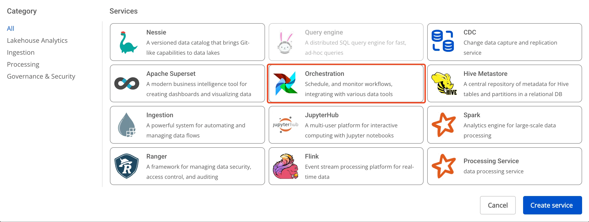
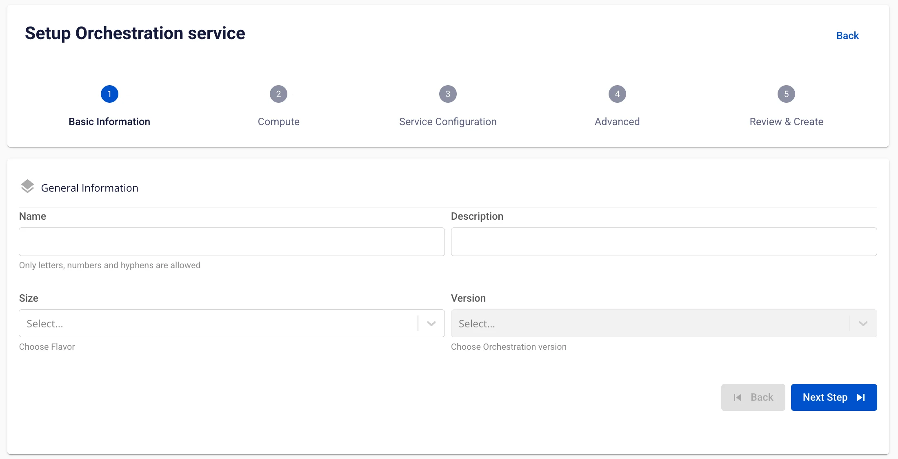

# Tạo Orchestration

**Orchestration service** được định nghĩa là một dịch vụ quản lý và tự động hóa các quy trình làm việc (workflows) trong hệ thống dữ liệu, giúp đảm bảo các tác vụ xử lý dữ liệu được thực hiện tuần tự hoặc song song theo lịch trình hoặc sự kiện, đồng thời cung cấp khả năng theo dõi và khắc phục sự cố hiệu quả.

Để tạo Orchestration service, người dùng thực hiện các bước sau:

**Bước 1:** Tại thanh menu chọn **Data Platform** > chọn **Workspace Management** > chọn **Workspace name**

**Bước 2:** Tại phần **My services** nhấn **Create** > hiển thị popup **New service** chọn **Orchestration** > **Create**



**Bước 3:** Trong form tạo **Orchestration**, nhập thông tin màn **Basic Information**:

 * **Name** (required): Tên Orchestration

Chú ý: Tên Orchestration có thể chứa các kí tự chữ cái thường a-z hoặc chữ cái in hoa A-Z hoặc các kí tự số 0-9. Đặc biệt không dùng dấu cách có thể thay dấu cách bằng dấu “-” hoặc “_”.

 * **Description** (optional): Mô tả

 * **Version** (required): chọn version

 * **Size** (required): chọn size cấu hình cho Airflow dựa trên số lượng DAG chạy đồng thời

 * Gói **Dev**: Giới hạn DAG khuyến nghị khoảng 20-25 DAG

 * Gói **Small**: Giới hạn DAG khuyến nghị khoảng 40-50 DAG

 * Gói **Medium**: Giới hạn DAG khuyến nghị khoảng 70-80 DAG



**Bước 4:** Nhấn **Next Step** để chuyển sang màn nhập thông tin **Compute**

Nhập thông tin sau:

 * **Storage policy** (required): chọn **Storage Policy**


Nếu người dùng muốn tự động tăng cấu hình Worker của Airflow, tích chọn **Enable worker auto scaling** > nhập số node tối đa cho W**orker**

**Bước 5:** Nhấn **Next** để chuyển sang màn **Service configuration**

Nhập các thông tin sau:

 * **Mount S3 storage**

 * **Storage Name** (required): chọn Storage cho phần mount S3
 * **DAGs**

 * **Type** (required): Chọn type là S3/GIT

 * Trường hợp **Type** là S3**:** lấy thông tin DAGs trong S3 storage

 * **Trường hợp Type là GIT, n** hập các thông tin sau:

 * **Repository URL (required)**: địa chỉ lưu file DAGs

 * **Branch (required)**: nhánh kết nối tới thư mục chứa file DAGs

 * **Path (required)**: đường dẫn cụ thể tới thư mục chứa file DAGs


**Bước 6:** Nhấn **Next** để chuyển sang màn **Advanced**

 * Database (thông tin Database lưu dữ liệu cho **Data governance**, người dùng có thể sử dụng Database đã tạo trên dịch vụ **FPT Database Engine** hoặc các **Database** khác của người dùng)

Trường hợp chọn **type** là **PostgreSQL**

 * **Select Database** (required): Chọn Database

 * **Host name** (required): Hostname hoặc IP của Postgres server

 * **Port** (required): Postgres server port, mặc định là 5432

 * **Database** (required): tên database

 * **Username** (required): Tên tài khoản truy cập tới Database

 * **Password** (required): Mật khẩu truy cập tới Database

Trường hợp chọn **Manual configuration**

 * **Host name** (required): Hostname hoặc IP của Postgres server

 * **Port** (required): Postgres server port, mặc định là 5432

 * **Database** (required): tên database

 * **Username** (required): user truy cập tới Database

 * **Password** (required): Password truy cập tới Database


Sau khi nhập đầy đủ thông tin **Database**, người dùng ấn **Test connection** để kiểm tra kết nối từ **Workspace** đến **Database** đã nhập

 * **Redis**

Trường hợp chọn **From FPT Database Engine**

 * **Select Database (** required**)**: Chọn Database

 * **Host name(** required**)**: Hostname hoặc IP của Redis

 * **Port (** required**)**: Redis port, mặc định là 6379

 * **Username (** required**)**: user truy cập tới Database

 * **Password (** required**)**: Password truy cập tới Database

 * **Logical database** (required): chọn thông tin logical DB

Trường hợp chọn **Manual configuration**

 * **Host name** (required): Hostname hoặc IP của redis

 * **Port** (required): redis port

 * **Username** (required): user truy cập tới Database

 * **Password** (required): Password truy cập tới Database

 * **Logical database** (required): chọn thông tin logical DB

Sau khi nhập đầy đủ thông tin **Database**, người dùng ấn **Test connection** để kiểm tra kết nối từ **Workspace** đến **Database** đã nhập

 * **Remote logging**

 * **Bucket name** (required): tên bucket

 * **Endpoint** (required): địa chỉ truy cập

 * **Access key** (required): khóa truy cập

 * **Secret** (required): mã truy cập

 * **Path** (required): thư mục chứa các tệp **remote logs**

Sau khi nhập đầy đủ thông tin **Remote logging**, người dùng ấn **Test connection** để kiểm tra kết nối từ **Workspace** đến **S3** đã nhập

 * **Single Sign On**

 * Nếu không tích chọn Single Sign On, Superset được khởi tạo xác thực bằng **Basic authen**

 * Nếu tích chọn **Single Sign On:**

 * **Provider: FPT ID**

Người dùng nhập các thông tin sau:

 * **Username**: tên username

 * **Email**: địa chỉ email FPT

 * **Provider: Google**

Người dùng nhập các thông tin sau:

 * **Client ID**: một đoạn mã ID được sử dụng để xác thực client với google

 * **Client Secret**: mật khẩu được sử dụng để xác thực client với google

 * **Email**: địa chỉ email

 * **Provider: Keycloak**

Người dùng nhập các thông tin sau:

 * **Auth Provider name**: Tên provider

 * **Realm**: là một không gian quản lý mà trong đó, tất cả người dùng, nhóm, vai trò, khách hàng (clients) và các đối tượng khác đều được quản lý và bảo mật một cách độc lập

 * **Auth server url**: là URL cơ bản của máy chủ Keycloak, được sử dụng bởi các clients để thực hiện xác thực

 * **Client ID**: một đoạn mã ID được sử dụng để xác thực client với Keycloak

 * **Client Secret**: mật khẩu được sử dụng để xác thực client với Keycloak

 * **Username**: Tên username trong keycloak

 * **Email**: địa chỉ email trong keycloak

 * **Secret backends**

 * **Provider = FPT Key Vault**

 * **Mount point (required):** Đường dẫn mount point của secrets backend (ví dụ: airflow-connections)

 * **Connection path (required):** Đường dẫn/key dùng cho kết nối Airflow

 * **Variable path (required):** Đường dẫn/key cho biến môi trường hoặc secrets

 * **URL (required):** Địa chỉ endpoint của Vault (ví dụ: <http://pickadkf.keyvault.fptcloud.com>)

 * **Auth type:** Kiểu xác thực với Vault (ví dụ: token)

 * **Token(required):** Mã token xác thực tài khoản với Vault

**Chú ý:** Vault Policy - Token cần có quyền "read" và "list" trên đường dẫn chứa connections và variables & Gán policy vào token

```
{
 "path": {
 "/data//*": {
 "capabilities": [
 "read",
 "list"
 ]
 },
 "/data//*": {
 "capabilities": [
 "read",
 "list"
 ]
 },
 "/metadata/": {
 "capabilities": [
 "list"
 ]
 },
 "/metadata/": {
 "capabilities": [

 "list"
 ]
 }
 }
 }
```

Click button **Test connection** \- kiểm tra kết nối thực tế với secret backend


 * **Custom Domain**

 * **Mục đích:** Cho phép cấu hình domain tùy chỉnh để truy cập services.

 * **Với Workspace Public:** Dùng để gán domain và certificate mà không cần bật/tắt TLS (HTTPS luôn khả dụng).

 * **Với Workspace Private:** Ngoài domain và certificate, người dùng có thể tùy chọn bật hoặc tắt TLS/SSL để quyết định dùng HTTPS hay HTTP.

 * **Workspace là Public**

 * **Custom domain**: Tích để bật domain tùy chỉnh.

 * **Domain**: Nhập tên miền (VD: abc.local, jupyter.example.com).

 * **Certificate name**: Chọn từ danh sách certificate đã import trong **Certificate Manager**.

 * **Nút**:

 * **Manage certificate**: Mở màn hình quản lý certificate.

 * **Validate**: Kiểm tra chứng chỉ hợp lệ với domain.

 * 
:::note
Ở Workspace Public **không hiển thị** tùy chọn **TLS/SSL certificate** — hệ thống mặc định hỗ trợ HTTPS.
:::


 * **Workspace là Private**

 * **Custom domain**: Tích để bật domain tùy chỉnh.

 * **Domain**: Nhập tên miền.

 * **TLS/SSL certificate**: Tích để bật HTTPS cho services.

 * **Certificate name**: Chọn từ danh sách certificate.

 * **Nút**:

 * **Manage certificate**: Mở quản lý certificate.

 * **Validate**: Kiểm tra chứng chỉ.

 * 
:::note
Nếu bỏ tích **TLS/SSL certificate**, dịch vụ sẽ chạy HTTP và không yêu cầu certificate.
:::


**Bước 7:** Nhấn **Next** để chuyển sang màn **Review & create**

**Bước 8.** Kiểm tra thông tin nhập sau đó nhấn **Create** để hoàn thành khởi tạo **Orchestration**

**Orchestration** hoàn thành khởi tạo khi **Worker Status** là **Succeeded** và **Status** của **Orchestration** là **Healthy** (~10 phút)
