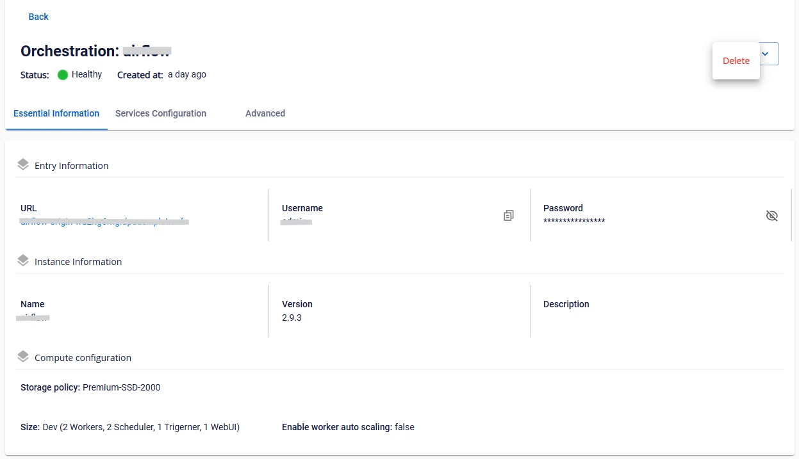

# Xóa Orchestration

Để xóa **Orchestration service**, người dùng thực hiện các bước sau:

**Bước 1:** Tại thanh menu chọn **Data Platform** > chọn **Workspace Management** > chọn **Workspace name**

**Bước 2:** Chọn **Orchestration** > nhấn vào nút **Action** góc phải màn hình chọn **delete**

**Bước 3:** Hiển thị hộp thoại **Delete application** > nhập delete > nhấn **Confirm** để xóa hoàn thành việc xóa app

