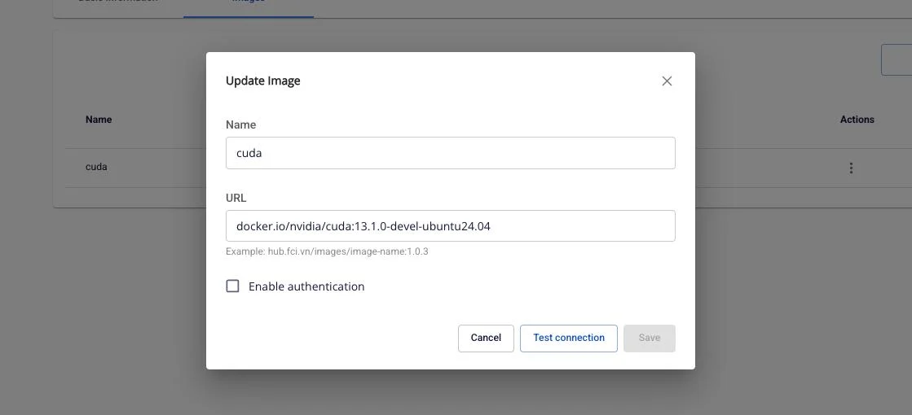

# Quản lý Image của Compute

Tính năng **Prepulling Image** cho phép người dùng quản lý các Docker image được pull về workspace từ các registry khác nhau. Việc prepull image giúp tối ưu thời gian khởi động các container và đảm bảo image sẵn sàng sử dụng khi cần thiết.

**Lợi ích:**

 * Giảm thời gian khởi động container
 * Quản lý tập trung các image cần thiết cho compute
 * Hỗ trợ cả public và private registry
 * Theo dõi trạng thái pull image realtime

**Giới hạn:** Mỗi Processing Service tối đa được tạo **5 compute**.

### 1\. Xem danh sách Image của Compute

Để xem danh sách các image đã được prepull về compute, người dùng thực hiện các bước sau:

**Bước 1:** Tại màn hình **Processing services** > chọn tab **Compute**

**Bước 2:** Click vào compute muốn xem danh sách image

**Bước 3:** Chọn tab **Images**

**Kết quả:** Hiển thị danh sách các image đã được thêm vào compute với các thông tin:

 * **Name**: Tên định danh của image
 * **URL**: Đường dẫn đầy đủ đến image registry
(ví dụ: `docker.io/nvidia/cuda:13.1.0-devel-ubuntu24.04`)
 * **Status**: Trạng thái hiện tại của image
 * **Ready**: Image đã sẵn sàng sử dụng
 * **Progressing**: Đang trong quá trình pull image
 * **Processing**: Đang xử lý
 * **Failed**: Pull image thất bại
 * **Degraded**: Image có vấn đề (có icon để xem log chi tiết)
 * **Unknown**: Trạng thái không xác định
 * **Actions**: Menu thao tác với image (Update, Retry, Delete)

**Lưu ý:** Nếu chưa có image nào, màn hình sẽ hiển thị thông báo "No image yet" với button **Create** để thêm image mới.

### 2\. Thêm Image mới

#### Thêm Image từ Public Registry (không cần authentication)

**Bước 1:** Tại tab **Images** của Compute, click button **Create**

**Bước 2:** Trong popup **Add Image**, nhập các thông tin:

 * **Name**: Tên định danh cho image (bắt buộc)
 * Chỉ chấp nhận chữ cái, số và dấu gạch ngang (-)
 * Tối đa 30 ký tự
 * Ví dụ: `nginx-latest`, `cuda-13-1-0`
 * **URL**: Đường dẫn đến image (bắt buộc)
 * Format: registry/repository/image-name:tag
 * Ví dụ: docker.io/library/nginx:latest
 * Ví dụ: hub.fci.vn/images/image-name:1.0.3

**Bước 3:** Đảm bảo checkbox **Enable authentication** không được chọn (dành cho public image)

**Bước 4:** Click button **Test connection** để kiểm tra kết nối đến registry

 * Nếu thành công: Hiển thị thông báo "Success - Test connection successfully"
 * Nếu thất bại: Hiển thị thông báo lỗi chi tiết

**Bước 5:** Sau khi test connection thành công, button **Save** sẽ được enable

**Bước 6:** Click button **Save**

**Kết quả:**

 * Hiển thị thông báo "Success - Add successfully"
 * Image mới xuất hiện trong danh sách với trạng thái **Progressing**
 * Sau khi pull hoàn tất, trạng thái chuyển sang **Ready**

#### Thêm Image từ Private Registry (có authentication)

**Bước 1:** Tại tab **Images** của Compute, click button **Create**

**Bước 2:** Trong popup **Add Image**, nhập các thông tin:

 * **Name**: Tên định danh cho image
 * **URL**: Đường dẫn đến private image

**Bước 3:** Check vào checkbox **Enable authentication**

**Bước 4:** Nhập thông tin xác thực:

 * **Username**: Tên người dùng hoặc service account (bắt buộc)
 * **Secret**: Access token hoặc password (bắt buộc)
 * Click icon view để hiển thị/ẩn mật khẩu

**Bước 5:** Click button **Test connection** để kiểm tra kết nối

**Bước 6:** Sau khi test connection thành công, click button **Save**

**Kết quả:** Image được thêm vào danh sách và bắt đầu quá trình pull với authentication đã cung cấp.

### 3\. Cập nhật Image

Người dùng có thể cập nhật thông tin của image đã tồn tại (tên, URL, authentication). Khi cập nhật, hệ thống sẽ tự động pull lại image với thông tin mới.

**Bước 1:** Tại danh sách Images, click vào icon **⋮** (3 chấm dọc) ở cột **Actions** của image muốn cập nhật

**Bước 2:** Chọn **Update** từ menu dropdown

**Bước 3:** Trong popup **Update Image**, các field sẽ hiển thị thông tin hiện tại của image

**Bước 4:** Chỉnh sửa các thông tin cần thiết:

 * Thay đổi **Name** (tuân thủ quy tắc: chữ, số, dấu gạch ngang, max 30 ký tự)
 * Thay đổi **URL**
 * Enable/Disable **authentication**:
 * Nếu enable: Nhập Username và Secret mới
 * Nếu disable: Xóa authentication (dùng cho public image)

**Bước 5:** Click button **Test connection** để kiểm tra cấu hình mới

**Bước 6:** Sau khi test thành công, click button **Save**

### 4\. Retry Image

Khi image có trạng thái **Failed** hoặc **Degraded**, người dùng có thể thực hiện retry để pull lại image.

**Bước 1:** Tại danh sách Images, click vào icon **⋮** của image có trạng thái Failed/Degraded

**Bước 2:** Chọn **Retry** từ menu dropdown

**Bước 3:** Trong popup **Retry compute image**, xác nhận thông tin:

**Bước 4:** Click button **Confirm** để xác nhận retry

### 5\. Xóa Image

Người dùng có thể xóa image không còn sử dụng khỏi compute.

**Bước 1:** Tại danh sách Images, click vào icon **⋮** của image muốn xóa

**Bước 2:** Chọn **Delete** (màu đỏ) từ menu dropdown

**Bước 3:** Trong popup **Delete compute image**, đọc cảnh báo:

**Bước 4:** Để xác nhận xóa, nhập chính xác text `delete` (viết thường) vào ô input

**Bước 5:** Button **Confirm** sẽ được enable sau khi nhập đúng

**Bước 6:** Click button **Confirm**

### 6\. Xem Log của Image

Khi image có trạng thái **Degraded**, người dùng có thể xem log chi tiết để troubleshoot vấn đề.

**Bước 1:** Tại danh sách Images, tìm image có trạng thái **Degraded** (có icon bên cạnh)

**Bước 2:** Click vào icon **** (information)

**Bước 3:** Popup **Logs** sẽ hiển thị với nội dung log chi tiết

**Ví dụ log:** _[2020-07-07 15:04:29,334] DEBUG Progress event:
TRANSFER_PART_COMPLETED_EVENT, bytes: 0
(io.confluent.connect.s3.storage.S3OutputStream:286)_

**Bước 4:** Đọc và phân tích log để xác định nguyên nhân lỗi

**Bước 5:** Click icon X để đóng popup log

**Kết quả:** Popup đóng lại, quay về màn hình danh sách Images
