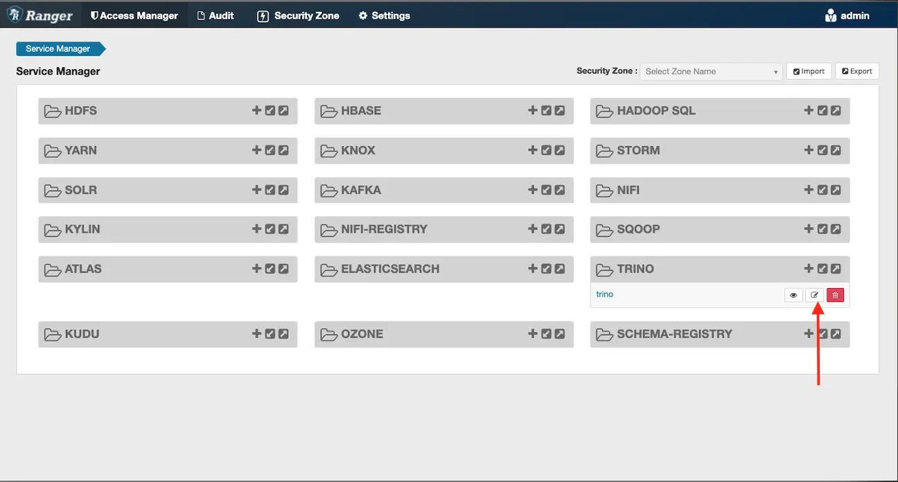

# Quản lý Users

Hiển thị thông tin danh sách các **User** của **Query engine**

 * Thêm User:

 * **Bước 1.** Tại màn hình **Users**, **Create a user**

 * **Bước 2.** Nhập thông tin cho **User**

 * **Username**: tên tài khoản

 * **Bước 3.** Ấn **Create** để tạo **Connector**, ấn **Cancel** để huỷ bỏ (sau khi Create Connector, Query Engine chuyển trạng thái **Processing** và thực hiện tạo cấu hình **\~3 phút**)

 * Chi tiết **User**: tại màn hình **Users**, ấn vào tên **user** cần xem chi tiết thông tin để xem thông tin Username, Password

 * Xoá **User**

 * Bước 1: Tại màn hình **Users**, chọn **User** cần xoá, chọn **Action** > **Delete**

 * Bước 2: Xác nhận xoá hoặc huỷ bỏ thao tác xoá tại hộp thoại xác nhận

