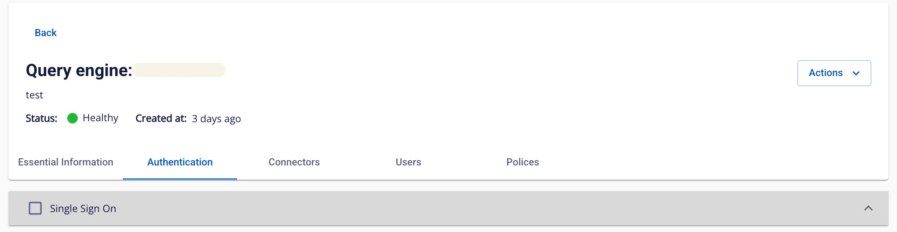

# Xem thông tin Query Engine

Để xem thông tin **Query engine**, người dùng thực hiện các bước sau:

**Bước 1:** Tại thanh menu chọn **Data Platform** > chọn **Workspace Management** > chọn **Workspace name**

**Bước 2:** Tại phần **My services** chọn **Query engine**

Màn hình hiển thị 5 tab: **Essential Information**, **Authentication**, C**onnectors**, **Users**, **Policies**

**_1\. Essential Information_**

Hiển thị thông tin chi tiết của Query engine

**_2\. Authentication_**

Hiển thị thông tin xác thực của **Query engine**

**_3\. Connectors_**

Hiển thị thông tin các **Connector** của **Query engine**

**_4\. Users_**

Hiển thị thông tin danh sách các **User** của **Query engine**

**_5\. Policies_**

Hiển thị thông tin **Policies** của **Query engine.** Nếu Authentication type là **Integration Ranger**, **Query engine** không hiển thị thông tin tab **Policies**, mọi cấu hình kiểm soát truy cập được thực hiện qua **Ranger-Admin**

