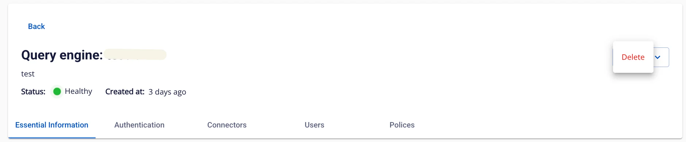
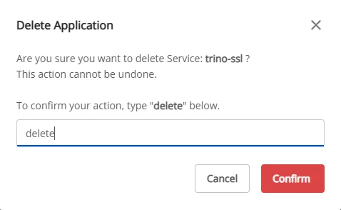

# Xóa Query Engine

Để xóa Query engine, người dùng thực hiện các bước sau:

**Bước 1:** Tại thanh menu chọn **Data Platform** > chọn **Workspace Management** > chọn **Workspace name**

**Bước 2:** Tại phần application chọn **Query engine** > nhấn vào nút **Action** góc phải màn hình chọn **delete**

**Bước 3.** Hiển thị hộp thoại **Delete application** > nhập **delete** > nhấn C**onfirm** để xóa hoàn thành việc xóa app

