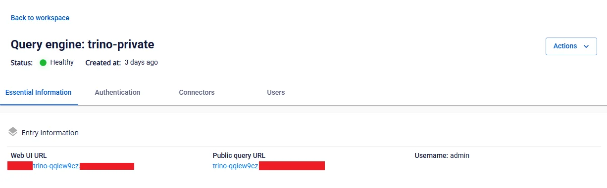

# Truy cập và cấu hình quản lý Query Engine

**Precondition**: Dịch vụ **Query engine** đã được khởi tạo thành công, trạng thái của **Workspace** là **Successed** và trạng thái của **Trino** là **Healthy** (khởi tạo dịch vụ Query engine **tại đây**)

**Bước 1.** Truy cập **Ranger** theo **URL** tại tab **Essential information** và **Username** /**Password**

**Bước 2:** Tạo Trino Service từ **Ranger Admin**, tại màn hình **Service Manager**, chọn **Resource TRINO**, ấn biểu tượng **Add**

**Bước 3.** Nhập thông tin khởi tạo **Service**

 * **Service name**: tên service (là chuỗi ký tự nằm trong URL truy cập **Trino**, có dạng: **trino-xxxxxxxx**)

 * **Display name:** tên hiển thị

 * **Description**: mô tả

 * **Active Status**: trạng thái của **Service**

 * **Select Tag Service**: lựa chọn thẻ

 * **Username**: tên tài khoản đăng nhập Query engine

 * **Password**: mật khẩu đăng nhập Query engine

 * **jdbc.driverClassName**: mặc định io.trino.jdbc.TrinoDriver

 * **jdbc.url**: địa chỉ kết nối Query engine qua JDBC (**jdbc:trino:// :443**)

 * **Superusers**: tên tài khoản mà khi kết nối Query engine sẽ được bỏ qua kiểm tra quyền truy cập

 * **Superuser groups**: tên nhóm tài khoản mà khi kết nối Query engine sẽ được bỏ qua kiểm tra quyền truy cập

 * **Service admin users**: tên tài khoản trên Ranger được chỉ định làm admin của Service

 * **Service admin usergroups**: tên nhóm trên Ranger được chỉ định làm admin của Service

**Bước 4.** Lưu thông tin **Service**

Sau khi nhập đầy đủ thông tin yêu cầu, người dùng ấn **Add** để lưu thông tin **Service** cho **Query engine** vào **Ranger-Admin**

**Bước 5:** Kiểm tra kết nối

 * Tại màn hình Service Manager, chọn biểu tượng **Edit** thông tin **Service Trino** vừa tạo, sau đó ấn **Test connection**

 * Đảm bảo **Ranger-Admin** đã kết nối thành công tới **Query Engine** (**Trino**) khi kết quả **Test connection** là **Connected Successfully**

 ")
