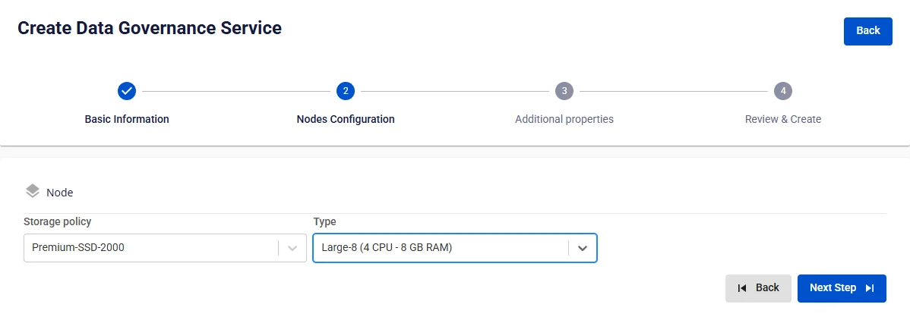

# Tạo Ranger

**FPT Data Governance** sử dụng **Ranger** là một giải pháp quản lý bảo mật và kiểm soát truy cập dành cho giải pháp **Lakehouse** cho **Query engine** (**Trino)**. Nó giúp quản lý quyền truy cập một cách tập trung và chi tiết, hỗ trợ kiểm soát dựa trên Role-Based Access Control (RBAC) và Attribute-Based Access Control (ABAC).

Để tạo **Data Governance**, người dùng thực hiện các bước sau:

**Bước 1:** Tại thanh menu chọn **Data Platform** > chọn **Workspace Management** > chọn **Workspace name**

**Bước 2:** Tại phần **My service** nhấn **Create** > hiển thị popup chọn **New service** chọn **Ranger** > **Create**

**Bước 3:** Trong form tạo **Data Governance**, nhập thông tin màn **Basic Information**:

 * **Name** (required): Tên dịch vụ

Chú ý: Tên dịch vụ phải từ 1 đến 30 kí tự. Có thể chứa các kí tự chữ cái thường a-z hoặc chữ cái in hoa A-Z hoặc các kí tự số 0-9

 * **Description** (optional): Mô tả

 * **Version** (required): chọn version

**Bước 4:** Nhấn **Next** để chuyển sang màn nhập thông tin **Node configuration**

Nhập thông tin sau:

 * **Storage policy** (required): chọn Storage policy

 * **Type** (required): chọn cấu hình tài nguyên

**Bước 5.** Nhấn **Next** để chuyển sang màn hình **Additional properties**

 * **Database** (thông tin Database lưu dữ liệu cho **Data governance**, người dùng có thể sử dụng Database đã tạo trên dịch vụ **FPT Database Engine** hoặc các **Database** khác của người dùng)

Trường hợp chọn **type** là **PostgreSQL**

 * **Host name(required)**: hostname hoặc IP của **Postgres**

 * **Port (required)**: cổng kết nối, mặc định là 5432

 * **Database name (required)**: tên database

 * **Username (required)**: tên tài khoản truy cập vào **Postgres**

 * **Password (required)**: mật khẩu truy cập vào **Postgres**

Sau khi nhập đầy đủ thông tin **Database**, người dùng ấn **Test connection** để kiểm tra kết nối từ **Workspace** đến **Database** đã nhập

Nhập thông tin **Audit logs database:**

 * **Type (required)**: Opensearch hoặc Elasticsearch

:::note
Trong **Configure Parameters** của **OpenSearch**, tham số ssl_http cần được cấu hình là False (HTTP) thay vì giá trị mặc định True (HTTPS).
:::

 * **Protocol (required)**: chọn http hoặc https

 * **Host name (required)**: địa chỉ truy cập

 * **Port (required)**: cổng kết nối

 * **Username (required)**: tên tài khoản

 * **Password (required)**: mật khẩu

 * **Index (required):** index

Nhấn **Test connection** để kiểm tra kết nối từ **Workspace** tới **Audit logs database**

**Usersync:** (Tự động đồng bộ (sync) người dùng và nhóm từ LDAP/AD vào Ranger, giúp quản lý phân quyền tập trung và giảm thao tác tạo thủ công.)

 * **Enable Usersync** (optional): mặc định **uncheck**.

 * **Uncheck** → Ranger không đồng bộ LDAP, không hiển thị thêm trường.

 * **Checked** → mở các phần cấu hình bên dưới.

 * **Enable Usersync** = checked, nhập thông tin:

 * **LDAP/AD URL (required)**: ldap://host:port hoặc ldaps://host:port.

 * **Password (required)**: mật khẩu của tài khoản bind.

 * **Username (required)**: tài khoản bind có quyền đọc, (vd:cn=admin,dc=example,dc=com.)

 * **User attribute** **(required)**: thuộc tính dùng làm username trong Ranger (uid, sAMAccountName, cn, …).

 * **User object class (required)**: kiểu object chứa user (person, inetOrgPerson, user, …).

 * **User search base (required)**: DN gốc tìm user, VD ou=Users,dc=example,dc=com.

 * **User search filter (optional)**: bộ lọc bổ sung nếu cần, VD (&(objectClass=person)(department=IT)).

 * **User group name attribute (optional)**: thuộc tính lưu danh sách nhóm trên user (thường là memberOf).

 * **Enable group config**: chọn Enabled để sync nhóm.

 * **Group member attribute (optional)**: thuộc tính liệt kê thành viên (member, uniqueMember, memberUid).

 * **Group name attribute (required khi Enabled)**: thuộc tính tên nhóm (cn).

 * **Group object class (required khi Enabled)**: kiểu object nhóm (groupOfNames, group, …).

 * **Group search base (required khi Enabled)**: DN gốc tìm group, VD ou=Groups,dc=example,dc=com.

 * **Group search filter (optional)**: bộ lọc nâng cao, VD (&(objectClass=group)(cn=dev*)).

Sau khi điền đủ thông tin, nhấn **Test connection** để kiểm tra Ranger kết nối tới LDAP/AD thành công.

 * **Custom Domain**

 * **Mục đích:** Cho phép cấu hình domain tùy chỉnh để truy cập services.

 * **Với Workspace Public:** Dùng để gán domain và certificate mà không cần bật/tắt TLS (HTTPS luôn khả dụng).

 * **Với Workspace Private:** Ngoài domain và certificate, người dùng có thể tùy chọn bật hoặc tắt TLS/SSL để quyết định dùng HTTPS hay HTTP.

 * **Workspace là Public**

 * **Custom domain**: Tích để bật domain tùy chỉnh.

 * **Domain**: Nhập tên miền (VD: abc.local, jupyter.example.com).

 * **Certificate name**: Chọn từ danh sách certificate đã import trong **Certificate Manager**.

 * **Nút**:

 * **Manage certificate**: Mở màn hình quản lý certificate.

 * **Validate**: Kiểm tra chứng chỉ hợp lệ với domain.

 * 
:::note
Ở Workspace Public **không hiển thị** tùy chọn **TLS/SSL certificate** — hệ thống mặc định hỗ trợ HTTPS.
:::

 * **Workspace là Private**

 * **Custom domain**: Tích để bật domain tùy chỉnh.

 * **Domain**: Nhập tên miền.

 * **TLS/SSL certificate**: Tích để bật HTTPS cho services.

 * **Certificate name**: Chọn từ danh sách certificate.

 * **Nút**:

 * **Manage certificate**: Mở quản lý certificate.

 * **Validate**: Kiểm tra chứng chỉ.

 * 
:::note
Nếu bỏ tích **TLS/SSL certificate**, dịch vụ sẽ chạy HTTP và không yêu cầu certificate.
:::

**Bước 6:** Nhấn **Next Step** để chuyển sang màn **Review & Create**

**Bước 7.** Kiểm tra thông tin nhập sau đó nhấn **Create** để hoàn thành.

**Data governance** hoàn thành khởi tạo khi **Worker Status** là **Succeeded** và **Status** của **Ranger** là **Healthy** (~10 phút)
