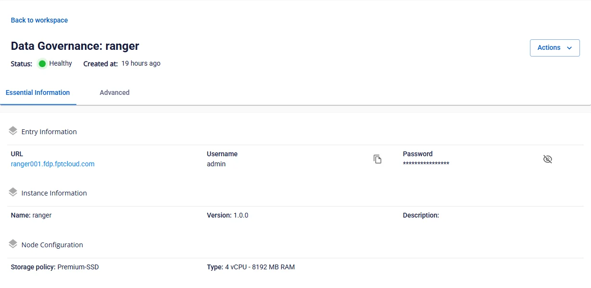

# Xem thông tin Ranger

Để xem thông tin **Data governance**, người dùng thực hiện các bước sau:

**Bước 1:** Tại thanh menu chọn **Data Platform** > chọn **Workspace Management** > chọn **Workspace name**

**Bước 2:** Tại phần **My services** chọn **Data governance**

Màn hình hiển thị 2 tab: **Essential Information**, **Advanced**

 * **Essential Information**

Hiển thị thông tin chi tiết của **Data governance** mà người dùng đã cấu hình

Truy cập **Ranger** theo thông tin **URL**, **Username**, **Password** hiển thị

 * **Advanced**

Hiển thị thông tin Database đã cấu hình cho Data governance

