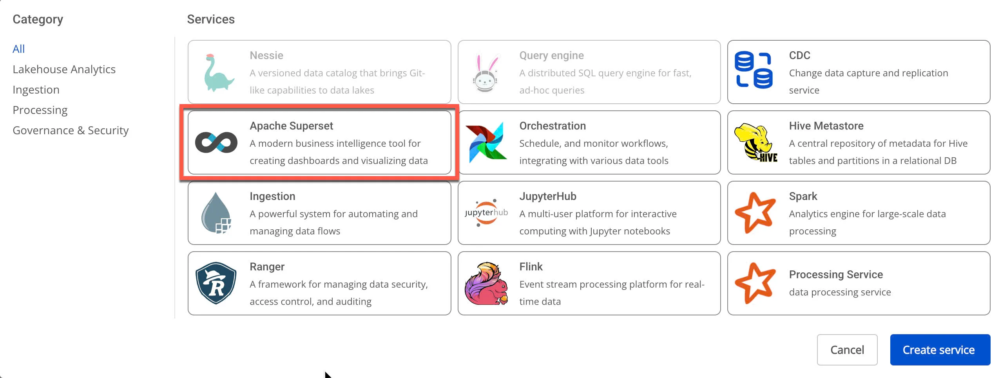
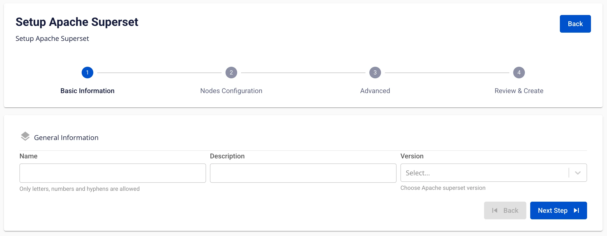
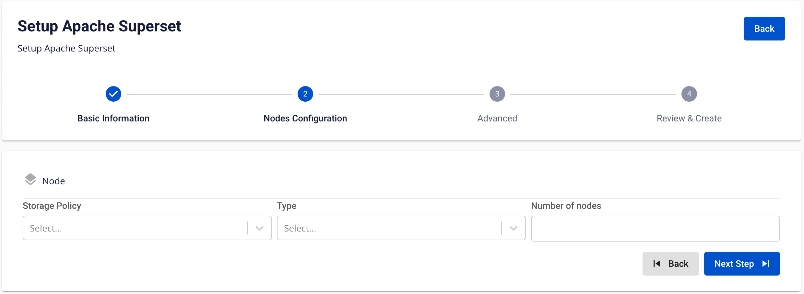
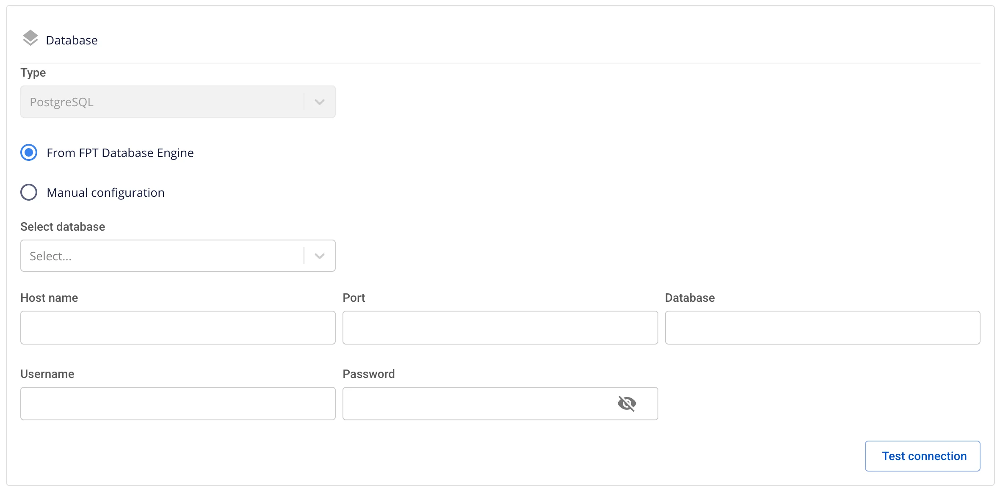
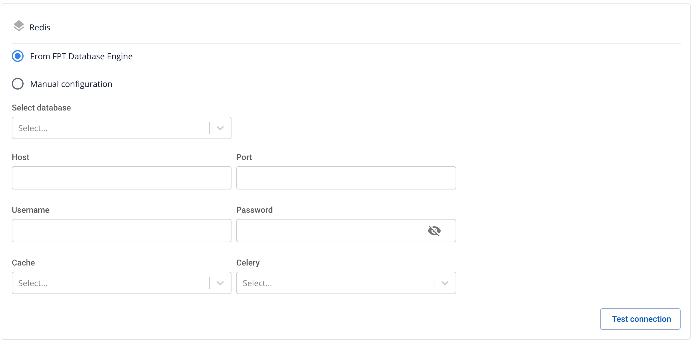

# Tạo superset

**Apache Superset** là một nền tảng BI (Business Intelligence) mã nguồn mở, giúp trực quan hóa dữ liệu, tạo dashboard, và phân tích dữ liệu một cách dễ dàng. Nó là một giải pháp thay thế mạnh mẽ cho Tableau, Power BI trong các hệ thống sử dụng các nền tảng dữ liệu lớn như Druid, Presto, Trino, BigQuery, ClickHouse, MySQL, PostgreSQL, và nhiều hệ thống khác

Để tạo **Apache Superset**, người dùng thực hiện các bước sau:

**Bước 1:** Tại thanh menu chọn **Data Platform** > chọn **Workspace Management** > chọn **Workspace name**

**Bước 2:** Tại phần **My services** nhấn **Create** > hiển thị popup **New Service** chọn **Apache Superset** > **Create** 

**Bước 3:** Trong form tạo **Apache Superset**, nhập thông tin màn **Basic Information**:

 * **Name** (required): Tên dịch vụ

Chú ý: Tên dịch vụ phải từ 1 đến 30 kí tự. Có thể chứa các kí tự chữ cái thường a-z hoặc chữ cái in hoa A-Z hoặc các kí tự số 0-9.

 * **Description** (optional): Mô tả
 * **Version** (required): chọn version

**Bước 4.** Nhấn **Next** để chuyển qua màn **Node configuration**

Nhập các thông tin sau:

 * **Storage policy** (required): chọn **Storage Policy**

 * **Type** (required): chọn cấu hình tài nguyên

 * **Number of nodes** (required): nhập số node cho **Superset** để dịch vụ được **HA**

**Bước 5.** Nhấn **Next** để chuyển qua màn **Advanced**

 * **Database** (thông tin Database lưu dữ liệu cho **Apache Superset**, người dùng có thể sử dụng Database đã tạo trên dịch vụ **FPT Database Engine** hoặc các **Database** khác của người dùng)

 * **Type**: mặc định PostgreSQL

 * **Host name(required)**: hostname hoặc IP của Postgres

 * **Port (required)**: cổng kết nối, mặc định là 5432

 * **Database name (required)**: tên database

 * **Username (required)**: tên tài khoản truy cập vào **Postgres**

 * **Password (required)**: mật khẩu truy cập vào **Postgres**

Sau khi nhập đầy đủ thông tin **Database**, người dùng ấn **Test connection** để kiểm tra kết nối từ **Workspace** đến **Database** đã nhập

 * **Redis** (thông tin Database lưu dữ liệu cho **Apache Superset**, người dùng có thể sử dụng Database đã tạo trên dịch vụ **FPT Database Engine** hoặc các **Database** khác của người dùng)

 * **Host (required)**: hostname hoặc IP của Redis

**Port (required)**: cổng kết nối

 * **Username (required)**: tên tài khoản

 * **Password (required)**: mật khẩu

Nhấn **Test connection** để kiểm tra kết nối từ **Workspace** tới **Redis**

 * **Cache (required)**: chọn index cho lưu cache

 * **Celery (required)**: chọn index cho xử lý

 * **Single Sign On**

 * Nếu không tích chọn Single Sign On, Superset được khởi tạo xác thực bằng **Basic authen**

 * Nếu tích chọn **Single Sign On:**

 * **Provider: FPT ID**

Người dùng nhập các thông tin sau:

 * **Username**: tên username

 * **Email**: địa chỉ email FPT

 * **Provider: Google**

Người dùng nhập các thông tin sau:

 * **Client ID**: một đoạn mã ID được sử dụng để xác thực client với google

 * **Client Secret**: mật khẩu được sử dụng để xác thực client với google

 * **Email**: địa chỉ email

 * **Provider: Keycloak**

Người dùng nhập các thông tin sau:

 * **Auth Provider name**: Tên provider

 * **Realm**: là một không gian quản lý mà trong đó, tất cả người dùng, nhóm, vai trò, khách hàng (clients) và các đối tượng khác đều được quản lý và bảo mật một cách độc lập

 * **Auth server url**: là URL cơ bản của máy chủ Keycloak, được sử dụng bởi các clients để thực hiện xác thực

 * **Client ID**: một đoạn mã ID được sử dụng để xác thực client với Keycloak

 * **Client Secret**: mật khẩu được sử dụng để xác thực client với Keycloak

 * **Username**: Tên username trong keycloak

 * **Email**: địa chỉ email trong keycloak

 * **Custom Domain**

 * **Mục đích:** Cho phép cấu hình domain tùy chỉnh để truy cập services.

 * **Với Workspace Public:** Dùng để gán domain và certificate mà không cần bật/tắt TLS (HTTPS luôn khả dụng).

 * **Với Workspace Private:** Ngoài domain và certificate, người dùng có thể tùy chọn bật hoặc tắt TLS/SSL để quyết định dùng HTTPS hay HTTP.

 * **Workspace là Public**

 * **Custom domain**: Tích để bật domain tùy chỉnh.

 * **Domain**: Nhập tên miền (VD: abc.local, jupyter.example.com).

 * **Certificate name**: Chọn từ danh sách certificate đã import trong **Certificate Manager**.

 * **Nút**:

 * **Manage certificate**: Mở màn hình quản lý certificate.

 * **Validate**: Kiểm tra chứng chỉ hợp lệ với domain.

 * 
:::note
Ở Workspace Public **không hiển thị** tùy chọn **TLS/SSL certificate** — hệ thống mặc định hỗ trợ HTTPS.
:::

 * **Workspace là Private**

 * **Custom domain**: Tích để bật domain tùy chỉnh.

 * **Domain**: Nhập tên miền.

 * **TLS/SSL certificate**: Tích để bật HTTPS cho services.

 * **Certificate name**: Chọn từ danh sách certificate.

 * **Nút**:

 * **Manage certificate**: Mở quản lý certificate.

 * **Validate**: Kiểm tra chứng chỉ.

 * 
:::note
Nếu bỏ tích **TLS/SSL certificate**, dịch vụ sẽ chạy HTTP và không yêu cầu certificate.
:::

**Bước 6:** Nhấn **Next** để chuyển qua màn **Review & Create**

**Bước 7.** Kiểm tra thông tin sau đó nhấn **Create** để hoàn thành khởi tạo **Apache Superset**

**Superset** hoàn thành khởi tạo khi **Worker Status** là **Succeeded** và **Status** của **Apache Superset** là **Healthy** (~10 phút)
