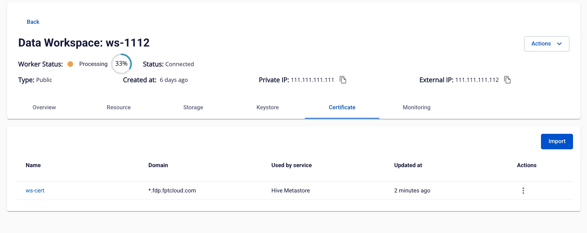
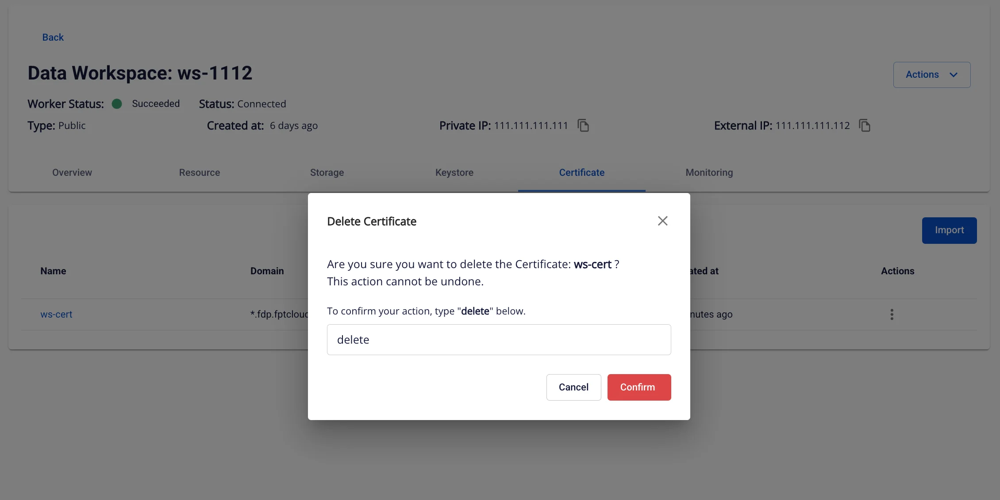

# Certificate Manager

**Certificate Manager** là module trong **Workspace** dùng để quản lý vòng đời chứng chỉ số (SSL/TLS), giúp đảm bảo an toàn, liên tục và thuận tiện khi sử dụng.

Các chức năng chính:

 * Quản lý chứng chỉ.

 * Thay thế (renew) hoặc xóa chứng chỉ.

 * Áp dụng chứng chỉ cho các dịch vụ trong Workspace.

### 1\. Danh sách Certificate

**Mục đích:** Hiển thị danh sách chứng chỉ đã tạo trong hệ thống.

**Truy cập:** Data Platform > Chọn Workspace > Tab Certificate

**Danh sách Certificate, gồm các cột:**

 * **Name**: Tên chứng chỉ (click để xem chi tiết).

 * **Domain**: Tên miền áp dụng.

 * **Used by service**: Dịch vụ đang sử dụng chứng chỉ.

 * **Updated at**: Thời gian cập nhật gần nhất.

 * **Action**: Menu thao tác ( sửa, xóa).

 * **Import to renew**: Nhập chứng chỉ để gia hạn (chỉ khả dụng nếu đang được sử dụng).

 * **Delete**: Xóa chứng chỉ khỏi hệ thống.

 * Button **Import**: Nhập (import) chứng chỉ mới.

### 2\. Import Certificate

**Mục đích:** Tải lên chứng chỉ SSL/TLS và private key mới để sử dụng.

**Truy cập:** Data Platform > Workspace > Certificate > Import

**Các bước:**

 1. Nhập **Name** (chỉ chứa chữ, số, dấu gạch ngang; không trùng tên đã tồn tại).

 2. Dán nội dung **Certificate content** (PEM format).

 3. Dán nội dung **Certificate private key** (PEM format).

 4. Nhấn **Import**.

**Lưu ý kiểm tra hệ thống:**

 * Định dạng PEM hợp lệ.

 * Chứng chỉ không hết hạn, chưa bị thu hồi, và đã đến ngày hiệu lực.

 * Private key khớp với certificate.

### 3\. Import Certificate to Renew

**Mục đích:** Thay thế chứng chỉ hiện tại bằng chứng chỉ mới.

**Truy cập:** Data Platform > Workspace > Certificate > Import Certificate to Renew

**Các bước:**

 1. Nhập **Certificate content** và **Certificate private key** (định dạng PEM).

 2. Nhấn **Import & renew**.

 3. Hệ thống cập nhật và áp dụng ngay cho dịch vụ đang dùng.

**Điều kiện:**

 * Định dạng PEM hợp lệ.

 * Không bị hết hạn, thu hồi, hoặc chưa đến ngày hiệu lực.

 * Private key khớp certificate.

 * Chứng chỉ chưa được renew trước đó.

### 4\. Certificate Details

**Mục đích:** Xem thông tin chi tiết của chứng chỉ.

**Truy cập:** Data Platform > Workspace > Certificate > Click vào tên chứng chỉ

Khi nhấn vào tên chứng chỉ trong **Certificate List**, hệ thống sẽ mở popup chi tiết và hiển thị các trường sau:

Trường | Mô tả chi tiết
---|---
**Name** | Tên định danh của chứng chỉ trong hệ thống. Được đặt khi import chứng chỉ. Dùng để phân biệt các chứng chỉ khác nhau.
**Domain name** | Tên miền hoặc wildcard domain (ví dụ: example.com hoặc *.example.com) mà chứng chỉ bảo vệ. Đây là thông tin quan trọng để xác định chứng chỉ có phù hợp với dịch vụ cần dùng hay không.
**Public key info** | Thông tin về loại và độ dài khóa công khai, ví dụ: **RSA 2048**, **RSA 4096**, **ECDSA P-256**. Độ dài càng lớn thì mức độ bảo mật càng cao nhưng yêu cầu xử lý cũng cao hơn.
**Valid From** | Ngày giờ chứng chỉ bắt đầu có hiệu lực. Hiển thị kèm múi giờ (timezone) để tránh nhầm lẫn khi triển khai ở nhiều khu vực.
**Valid To** | Ngày giờ chứng chỉ hết hiệu lực. Sau thời điểm này, chứng chỉ sẽ không còn hợp lệ và có thể khiến dịch vụ bị lỗi kết nối bảo mật (HTTPS).
**Expires in** | Số ngày còn lại cho đến khi chứng chỉ hết hạn. Hệ thống tính tự động dựa trên thời gian hiện tại và **Valid To**. Đây là chỉ số giúp theo dõi và lên kế hoạch renew kịp thời.
**Used by service** | Danh sách các dịch vụ hiện đang sử dụng chứng chỉ này, ví dụ: **JupyterHub**, **Ingestion API**, **Query Engine** … Trường này chỉ hiển thị nếu chứng chỉ đang được gán cho ít nhất một dịch vụ.
**Serial number** | Số serial duy nhất của chứng chỉ, thường do CA (Certificate Authority) cấp. Dùng để tra cứu, xác minh hoặc quản lý chứng chỉ trong hệ thống.
**Signature algorithm** | Thuật toán chữ ký số mà chứng chỉ sử dụng, ví dụ: **SHA-256 with RSA** hoặc **ECDSA with SHA-384**. Điều này ảnh hưởng tới độ an toàn và tốc độ xử lý.
**Updated at** | Thời gian chứng chỉ được cập nhật gần nhất trong hệ thống (thường khi import mới hoặc renew). Giúp theo dõi lịch sử thay đổi chứng chỉ.

### 5\. Delete Certificate

**Mục đích:** Xóa chứng chỉ khỏi hệ thống.

**Truy cập:** Data Platform > Workspace > Certificate > Action > Delete

**Các bước:**

 1. Nhập từ khóa **delete** vào ô xác nhận.

 2. Nhấn **Confirm** để xóa.

**Điều kiện:**

 * Nếu chứng chỉ đang được sử dụng, không thể xóa.

 * Nếu nhập sai từ khóa hoặc để trống, hệ thống sẽ báo lỗi.

