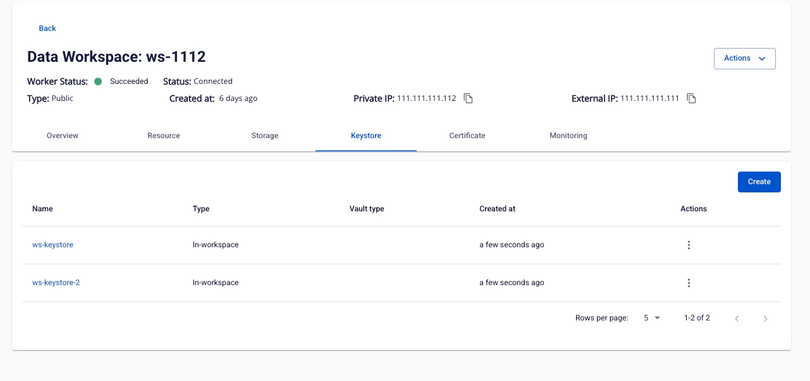
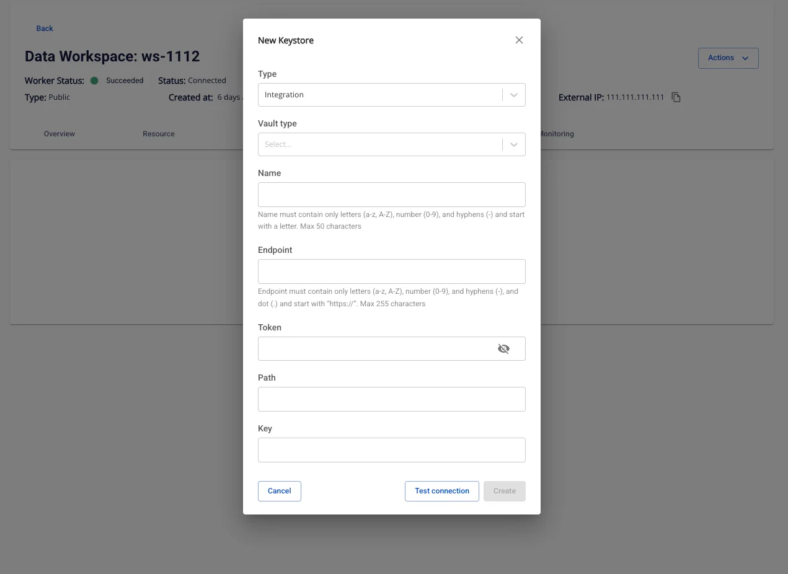
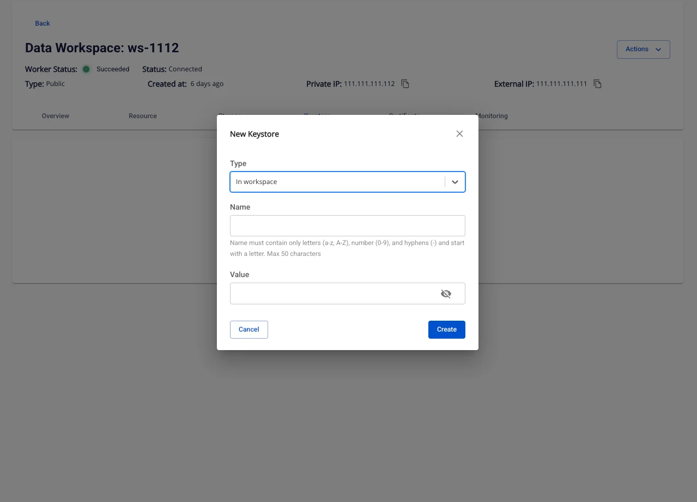
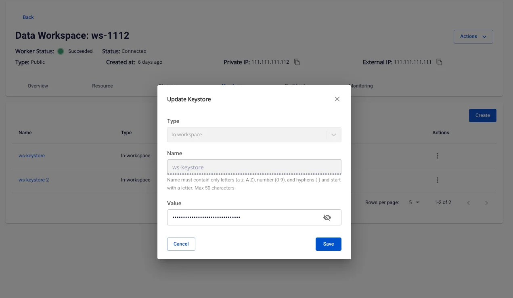
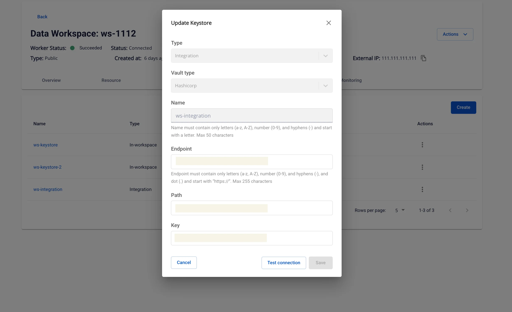
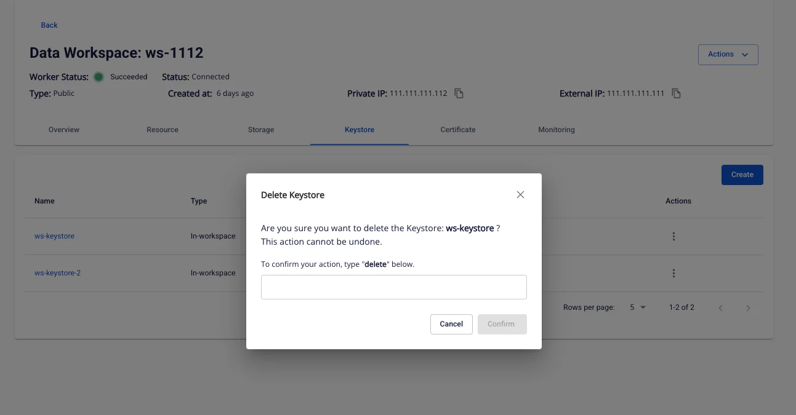

# Keystore Management

**Keystore Management** trong Workspace cho phép người dùng lưu trữ và quản lý khóa/bí mật (keys, tokens, credentials) dùng cho các dịch vụ trong hệ thống.

Keystore có thể nằm **trong Workspace** hoặc tích hợp với dịch vụ lưu trữ khóa bên ngoài (ví dụ: HashiCorp Vault).

### 1\. Danh sách Keystore

**Mục đích:** Hiển thị tất cả Keystore đã tạo.

**Truy cập:** Data Platform > Workspace Management > Keystore

**Màn hình hiển thị:**

 * **Name** – Tên định danh keystore.

 * **Type** – Loại keystore:

 * _Integration_ (tích hợp ngoài, ví dụ HashiCorp Vault).

 * _In-workspace_ (lưu trữ nội bộ).

 * **Vault type** – Kiểu vault khi tích hợp ngoài (vd: HashiCorp).

 * **Created at** – Thời gian tạo keystore.

 * **Action** – Menu thao tác (Cập nhật, Xóa).

### 2\. Tạo Keystore mới

**Bước 1:** vào Data Platform > Workspace Management > Keystore.

**Bước 2:** nhấn **Create** để mở popup **Create keystore**.

#### Case: Type = Integration (kết nối Vault ngoài, vd: HashiCorp)

**Bước 3:** ở trường **Type**, chọn **Integration**.

**Bước 4:** ở **Vault type**, chọn hệ thống bạn dùng (thường là **HashiCorp**).

**Bước 5:** nhập **Name** (tên định danh):

 * chỉ chữ a–z, A–Z, số 0–9, dấu “-”, bắt đầu bằng chữ, tối đa **50** ký tự.

 * nên đặt theo chuẩn mục-đích-môi-trường (vd: s3-prod).

**Bước 6:** nhập **Endpoint** (URL Vault):

 * bắt đầu bằng https://, tối đa **255** ký tự.

 * chỉ chứa chữ, số, dấu “-”, dấu “.” (theo rule hiển thị trên form).

 * ví dụ: [https://vault.example.com](<https://vault.example.com/>).

**Bước 7:** nhập **Token**:

 * token truy cập Vault (ẩn ký tự khi nhập, có thể bật để xem).

 * nhớ dùng token còn hạn; khi thay token sau này bạn sẽ **Update** lại.

**Bước 8:** nhập **Path** và **Key**:

 * **Path**: đường dẫn tới secret trong Vault (min 1, max **255** ký tự).

 * **Key**: tên secret/key trong path (min 1, max **255** ký tự).

 * ví dụ: Path data/lakehouse/s3-key — Key sse-c-key.

**Bước 9:** nhấn **Test connection**:

 * Nếu **OK** → nút **Save** được bật.

 * Nếu **Fail** → kiểm tra lại Endpoint/Token/Path/Key (thường sai quyền truy cập, token hết hạn, path/key không tồn tại, hoặc endpoint không dùng HTTPS).

**Bước 10:** nhấn **Save** để tạo; **Cancel** để hủy.

#### Case: Type = In‑workspace (lưu bí mật ngay trong Workspace)

**Bước 3:** ở trường **Type**, chọn **In‑workspace**.

**Bước 4:** nhập **Name**:

 * quy tắc giống trên: a–z, A–Z, 0–9, “-”, bắt đầu bằng chữ, tối đa **50** ký tự.

**Bước 5:** nhập **Value**:

 * giá trị bí mật (mật khẩu, token, chuỗi kết nối…), tối đa **255** ký tự, **cho phép ký tự đặc biệt** (có icon để

### 3\. Cập nhật Keystore

**Mục đích:** Cho phép thay đổi thông tin cấu hình hoặc giá trị bí mật của keystore khi có thay đổi về endpoint, token, path hoặc nội dung giá trị.

Tại màn hình **Keystore List**, chọn biểu tượng Action (dấu 3 chấm) của keystore cần chỉnh sửa → **Update**.

#### Trường hợp 1 – Type = In-workspace

**Các bước thực hiện:**

**Bước 1:** Tại màn hình **Keystore List**, nhấn nút **Actions** (dấu 3 chấm) của keystore cần chỉnh sửa → chọn **Update**.

**Bước 2:** Cửa sổ **Update Keystore** xuất hiện với các trường:

 * **Type:** Được cố định là _In-workspace_ , không thể thay đổi.

 * **Name:** Tên định danh keystore, chỉ đọc, không chỉnh sửa được.

 * **Value:** Giá trị bí mật cần lưu (tối đa 255 ký tự, cho phép ký tự đặc biệt).

**Bước 3:** Nhập **Value** mới. Có thể nhấn biểu tượng để xem giá trị đang nhập.

**Bước 4:** Nhấn **Save** để lưu thay đổi hoặc **Cancel** để hủy.

#### Trường hợp 2 – Type = Integration

**Các bước thực hiện:**

**Bước 1:** Tại màn hình **Keystore List**, nhấn nút **Actions** của keystore cần chỉnh sửa → chọn **Update**.

**Bước 2:** Cửa sổ **Update Keystore** xuất hiện với các trường:

 * **Type:** Luôn là _Integration_ , không thể đổi.

 * **Vault type:** Kiểu vault (vd: HashiCorp), cố định, không chỉnh sửa.

 * **Name:** Tên định danh, chỉ đọc.

 * **Endpoint:** URL endpoint mới của vault (bắt đầu bằng https://, tối đa 255 ký tự).

 * **Path:** Đường dẫn chứa key trong vault.

 * **Key:** Tên key trong vault.

**Bước 3:** Điền hoặc cập nhật các trường **Endpoint**, **Path**, **Key** theo yêu cầu cấu hình mới.

**Bước 4:** Nhấn **Test connection** để kiểm tra kết nối tới vault.

 * Nếu thành công → nút **Save** sẽ được bật.

 * Nếu thất bại → kiểm tra lại thông tin đã nhập.

**Bước 5:** Nhấn **Save** để lưu thay đổi hoặc **Cancel** để hủy.

### 4\. Xóa Keystore

**Cách mở:** Nhấn **Action > Delete** tại keystore.

**Bước thực hiện:**

 1. Hệ thống hiển thị popup xác nhận.

 2. Nhập từ khóa **delete** vào ô xác nhận.

 3. Nhấn **Confirm** để xóa.

**Điều kiện:**

 * Nếu keystore đang được dùng bởi một dịch vụ, hệ thống báo lỗi:

_“The keystore is in use by: {service_name}”_ và không cho xóa.

