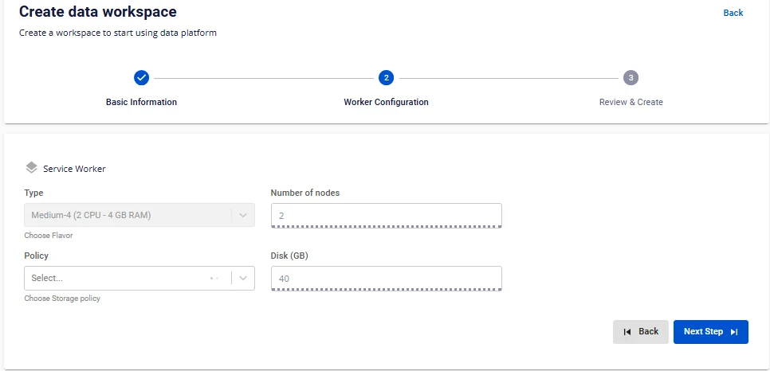

# Tạo workspace

**Workspace** là không gian làm việc của người dùng trên hệ thống **Data Platform**. Mục đích chính của**Workspace** là cung cấp một môi trường cô lập và an toàn để người dùng có thể thực hiện các nghiệp vụ liên quan đến dữ liệu một cách hiệu quả và tiện lợi.

Để tạo workspace, người dùng thực hiện các bước sau:

**Bước 1.** Tại thanh menu chọn **Data Platform** > chọn **Workspace Management** > nhấn **Create a Data Workspace**

**Bước 2.** Trong form tạo workspace, nhập thông tin màn **Basic Information**:

 * **Name** (required): Tên workspace

:::warning
Tên workspace phải từ 1 đến 30 kí tự. Có thể chứa các kí tự chữ cái thường a-z hoặc chữ cái in hoa A-Z hoặc các kí tự số 0-9. Không nhập tên workspace trùng nhau. Đặc biệt không dùng dấu cách có thể thay dấu cách bằng dấu “-” hoặc “_”.
:::

 * **Description** (optional): Mô tả workspace

 * **Type** (required): chọn loại **Public/Private**

 * **Subnet** (required): Chọn network

Workspace chỉ hoạt động với Subnets đã bật tùy chọn **Static Pool**, vì vậy bạn cần tạo một Subnets với Static Pool theo hướng dẫn sau:

Nhấn chọn **Go to Network**

Màn hình chuyển sang màn tạo Subnet, nhấn **Creat Subnet**

Trong form tạo Subnet người dùng nhập các thông tin sau:

 * **Name**: nhập tên Subnet

 * **Type**: chọn type cho Subnet

:::warning
Chọn Type là Routed
:::

 * Network address (CIDR): Nhập CIDR hợp lệ

 * Gateway IP: nhập địa chỉ gateway IP

 * Static IP Pool (optional): Nhập 1 dải IP hợp lệ được lấy từ CIDR.

:::warning
yêu cầu có thông tin **Static IP Pool**:::

 * **Primary DNS**: địa chỉ DNS chính

 * **Secondary DNS** (Optional): địa chỉ DNS phụ

 * **Add tag** (optional): thẻ gắn với subnet

Sau đó nhấn **Create subnet** để hoàn thành tạo Subnet.

 * **LB Size** (required): Chọn đúng LB được cấp

:::warning
kiểm tra quota LB trước khi tạo **Workspace** bằng cách trên menu chọn **Dashboard**, phần **load balancer** chọn **detail**. Nếu chưa có liên hệ sale support
:::

**Bước 3.** Nhấn nút **Next Step** để chuyển sang màn **Worker Configuration**

Nhập thông tin màn **Worker Configuration**:

 * **Policy** (required): chọn **storage policy** cho **Service worker**

 * **Type**: giá trị mặc định là Medium-4(2 VCPU – 4 GB RAM)

 * **Number of nodes**: giá trị mặc định là 2

**Disk (GB)**: giá trị mặc định là 40

**Bước 4.** Nhấn nút **Next Step** để chuyển qua màn **Review & Create**

**Bước 5.** Kiểm tra thông tin sau đó nhấn **Create** để hoàn thành việc tạo workspace

**Workspace** hoàn thành khởi tạo khi **Worker Status** là **Succeeded** và Status là**Connected** (~10 phút)
