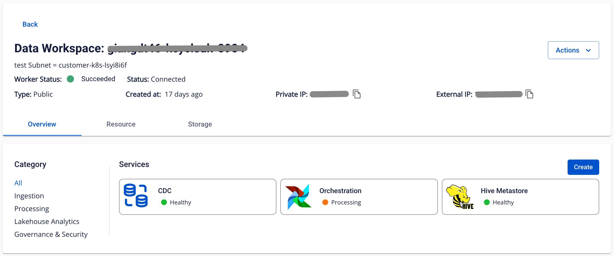
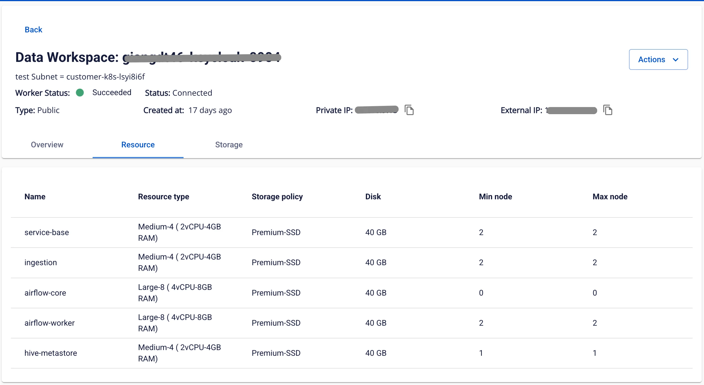

# Xem thông tin workspace

Để xem thông tin workspace, người dùng thực hiện hiện các bước sau:

**Bước 1.** Tại thanh menu chọn **Data Platform** > chọn **Workspace Management**

**Bước 2.** Nhấn vào một **workspace name**

Màn hình hiển thị 3 tab: **Overview**, **Resource**, **Storage**

**Tab Overview**

Màn hình hiển thị các**service** đã được cài trong workspace

**Tab Resource**

Hiển thị phần cấu hình **Resource** cho workspace

**Tab storage**

Quản lý các nguồn dữ liệu tích hợp (**Mount**) trên **Workspace**.

Để tạo storage, người dùng thực hiện các bước sau:

**Bước 1.** Tại thanh menu chọn **Data Platform** > chọn **Workspace Management** > nhấn vào một **workspace name**

**Bước 2.** Chọn tab **Storage** > nhấn **Create**

**Bước 3.** Hiển thị hộp thoại chọn các thông tin sau:

 * **Category**:

 * **Airflow - Jupyterhub - Spark service**: storage cho các service sau: **Airflow**, **Jupyterhub**, **Spark service**

 * **Flink**: Storage cho **Apache Flink**

 * **Ingestion service**: Storage cho **Ingestion service**

 * **Type**: chọn loại storage, bao gồm: **S3**, **NFS**

**Bước 4.** Nhấn nút **Create**, màn hình chuyển sang màn nhập các thông tin kết nối **Storage**:

 * **Name** (required): tên gói

 * **Bucket name** (required): tên bucket

 * **Endpoint** (required): địa chỉ

 * **Access key** (required): khóa truy cập

 * **Secret** (required): mã bảo mật

Sau khi nhập thông tin kết nối, người dùng ấn **Test connection** để kiểm tra kết nối từ **Workspace** tới **S3** đã nhập

Nếu **Type** là **NFS**, màn hình chuyển sang màn nhập các thông tin kết nối storage:

 * **Version** (required): phiên bản NFS

 * **Port** (required): cổng kết nối

 * **Name** (required): tên storage

 * **Server address** (required): địa chỉ máy chủ NFS

 * **Directory** (required): thư mục

**Bước 5.** Nhấn nút **Create** để hoàn thành việc tạo **storage**
