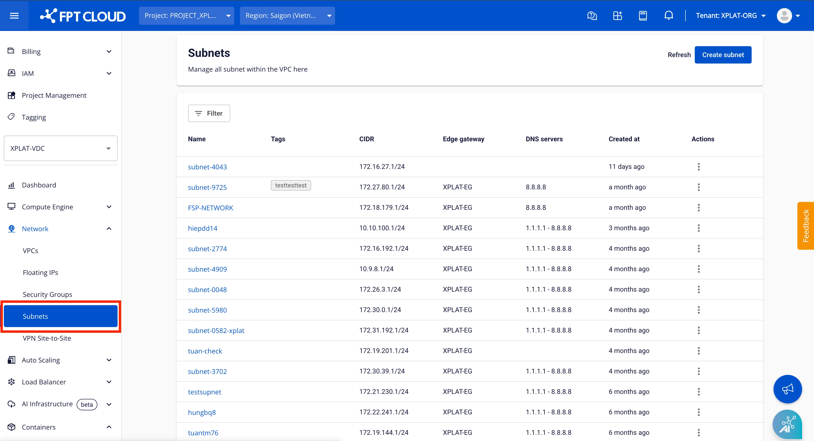

Initial Setup

Nếu đây là lần đầu tiên bạn sử dụng MANAGED GPU CLUSTER, trước tiên hãy kiểm tra và hoàn thành các công việc sau:

### 1\. Tạo tài khoản FPT Cloud và đăng nhập vào FPT Portal

Để đăng ký tài khoản FPT Cloud, bạn hãy truy cập trang chủ [tại đây](<https://fptcloud.com/>).

Sau đó chọn chức năng **Sign Up** và nhập các thông tin theo hướng dẫn của hệ thống. Bạn sẽ được bộ phận hỗ trợ liên hệ ngay sau đó và xác nhận các thông tin để tạo tài khoản.

Để đăng nhập vào FPT Portal, bạn hãy truy cập vào [console.fptcloud.com](<https://console.fptcloud.com/>).

Sau khi đăng nhập bằng tài khoản và mật khẩu đã được cấp, chọn đúng Tenant, Region, VPC.

Nếu không chắc chắn về các thông tin trên hoặc hệ thống phản hồi lỗi sau 3 lần thử thì hãy liên hệ ngay cho đội ngũ Support của chúng tôi để được hỗ trợ.

:::warning
Tài khoản phải có xác thực 2 bước (MFA) để có thể sử dụng sản phẩm AI Factory
:::

### 2\. Tạo Subnets cho Bare Metal GPU Servers sử dụng trong Managed GPU Cluster

Để tạo một Managed GPU Cluster, trước tiên bạn cần có một dải subnet trên Bare Metal GPU Servers, những máy tính này sẽ có nhiệm vụ như là các Worker node trong K8s Cluster. Địa chỉ IPv4 cho các Worker Bare Metal GPU sẽ được cấp phát động từ subnet này.

**Bước 1:** Tìm đến mục [AI Infrastructure] > chọn [Subnets] > chọn [Create Subnet]

**Bước 2**: Nhập tên mong muốn đặt cho subnet

**Bước 3:** Nhập tên cho Network ACL ứng với subnet

**Bước 4**: Nhấn [Create Subnet] để hoàn tất quá trình tạo subnet cho Bare Metal GPU

:::warning
Network ACL được tạo mặc định cho subnet sẽ chặn tất cả các lưu lượng vào (inbound) và cho phép tất cả lưu lượng ra (outbound). Để sử dụng Load Balancer cho Managed GPU Cluster, bạn cần mở các Rule phù hợp cho dải subnet Load Balancer để cho phép kết nối.
:::

### 3\. Tạo Subnets cho Load Balancer

Managed GPU Cluster Cluster chỉ hoạt động với Subnets đã bật tùy chọn Static Pool, vì vậy bạn cần tạo một Subnets với Static Pool theo hướng dẫn sau:

**Bước 1:** Ở phần **Network** chọn tab **Subnets**

**Bước 2**: Chọn **Create Subnet** ở trang **Subnets Management**

 **Bước 3:** Nhập các thông tin sau:

  * **Name:** Nhập Tên gợi nhớ của Subnet
  * **CIDR:** Nhập **CIDR** hợp lệ
  * Tích chọn vào tùy chọn **Advanced settings**
  * **Static IP Pool:** Nhập 1 dải IP hợp lệ được lấy từ CIDR.

Chọn **Save** để tạo Subnet mới. Hệ thống sẽ tiến hành xử lý và thông báo kết quả.

### 3\. Yêu cầu kích hoạt dịch vụ Managed GPU Cluster và cấp quota tài nguyên

Nếu đây là lần đầu tiên sử dụng FPT Cloud, một số dịch vụ có thể chưa được mở cho tài khoản của bạn. Hãy liên hệ với đội ngũ hỗ trợ của chúng tôi và cung cấp các thông tin về dịch vụ, cấu hình mong muốn. Chúng tôi sẽ cấp cho bạn các tài nguyên cần thiết như RAM, CPU, Storage, Public IP… để có thể bắt đầu sử dụng dịch vụ Managed GPU Cluster.

Liên hệ với đội ngũ hỗ trợ của chúng tôi qua:

**Hotline**: 1900638399

**Email**: support@fptcloud.com
