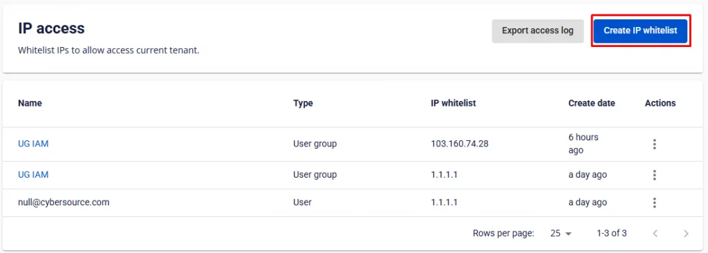
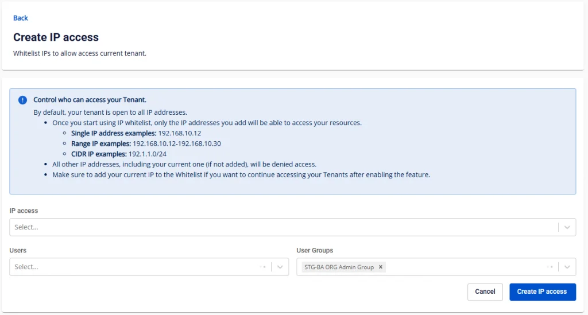
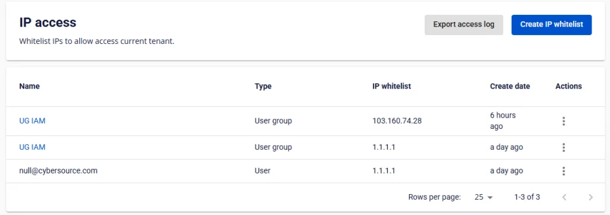

Khởi tạo một record IP access mới

**Bước 1**: Ở menu chọn **IAM** , chọn tab **IP access**. Tại đây bạn có thể quản lý danh sách người dùng được truy cập.

**Bước 2**: Chọn **Create**.

**Bước 3**: Tại trang khởi tạo IP access, bạn nhập các thông tin về địa chỉ IP access và danh sách người dùng. Vui lòng đọc kỹ hướng dẫn trước khi cài đặt. Sau đó bấm “Create ip access"

  * IP Access: Có thể chọn 1 hoặc nhiều IP, dãy IP hoặc CIDR IP

  * Users: có thể chọn 1 hoặc nhiều users

  * User groups: có thể chọn 1 hoặc nhiều user groups, tất cả user trong group sẽ được áp dụng

Sau khi khởi tạo thành công, record sẽ xuất hiện ở màn hình danh sách

