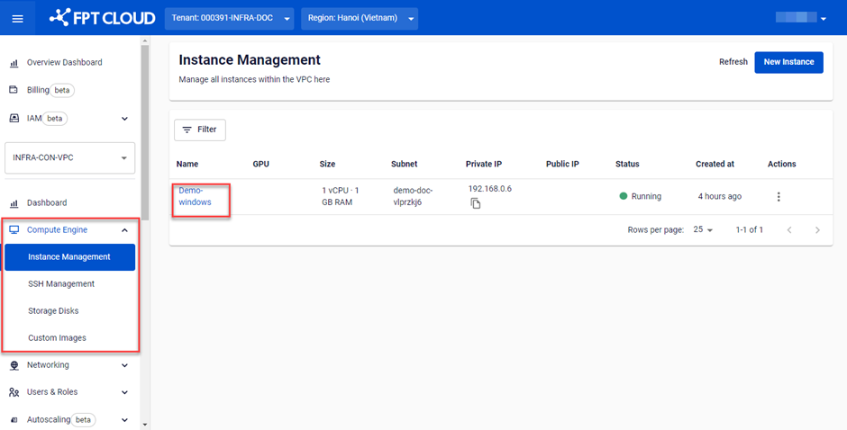
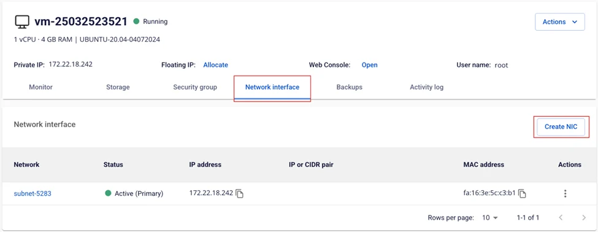
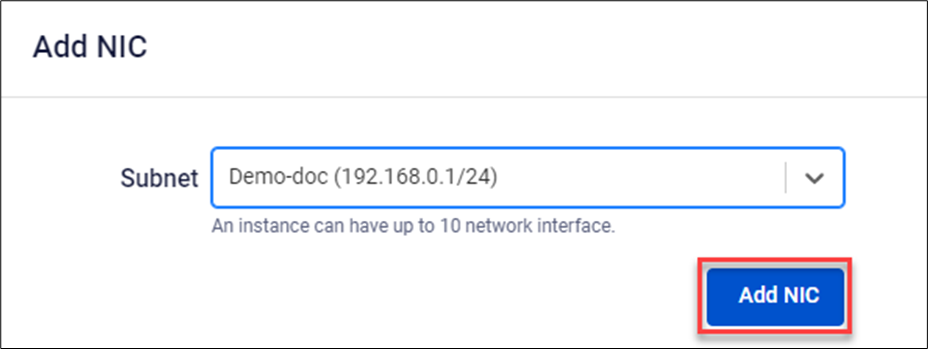
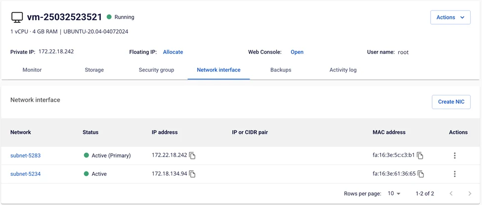
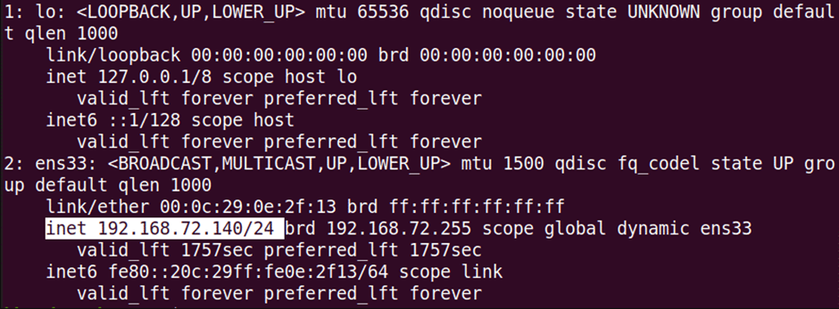
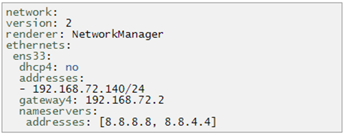

Attach a Network Card (NIC) to a Virtual Machine


You can attach up to 10 network cards to a single virtual machine. To attach an additional network card to a virtual machine, follow these steps:

**Step 1**: In the menu, select **Compute Engine** > **Instance Management**. Select the virtual machine to which you want to attach a **Subnet** to go to the **Instance Detail** page.



**Step 2**: Open the **Network Interface** tab. The system will display the list of network cards currently attached to the virtual machine, along with information about the **Subnet** each card is connected to. Select **Add NIC**.



**Step 3**: Select the **Subnet** within the **VPC** to attach to the virtual machine. Select **Add NIC** to confirm.



The system will process the request and display the result.

If successful, the new network card will appear in the **Network** table.



After adding the NIC in the FPT Portal, Windows and Linux virtual machines will typically detect the new network card automatically, and no manual configuration is required.

However, in some cases — if the Linux user is performing an operation on the virtual machine or if there is an OS error — the network card may not appear. Restart the machine to apply the configuration. If the issue persists, configure it manually using the following instructions:

### View Current IP Address
To view the current IP address of the machine, Linux users can use one of the following commands:
```
$ ip a
```

Or:
```
$ ip addr
```



### Set a Static IP Address
Ubuntu 20.04 uses netplan as the default network manager. The netplan configuration file is stored in the /etc/netplan directory. You can find the configuration file listed in that directory using the following command:
```
$ ls /etc/netplan
```

The command will return the name of the configuration file with a .yaml extension — in the example below, it is 01-network-manager-all.yaml.

Before making any changes to this file, make sure to create a backup. Use the cp command to do so:
```
$ sudo cp /etc/netplan/01-network-manager-all.yaml 01-network-manager-all.yaml.ba
```

Note: The configuration file may have a name other than 01-network-manager-all.yaml. Use the correct configuration file name in all commands.

Then, add the following lines, replacing the interface name, IP address, gateway, and DNS information to match your network requirements.


