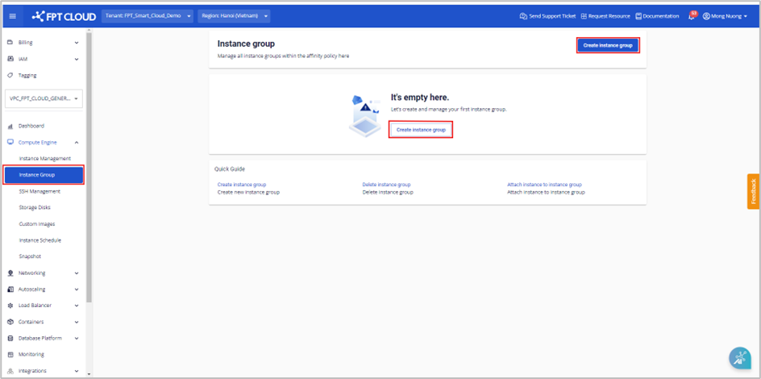
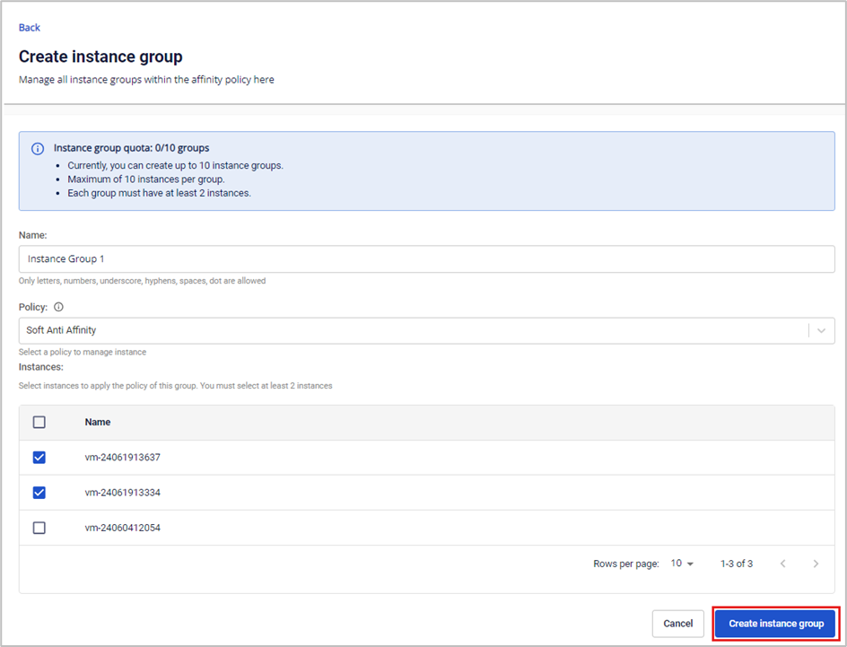

Create a New Instance Group

### For users using General resource type
Users can create a new instance group with the following steps:

**Step 1**: In the menu, select **Compute Engine** > **Instance Group**, then click **Create instance group**.

**Step 2**: Enter the required information:

  * **Name**: Name of the instance group.

  * **Policy**: Choose either the Soft Affinity or Soft Anti-Affinity policy to apply to the instance group being created.

**Note: The system supports creating a maximum of 10 instance groups, and each instance group can be attached to a maximum of 10 instances.**

**Step 3**: Click **Create instance group**. The system will initialize and notify you of the result.

If successful, the new instance group will be displayed on the **Instance Group** page.

**Note: The system does not support editing instance groups on general resources; only deletion and recreation of a new instance group is supported.**

### For users using Specific resource type
For specific resource types, create an instance group with the following steps:

**Step 1**: In the menu, select **Compute Engine** > **Instance Group**, then click **Create instance group**.

**Step 2**: Enter the required information:

  * **Name**: Name of the instance group.

  * **Policy**: Choose either the Soft Affinity or Soft Anti-Affinity policy to apply to the instance group being created.

  * **Instances**: Users must select at least 2 instances to create an instance group.

**Note:**

  * The instance list only shows virtual machines with the following statuses: Running, Stopped.

  * Each VPC can have a maximum of 10 instance groups, and each instance group can have a maximum of 10 instances.
