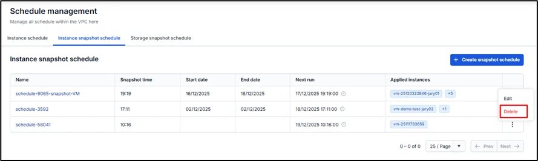
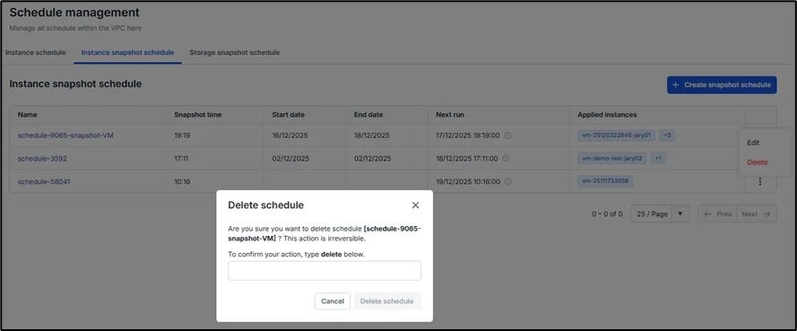

Delete a virtual machine snapshot schedule

**Step 1:** On the Instance snapshot schedule tab, select the schedule name in the action section and choose Delete.

**Step 2:** A warning dialog will appear, displaying the schedule name and asking the user to confirm. Type the word "delete" and click **Delete schedule** to proceed. The system will then completely remove the schedule, and any virtual machines that are currently attached (if any) will be released and retain their current status.

