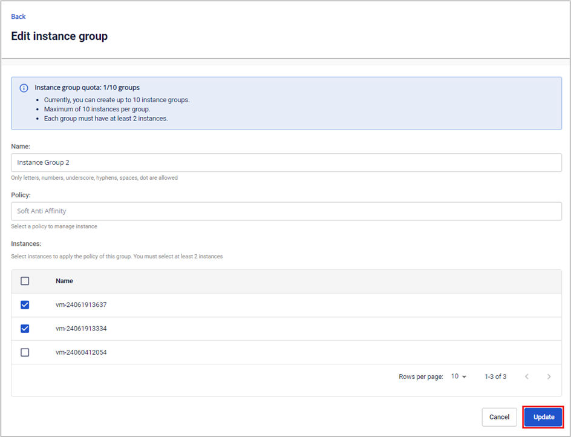

Edit Instance Group

_This feature applies only to users of the Specific service type._

**Step 1**. In the menu, select **Compute Engine** > **Instance Group**, then click **Edit** on the instance group.

**Step 2**. Edit the instance group information. Click **Update** to save the changes.

  * **Name**: Change the instance name

  * **Policy**: By default, users cannot edit the Policy

  * **Instances**: Change instances from the list

**Note:**

  * **Users cannot edit the policy information**

  * **The instance group can have its instances changed, but must always maintain at least 2 instances in the group**
