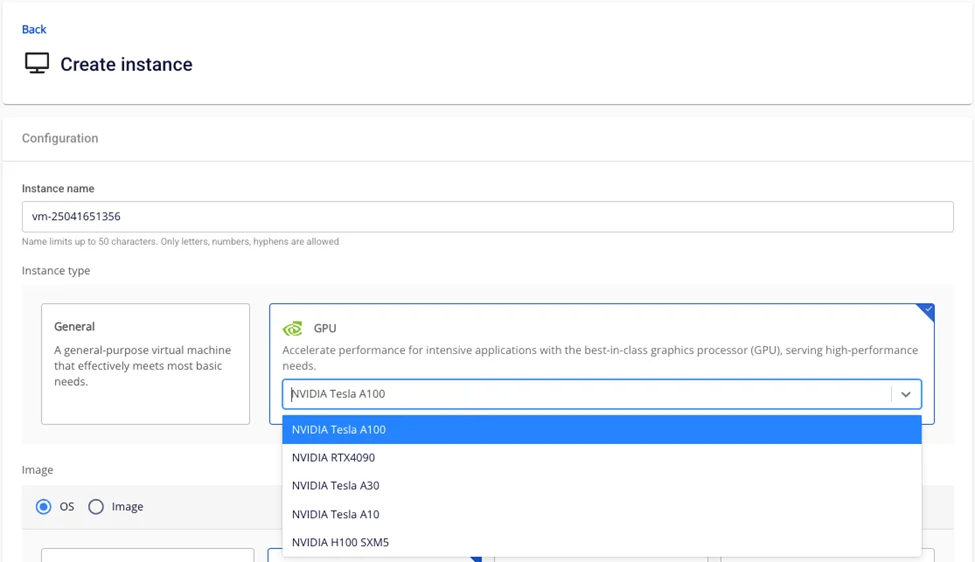
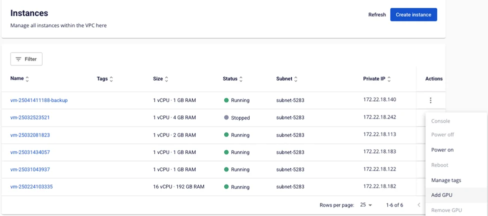
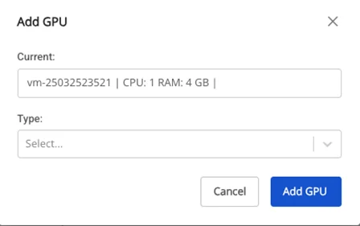

Manage GPU with Console Portal

## 1\. Create a Virtual Machine with GPU
Users can create a virtual machine with GPU.

**Step 1**: On the **Instance Management** screen, select **Create instance**.

**Step 2**: Select GPU and the GPU card type to use.

**Step 3**: Enter the remaining instance information.

**Step 4**: Click **Create Instance**.

**Step 5**: Verify the information. The information is updated on the Instance detail screen.

## 2\. Add GPU to an Instance in Instance Management
**Step 1**: On the **Instance management** screen, select the virtual machine to which you want to add a GPU.
:::warning
* Users must **Power off** the virtual machine before adding a GPU (status must be "Stopped").
:::

  * For machines in other states such as "Running" or "Pending", the feature will be **disabled**.

**Step 2**: Select **Actions**, then select **Add GPU**.

**Step 3**: Select the **GPU type** to add to the instance.

  * The system displays a list of compatible **GPU types** for the user to choose from.

    * **Current**: the current instance configuration

    * **Type**: only GPU resource types can be selected (standard configurations are not available in the list)

**Step 4**: Click the **Add GPU** button.

  * The system updates the information and adds the GPU to the instance.

**Step 5**: Verify the information. The information is updated on the Instance detail screen.

## 3\. Remove GPU from a Virtual Machine
**Step 1**: On the **Instance management** screen, select the virtual machine from which you want to remove the GPU.
:::warning
* Users must **power off** the virtual machine before removing the GPU (status must be "Stopped").
:::

  * For machines in other states such as "Running" or "Pending", the feature will be **disabled**.

**Step 2**: Click the **Remove GPU** button.

**Step 3**: Select the **resource type**:

  * **Current**: the current GPU instance configuration

  * **Type**: only standard resource types can be selected (GPU configurations are not available in the list)

**Step 4**: Click the **Remove GPU** button.

**Step 5**: The system will remove the GPU and convert the instance to the selected resource type. The updated configuration information will be reflected on the **Instance management** screen.

## 4\. Resize GPU Parameters of an Instance
**Step 1**: On the **Instance management** screen, select the virtual machine whose GPU you want to resize.
:::warning
* Users must **power off** the virtual machine before resizing the GPU (status must be "Stopped").
:::

  * For machines in other states such as "Running" or "Pending", the feature will be **disabled**.

**Step 2**: Click the **Resize** button.

**Step 3**: Select a **template** and a **resource type** (if the instance is a GPU instance, it can only be resized to a GPU type; if it is a standard instance, it can only be resized to a standard type).

  * For instances with GPU, the instance can only be resized to a GPU type.

  * For instances without GPU, the instance can only be resized to a non-GPU type. If users want to resize to a GPU type, they can use the Add GPU feature instead.

**Step 4**: Click the **Resize Instance** button.

**Step 5**: Verify the information. The information is updated on the **Instance Management** list screen and in the **Instance** detail page.
