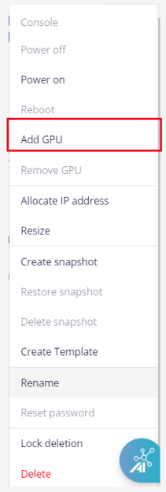
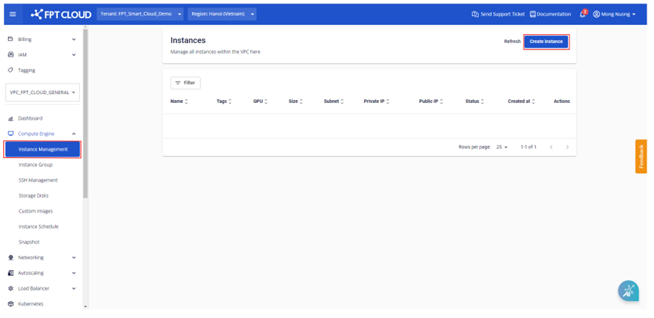

GPU Management with Console Portal for the Specific Service Type

## 1. Add a GPU to an Existing Virtual Machine
To attach an additional GPU to a previously created virtual machine, follow these steps:

**Step 1**: In the menu, select **Instance Management**. Under the **Actions** section, select **Add GPU.**

:::warning
Shut down the server before adding a GPU card to the machine.
:::

**Step 2**: Select the **GPU** configuration from the corresponding list and click **Update**.

The virtual machine must meet a minimum configuration of 8 vCPU – 24 GB RAM to use this feature.

## 2. Create a New GPU Virtual Machine
  * Users need to be allocated GPU quota to perform this action. When the VPC has run out of GPU usage quota, users will receive an error notification when creating a new GPU Server.

  * After creation, the system will immediately add the GPU to the virtual machine. Users can access the virtual machine console to verify the GPU information.

  * The minimum configuration to create a GPU Server is 8 vCPU – 24 GB RAM.

**Step 1**: In the menu, select **Compute Engine** > **Instance Management**, then click **Create instance**.

**Step 2**: Configure the virtual machine according to your needs with the following options:

  * **Instance Type**: Select GPU.
  * **GPU type:** Select the appropriate GPU type from the list.
  * **Image:** Select the main OS that suits your needs. Each OS group includes different versions. The default is the latest version.
  * **Resource type**: Select the appropriate configuration for the virtual machine from the list.
  * **Local Storage**: Add a disk to the machine, increase or decrease capacity, or use the default capacity (minimum 40 GB).
  * **Subnet & Private IP**: Auto-assign Subnet and private IP based on the VPC network. Users can change this if desired.
  * **Instance name**: Enter the virtual machine name for easy management. This will also be the hostname of the virtual machine.
  * **Authentication type**: Standard (Username/Password) or SSH key. If SSH Key is selected, the system will use the most recent SSH key (can be changed). If using the Standard method, users should remember and keep the password secure.

**Step 3**: Click **Create Instance** to create the virtual machine. The system will display a confirmation, verify resources, and proceed with the initialization of the new virtual machine based on the selected configuration.

After successful initialization, users can see the newly created virtual machine and check its information on the management dashboard. Each virtual machine will display complete information about its name, configuration (RAM, CPU, GPU, Storage), IP address, and operating status (Off/On/Suspended) on the panel.

## 3. Remove a GPU from a Virtual Machine
If you have previously attached a **GPU** to a virtual machine and no longer need it, you can remove the **GPU** with the following steps:

**Step 1**: In the menu, select **Instance Management**. Under the **Actions** section for the virtual machine from which you want to remove the **GPU**, select **Remove GPU**.

**Step 2:** Confirm the **GPU** removal information and click **Update.**
