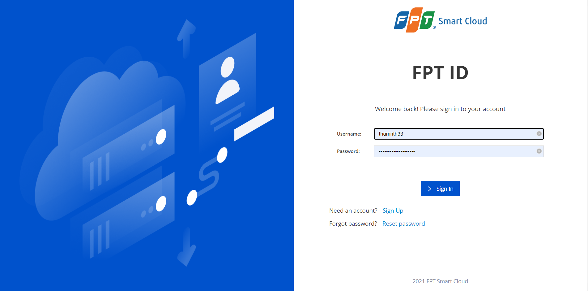
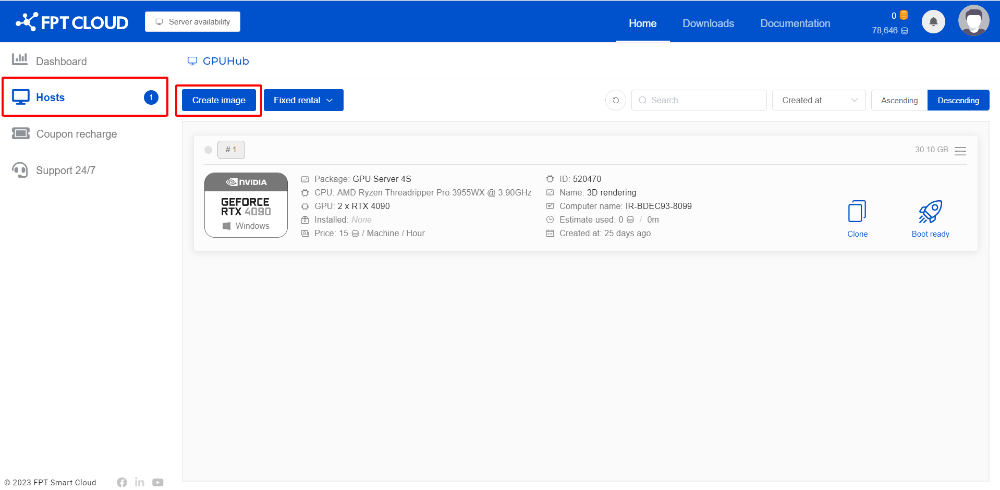
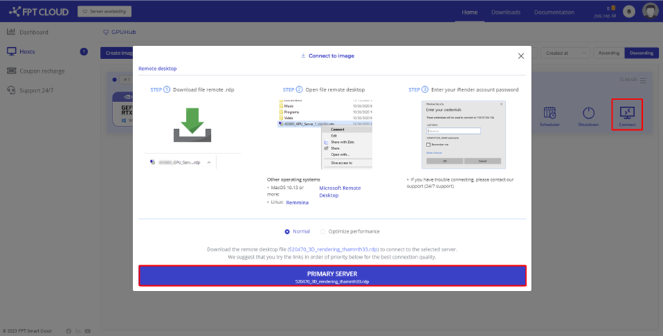
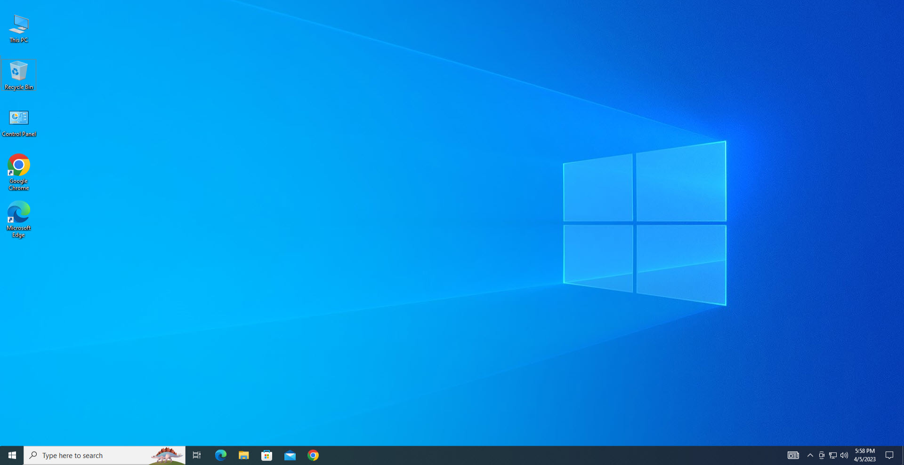
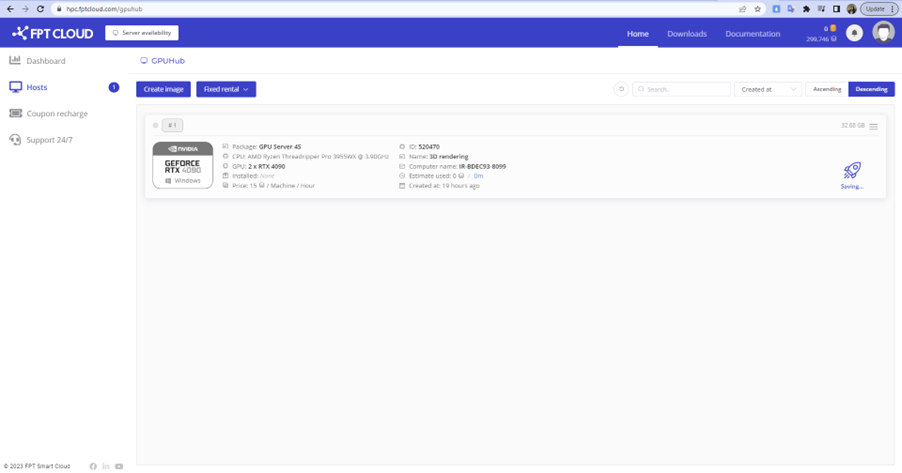

Quick Start Guide

To initialize and use a GPU Server on the HPC Portal, please follow the steps below:

**Step 1**: Log In

To log in and create a machine on the HPC Portal, please contact your administrator to grant permissions and allocate resources to your account.

After resources have been allocated, visit the [HPC Portal](<https://hpc.fptcloud.com/>) at <https://hpc.fptcloud.com> and log in using your FPT ID account.

**Step 2**: Create an Image

Go to Hosts > Create image to create a new GPU machine image.

Next, select the server configuration you want to use, provide a name, choose either Windows or Linux as the operating system, then click **Continue** > **Create Image**.

**Step 3**: Boot the Remote Machine

After the image has been created successfully, click **Boot ready**, then select **BOOT MACHINE** and wait 10–15 minutes for the machine to start.

The boot time depends on the image size (Image Size — everything you have installed on our server).

**Step 4**: Connect to the Remote Machine

There are 2 ways to connect to the machine that has been created and booted:

**Method 1**: SSH into the machine using the following credentials:

– Username: administrator

– Password: The secondary password that the user has set up

**Method 2**: Use Remote Desktop:

After the machine boots successfully, a **Connect** button will appear in the user interface as shown below.

:::warning
The system will start charging from the moment the Connect button appears in the interface. Charges will stop when you click the Shutdown button.
:::

To connect to the machine, click the Connect button and download the Remote Desktop Connection file (.RDP), then open the RDP file and enter your account password to log in.

If you are using macOS, you need to install [Microsoft Remote Desktop](<https://apps.apple.com/vn/app/microsoft-remote-desktop-10/id1295203466?l=vi&mt=12>) to open the .RDP file.

**Step 5**: Transfer Data to the Machine and Retrieve Results

Users can use online file transfer tools such as Google Drive, Dropbox, etc. to transfer data to be processed onto the machine.

Next, install the necessary software on the machine, then use online file transfer tools again to retrieve the result files to your personal computer.

**Note:** You only need to install software **once**. The HPC system will save your working environment after each shutdown, so you will not need to reinstall anything next time.

**Step 6**: Shut Down the Machine

After you finish using the machine and have transferred the result files to your personal computer, you must shut down the machine to stop billing.

To shut down, click the Shutdown button on the HPC Portal. The system will save all machine settings after the user shuts down.

If you want to schedule your server to shut down at a specific time in the future, click the **Schedule** button to set the shutdown time.

:::warning
Do not let your account run out of funds while using the server, as the server will automatically shut down, which may affect your work results — especially if you are rendering video.
:::
