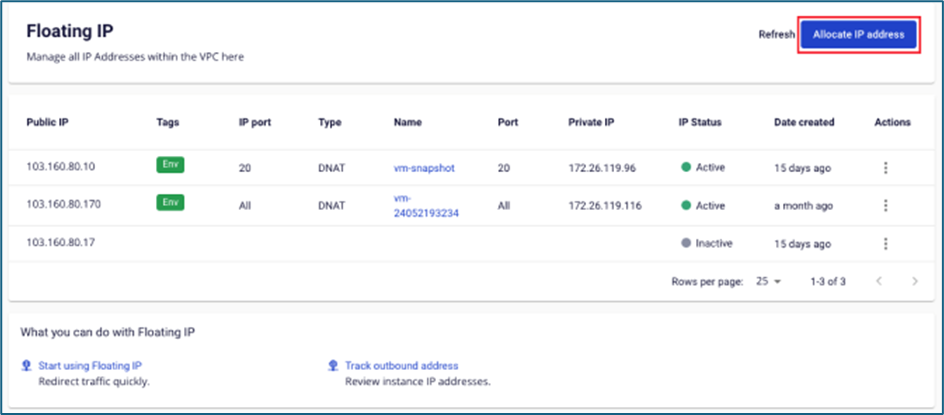
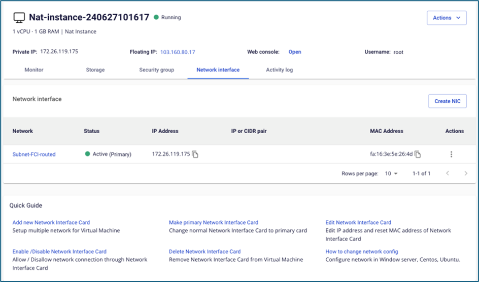
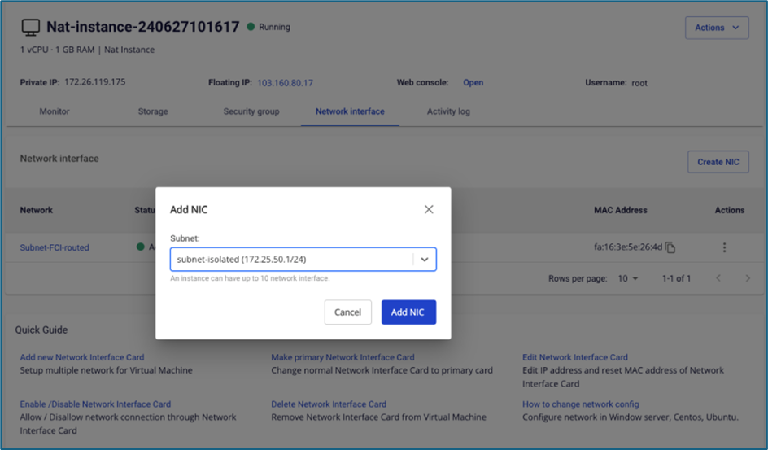
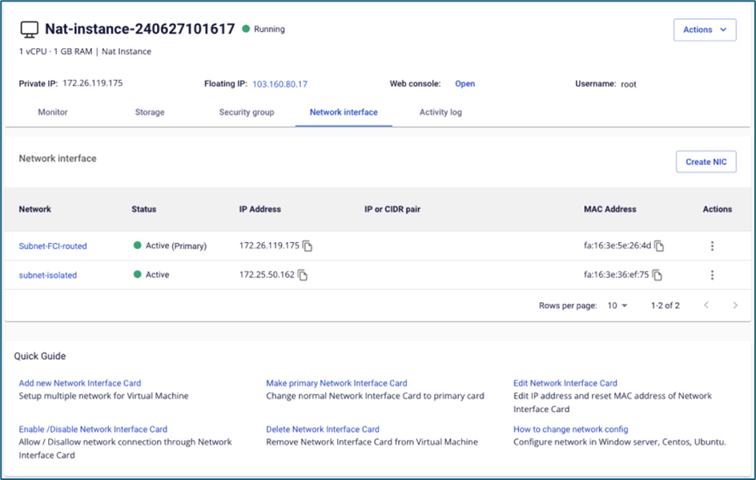
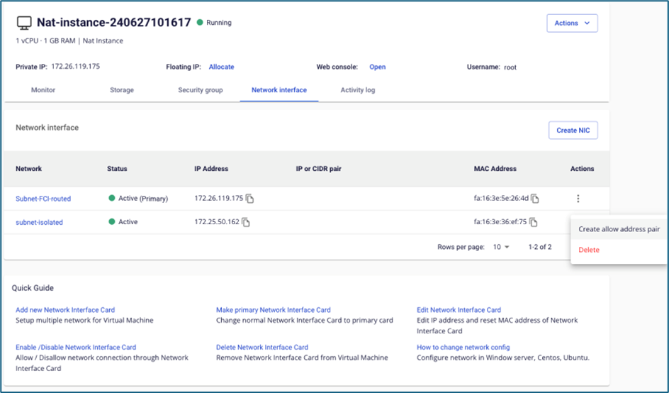

NAT Instance

This feature enables instances in an isolated network to access external Internet systems, such as installing software or connecting back to an on-premise environment.

Set up a NAT Instance as follows:

**Step 1**: Create a NAT Instance from the image provided by FCI.

**Note: For the subnet field, select a subnet that has Internet access.**

**Step 2**: Attach a Floating IP to the NAT Instance. If the instance already had a Floating IP attached during the initialization step, you do not need to perform this action.

**Step 3**: Attach a security group to the NAT Instance. Open the necessary rules for instances in the isolated network to access the Internet (you may also open the ICMP port to test ping connectivity). If the instance was already attached to a security group during the initialization step, you do not need to perform this action.

**Step 4**: Add a Network Interface Card (NIC) belonging to the same subnet as the isolated subnet of the instance that needs Internet access.

**Step 5**: Allow address pair 0.0.0.0/0 for the NIC belonging to the isolated network.

**Step 6**: Access the instance in the isolated network and change the gateway to the IP of the NAT Instance's NIC. In this example, FCI uses a Windows OS instance.

")
