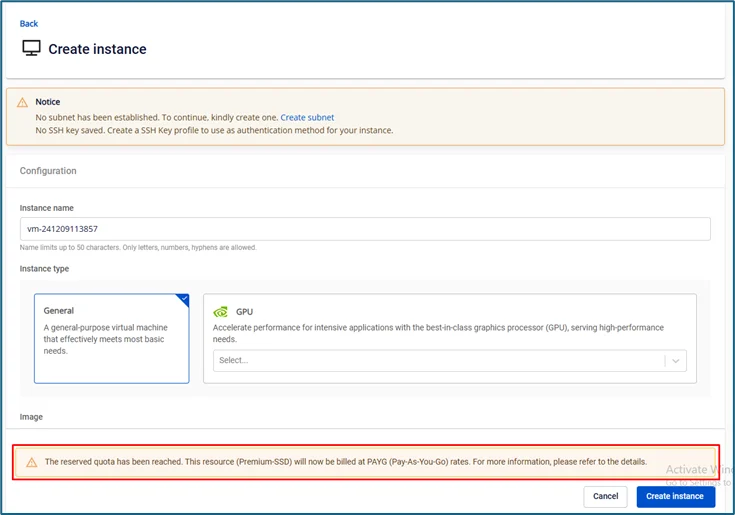
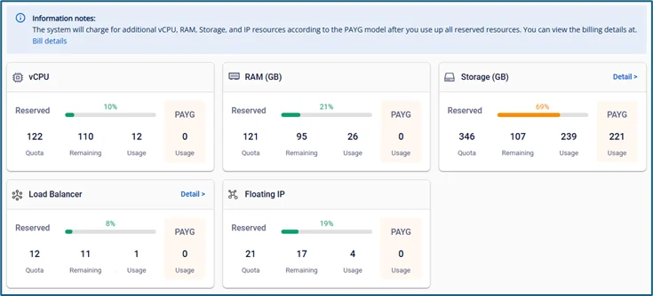

Using the Pay-As-You-Go (PAYG) Billing Service

When users have exhausted their prepaid resources, they can continue creating resources using the PAYG payment method.

## 1\. Create Resources Billed Under PAYG
During the creation of a new resource, if the service quota is exhausted, users will receive a notification indicating which resource type has run out, and the payment method will be switched accordingly.

Services that currently support PAYG billing:

  1. Virtual Machines: create, clone, resize VMs, create snapshots/templates from VMs
  2. Storage: create, resize storage, create snapshots from storage
  3. IP: Allocate IP
  4. Load Balancer v1 (general server only)
  5. Auto Scaling
  6. K8S/DB

## 2\. Dashboard Information Display
Displays tenant statistics:

  * Quota: total quantity from all active contract annexes (active) or expired but not yet reclaimed (expired)

  * Remaining: the amount of resources the user still has available to use

  * Usage: the amount of resources the user has already used

  * PAYG: when prepaid resources under the contract annex are exhausted, the system begins counting PAYG resources, which are billed at the PAYG rate.

Note: The quantity of PAYG resources is not fixed. When users delete resources and bring the total below the prepaid quantity, the system automatically updates the figures and stops charging for PAYG resources.

## 3\. Billing Information Display
To view detailed billing calculations and the amount used under the PAYG method, users can visit the Bills page by accessing the Unify Portal and selecting Billing -> Bills.

View the PAYG billing user guide at: <https://fptcloud.com/documents/billing/?doc=view-billing>

Note: This feature may not yet be available to all customers. If you are interested, please contact the support team for more information.
