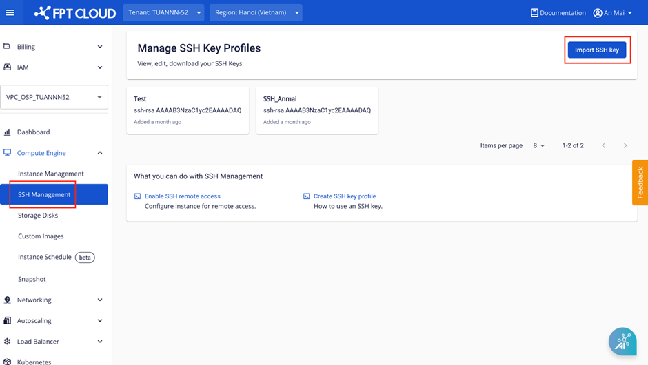
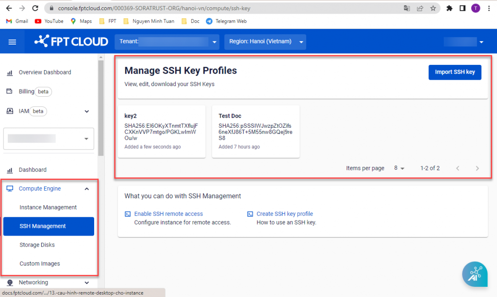
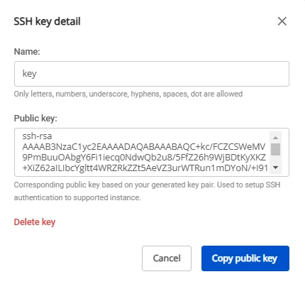
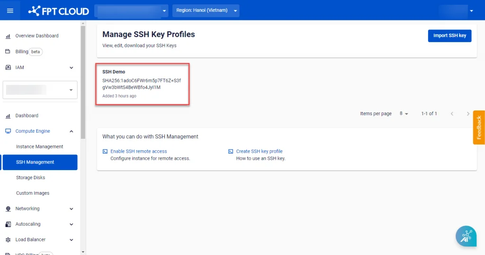
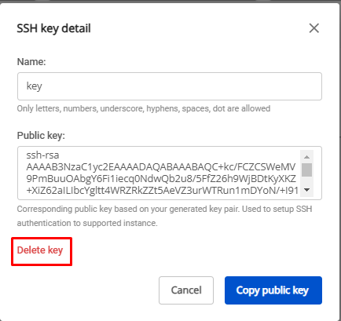

Profile SSH Key

### 1\. Create/Import an SSH Key Profile
**Step 1:** In the menu, select **Compute Engine** > **SSH Management**. Select **Import SSH key**.

**Step 2:** Enter the required information to create an SSH Key:

  * **Name:** The name of the SSH Key.
  * **Public Key**: The Public Key used by the system to generate the Private Key. If you already have a Public Key, enter it in the Public Key field. If not, select **Generate new key pair**. The system will automatically generate a valid **Public Key** for you.

Currently supported SSH key formats: 'ssh-rsa', 'ecdsa-sha2-nistp256', 'ecdsa-sha2-nistp384', 'ecdsa-sha2-nistp521', 'ssh-ed25519'.

**Step 3:** Once all information is filled in, click **Save**. The system will create the **SSH Key** pair and automatically download the key file to your machine in **< >.pem** format.

**Note:** The Private Key file **< >.pem** is only provided once at step 3. Users must store it in a safe location to avoid losing access to the server.

### 2\. View SSH Key Profile Details
Users can view all **SSH Key Profiles** created within the **VPC** under **Manage SSH Key Profiles**.

When a specific **SSH Key Profile** is selected, the system displays the **Name** and **Public Key**.

### 3\. Delete an SSH Key Profile
To delete an **SSH Key Profile** from **Manage SSH Key Profiles**, follow these steps:

**Step 1:** Select the **SSH Key Profile** to delete and open the **Detail** popup.

**Step 2:** Click the **Delete** icon. The system will immediately delete the **SSH Key Profile** and display the processing result.

**Note:** This action only removes the **SSH Key Profile** from **Manage SSH Key Profiles**. Virtual machines that were created using this **SSH Key** are not affected. Users can still use the previously downloaded **Private Key** file to connect to the virtual machines.
