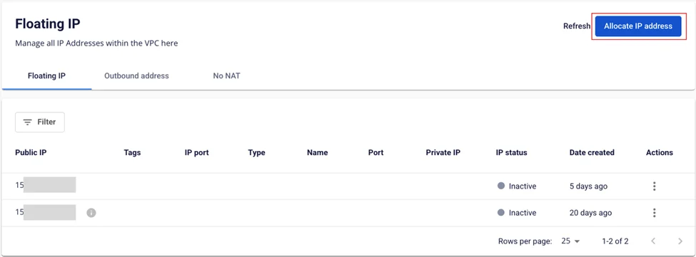
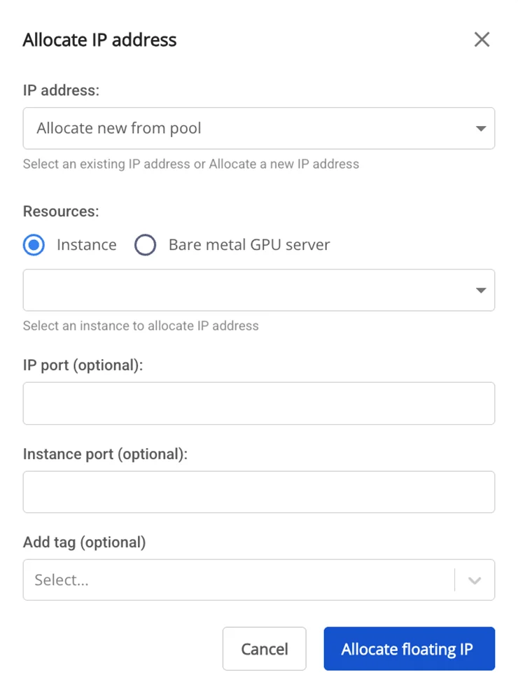
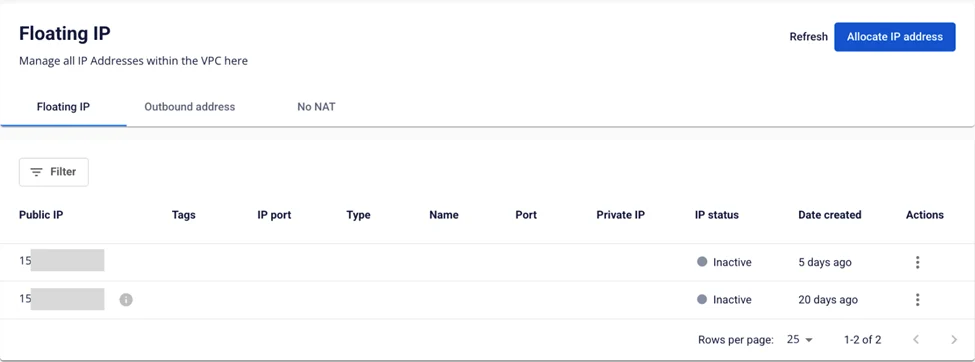
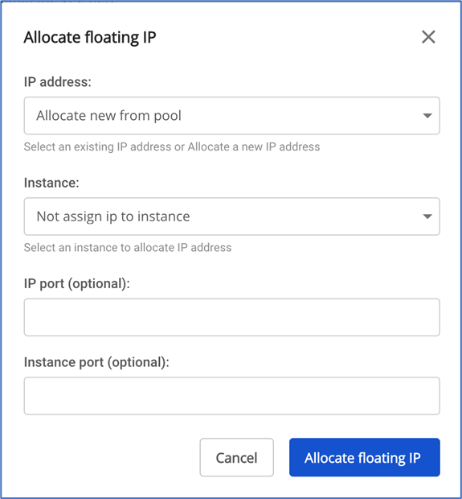
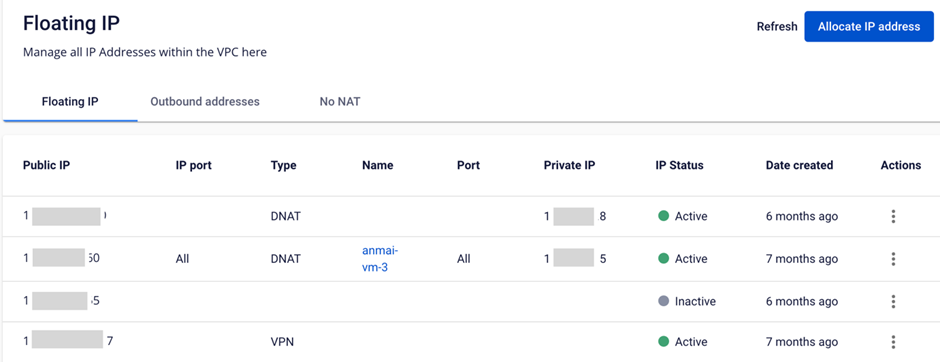
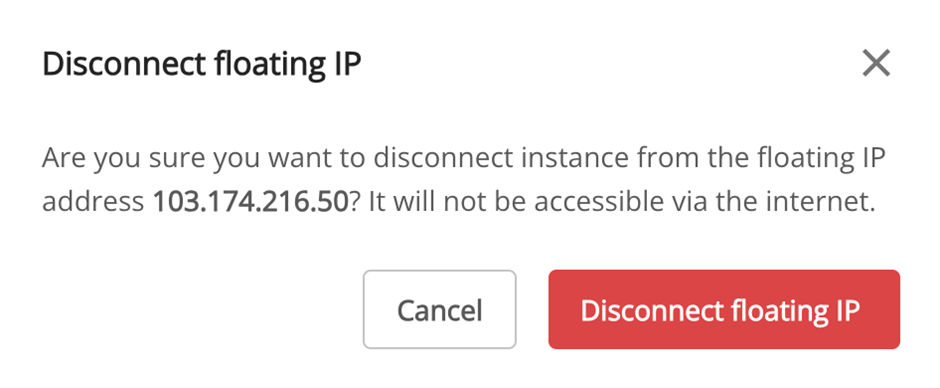
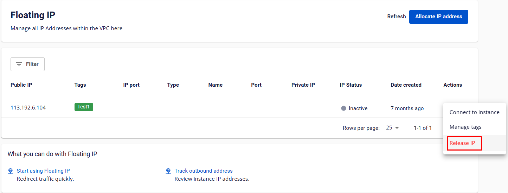
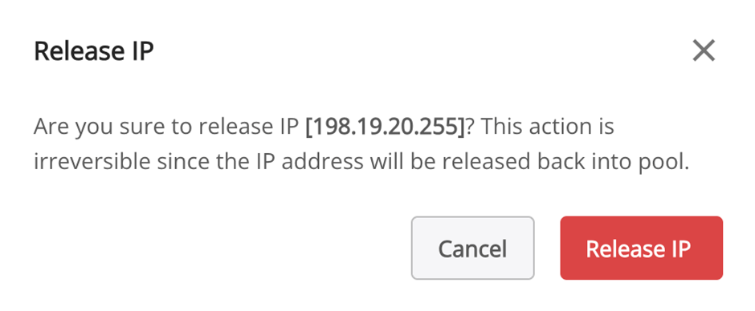

Floating IP Management

**Floating IP** is used to retain a **Public IP** address and route internet traffic to a virtual machine. To make a virtual machine accessible from the internet, you need to attach a **Floating IP** to it.

If you no longer need it or want to change the endpoint, you can redirect the **Floating IP** to another virtual machine in the same VPC with just a few simple steps.

This helps you save costs on Public IP resources and allows you to make maximum use of IP addresses.

### Allocate a New Public IP Address from the Pool
If your account still has remaining quota, you can allocate additional IPs for use.

To add a new **Public IP** to a VPC, follow these steps:

**Step 1**: In the menu, select **Networking** > **Floating IP**. Click **Allocate IP address**.

**Step 2**: Enter the required information. You can create multiple NAT rules with different IP ports in the range 1–65535:

  * **IP address**: Select **Allocate new from pool**.

  * **Instance**: Select the virtual machine to associate with this IP. If you do not need to attach it to a virtual machine yet (e.g., for later use or for other purposes such as Site-to-Site VPN), select "Not assign ip to instance".

  * **IP port (optional)**: The IP port to forward traffic into the system. You can configure NAT rules for individual ports. Ports for a single IP must be unique and cannot overlap across rules. If left blank, the system will default to forwarding on all ports.

  * **Instance Port (Optional)**: The port on the instance that receives forwarded data. You can configure NAT rules for individual ports. Ports for a single instance must be unique and cannot overlap across rules. If left blank, the system will default to forwarding on all ports.

  * **Add tag (optional)**: Attach a tag to the IP. This field is optional.

**Step 3**: Click **Allocate floating IP**. The system will verify the conditions for allocating the IP and display the result.

If successful, the IP will appear on the **Floating IP** page.

**Note: If the system reports an error due to quota exhaustion, please contact the support team to request additional quota.**

### Attach a Floating IP to a Server
**Step 1**: On the **Floating IP** management panel, under the **Action** column for the IP you want to attach, select **Connect to instance**.

**Step 2**: The **Connect to instance** popup will appear. Select the virtual machine to associate with this IP in the **Instance** field.

**Step 3**: Click **Allocate floating IP**. The system will process the request and display the result.

If successful, the IP and rule will appear on the **Floating IP** page.

### Detach a Floating IP from a Virtual Machine
If you no longer need the IP or want to detach it and attach it to another virtual machine, you can remove the **Floating IP** as follows:

**Step 1**: On the **Floating IP** management panel, under the **Actions** column for the IP you want to detach, select **Disconnect instance**.

**Step 2**: The system will display a confirmation popup. To confirm the detachment, click **Disconnect**.

### Release a Floating IP from a VPC
To release a **Floating IP** from a **VPC** when it is no longer needed, follow these steps:

**Step 1**: On the **Floating IP** management panel, under the **Action** column for the IP you want to release, select **Release IP**.

**Step 2**: The system will display a confirmation popup. To confirm the release, click **Release**.

