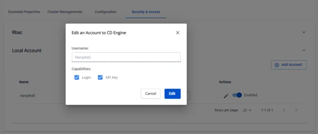
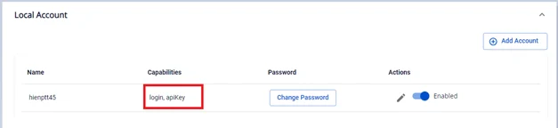

# Edit capabilities

FPT Cloud allows you to configure account capabilities:

- **login** — allows the user to log in via ArgoCD.
- **apiKey** — allows the user to create authentication tokens for API access. This option supports integration with CI/CD pipelines or other automated processes that need to interact with the ArgoCD API.

1. Navigate to **Security & Access** → **Local Account**, then select **Edit Account**.

2. Check or uncheck the desired capabilities.

:::note
At least one capability (apiKey or login) must be selected for the user.
:::

3. Click **Edit** to complete.

Result after editing:

