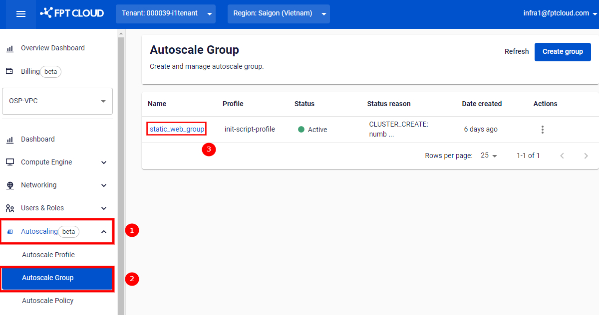
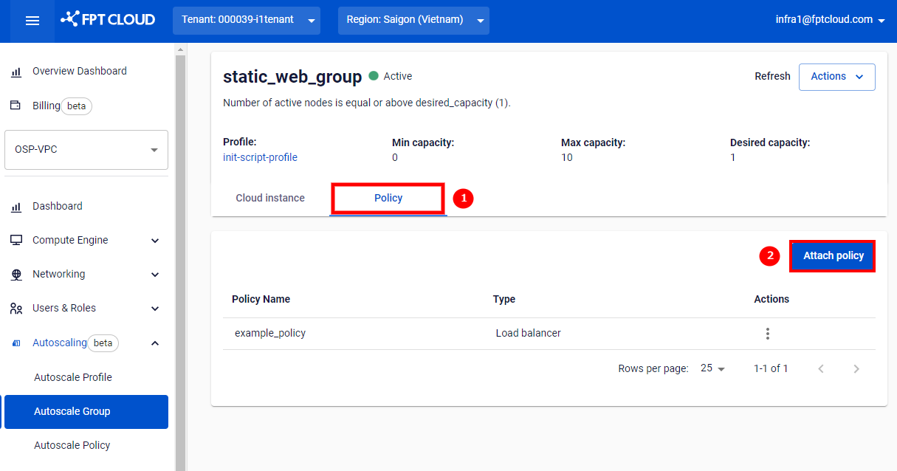
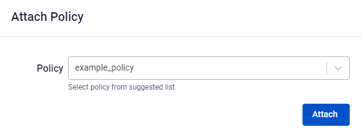

Attach a policy to a group

## **Step 1:** Go to **Autoscaling > Autoscale Group**. Click the name of the group you want to attach a policy to.

## **Step 2:** Switch to the **Policy** tab and select **Attach policy**.

## **Step 3:** A dialog will appear. Select the policy you want to attach and click **Attach**.

