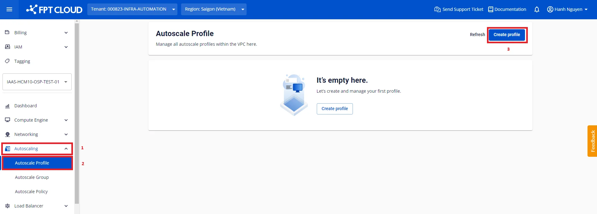
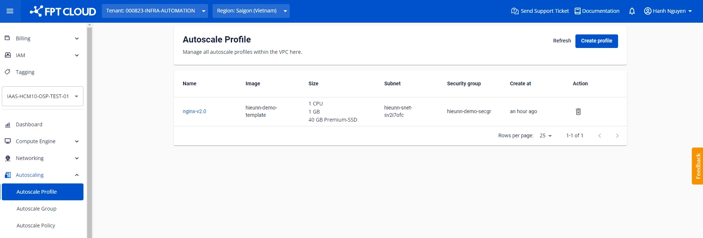

Create a Profile

## **Step 1**: Go to **Autoscaling > Autoscale Profile**. Click **Create profile**.

## **Step 2**: Configure the technical parameters.

**General Information**

Enter a profile name that is easy to manage. The name must not exceed 80 characters and may include Latin letters, numbers, underscores, hyphens, and dots.

**Image**

Currently, the available OS Families include: Ubuntu, Windows, CentOS, and Debian. Each OS group contains multiple distributions.

The **Custom** group is typically the preferred choice — it contains images that have been customized and configured by users to suit their specific needs. Images in this group can be obtained by:

  * Uploading a file from your local machine ([learn more](<https://fptcloud.com/documents/cloud-server/?doc=tai-len-custom-image> "Upload Custom Image"))
  * Creating an Instance Template from an existing server ([learn more](<https://fptcloud.com/documents/cloud-server/?doc=tutorials-quan-ly-instance-template> "Manage Instance Template"))

**Credentials**

Supported authentication methods include:

  * **SSH:** Requires an SSH key created in advance within the VPC ([learn more](<https://fptcloud.com/documents/cloud-server/?doc=profile-ssh-key> "Profile SSH Key")).
  * **Password.**
  * **None:** If access and authentication are not required, select _None_ to skip authentication entirely.

If the selected image belongs to the Custom group, it is assumed that the authentication method has already been configured within the image and no further changes are needed.

**Resource**

CPU & RAM: Select the appropriate specifications based on the provided instance types.

Storage: Choose the disk type and capacity to suit your needs. The default is Premium-SSD with a minimum of 40 GB.

:::warning
The specific minimum capacity is suggested based on the selected image's requirements. Reducing disk size below the image's minimum requirement may cause unexpected errors.
:::

**Network**

Select the appropriate subnet and security group within the VPC. The subnet and security group must be created in advance. If they do not exist yet, create them first:

  * Subnet ([learn more](<https://fptcloud.com/documents/cloud-server/?doc=Qu%E1%BA%A3n%20l%C3%BD%20Subnets> "Manage Subnets"))
  * Security group ([learn more](<https://fptcloud.com/documents/cloud-server/?doc=quan-ly-security-group> "Manage Security Group"))

**Advanced setting**

Enter a [cloud-init](<https://cloudinit.readthedocs.io/en/latest/topics/examples.html> "Cloud config examples") script if needed. When a node starts, cloud-init reads the metadata provided by the cloud and initializes the system accordingly. Cloud-init is commonly used to set up networking, storage, SSH public keys, and other system components.

Example: With the following sample script, nodes in the group will install the required packages, clone a static website from GitHub, and start the nginx server. To verify the result, allocate a Floating IP to the node and access the website via that Floating IP.
[code]
    Copy
    # Update apt database on first boot (run 'apt-get update').
    # Note, if packages are given, or package_upgrade is true, then
    # update will be done independent of this setting.
    package_update: true

    # if packages are specified, this package_update will be set to true
    # packages may be supplied as a single package name or as a list
    # with the format [, ] wherein the specific
    # package version will be installed.
    packages:
    - nginx
    - git

    # runcmd contains a list of either lists or a string
    # each item will be executed in order at rc.local like level with
    # output to the console
    # - runcmd only runs during the first boot
    # - if the item is a list, the items will be properly executed as if
    # passed to execve(3) (with the first arg as the command).
    # - if the item is a string, it will be simply written to the file and
    # will be interpreted by 'sh'
    runcmd:
    - systemctl enable nginx
    - systemctl start nginx
    - git clone https://github.com/cloudacademy/static-website-example.git
    - cp -r ./static-website-example/* /var/www/html/
    - rm -r ./static-website-example
[/code]

:::warning
Avoid including sensitive information in the script such as passwords, tokens, secret keys, or personal data.
:::

## **Step 3**: Click **Create profile** to confirm.

After creation, the profile appears in the list of existing profiles.

You can view the profile details by clicking on the profile name in the list:

## Notes

Modifying the technical parameters of a profile is not currently supported — this ensures configuration consistency when referencing the profile. However, you can rename the profile at any time.
