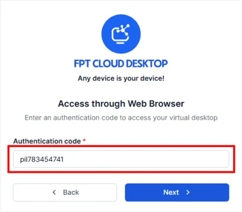
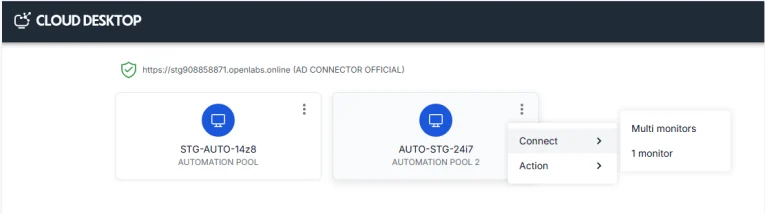
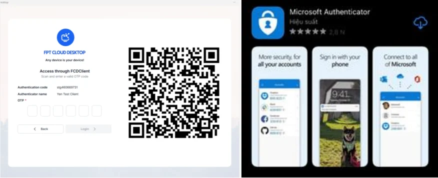
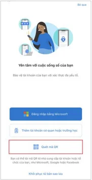
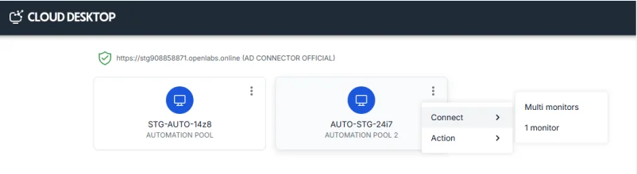

Access via Legacy FCDClient (Legacy Flow)

For users currently using the previously installed legacy FCDClient.

**Note:**

  * Access via the legacy FCDClient on PC or laptop will be discontinued **after March 31, 2026.** Access via other devices will continue to be supported until further notice. Users should proactively install the new FCDClient to avoid workflow interruption.
  * The access procedure via the legacy flow is similar to the [Web Browser Access Guide](<https://fptcloud.com/documents/fpt-cloud-desktop/?doc=SSO-qua-web-browserr> "Web Browser Access Guide"), with the only difference being that at the virtual machine selection step, users choose the FCDClient access method.

**1. Access the Service Homepage with the appropriate URL**

Valid URL formats:

  * The enterprise/organization's dedicated URL for FCD (provided by the customer administrator to users)
  * A URL already containing a valid authentication code (format: code.domain). Example: pil783454741.pilotfcd.online
  * The service's default URL

**This URL information is provided by the customer administrator.**

Access the service link via a web browser and select **Access through FPT Cloud Desktop Client**.

**2. Log in to the appropriate Authenticator (Server)**

If the user **accesses via a URL already containing a valid authentication code** (e.g., URL with valid code: pil783454741.pilotfcd.online):

  * Simply log in with the corresponding SSO account (e.g., log in with a Microsoft account), enter the corresponding OTP for SSO => Authenticator (Server) login successful. 

If the user downloads the Client from the service's default URL:

  * Enter the Authentication Code information (managed by the customer administrator) (Example of valid Authentication Code: pil783454741)

  * Log in with the corresponding SSO account (e.g., log in with a Microsoft account), enter the corresponding OTP for SSO => Authenticator (Server) login successful. 

**3. Access the virtual machine.** On the virtual machine list screen, select the desired virtual machine to access. **Note:** At this step, users select the FCDClient access option.

  * If the user has the legacy FCDClient installed: The system will open the legacy FCDClient to access the virtual machine. Enter the login credentials for the virtual machine if prompted by the system => Virtual machine access successful.
  *     * If the user has the new FCDClient installed: The system will prioritize opening FCDClient. Users need to repeat the access steps similar to [Step 2: Access virtual machine via new FCDClient](<https://fptcloud.com/documents/fpt-cloud-desktop/?doc=SSO-qua-FCDClient-moi#contentify_1> "Step 2: Access virtual machine via new FCDClient").

  * Enter the account credentials corresponding to the Server you want to log in to.

**Note:** If a two-factor authentication QR code is displayed: Download and install the **Microsoft Authenticator** app on your phone from the Apple Store or CH Play/Google Play.

Open the Authenticator app and scan the QR Code.

  * The app will synchronize and display the OTP to log in to FCD.
  * Enter the OTP and click **Submit** => Authenticator (Server) login successful.

**3. Access the virtual machine**

On the virtual machine list screen, select the desired virtual machine to access.

**Note:** At this step, users select the FCDClient access option.

  * If the user has the legacy FCDClient installed: The system will open the legacy FCDClient to access the virtual machine. Enter the login credentials for the virtual machine if prompted by the system => Virtual machine access successful.
  * If the user has the new FCDClient installed: The system will prioritize opening FCDClient. Users need to repeat the access steps similar to [Step 2: Access virtual machine via new FCDClient](<https://fptcloud.com/documents/fpt-cloud-desktop/?doc=SSO-qua-FCDClient-moi#contentify_1> "Step 2: Access virtual machine via new FCDClient").

