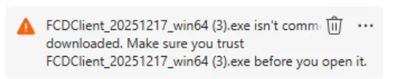
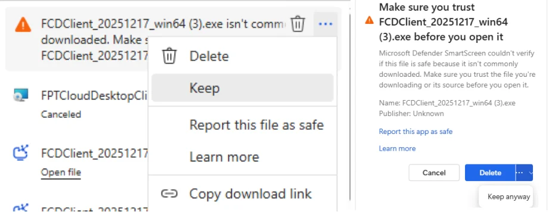
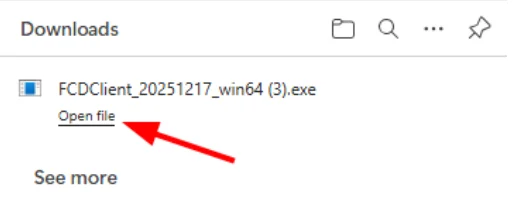
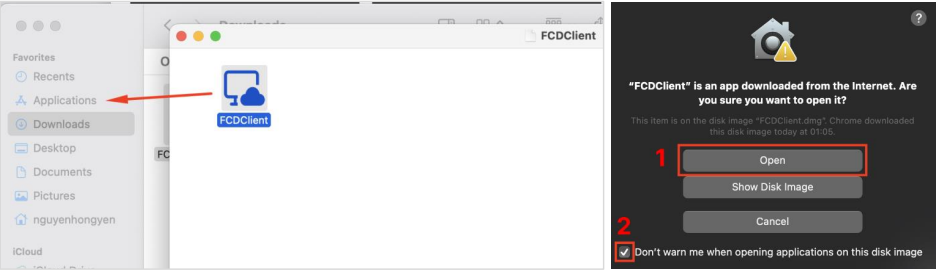
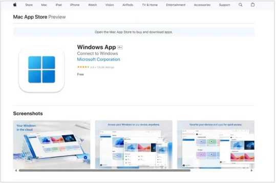
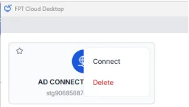
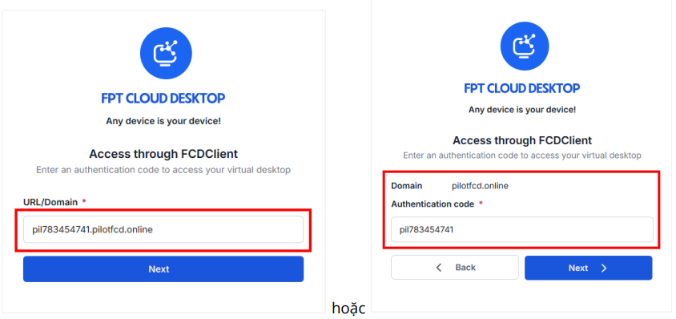
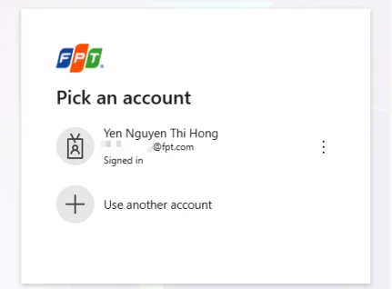
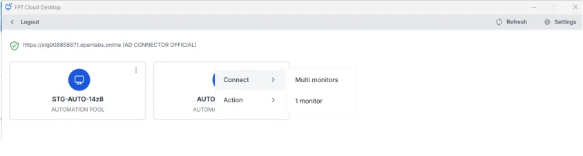

Access via the new FCDClient

For the most stable and fully featured experience, allowing you to interact directly within the application.

# Step 1: Install the new FCDClient

  * This only needs to be done once. On subsequent occasions you can access directly from the FCDClient application.
  * If you have already installed the new FCDClient previously, skip this step and proceed to [Step 2: Access a virtual machine via the new FCDClient](<https://fptcloud.com/documents/fpt-cloud-desktop/?doc=SSO-qua-FCDClient-moi#contentify_1> "Step 2: Access a virtual machine via the new FCDClient")

**1. Access the service homepage with the appropriate URL**

Valid URL formats:

  * The company/organization's dedicated URL for FCD (provided to users by the customer administrator)
  * A URL that already contains a valid authentication code (format: code.domain). Example: pil783454741.pilotfcd.online
  * The default service URL

**This URL is provided by the customer administrator**

Open the service link in a web browser and select **Access through FPT Cloud Desktop Client**.

**2. Download, install, and open the FCD Client application after installation is complete**

The system will automatically download the latest Client version compatible with the Windows operating system (users can also initiate the installation manually). If the browser displays a warning during download as shown below: 

Select the three-dot menu > **Keep** > **Keep anyway**.

Once the download is complete, proceed to install the application: Select **Open file** to install the application on your device.

**On Windows:** In the "Windows protected your PC" popup, click the "More info" hyperlink and then click the "Run anyway" button.

**On macOS:**

  * Drag the installation file into **"Applications"**.
  * Open the installation file and click the **"Open"** button to confirm opening and installation.
  * Check the box **"Don't warn me when opening applications on this disk image"**.

**=> FCD Client installed successfully. After installation, open the FCDClient application.**

**Note for macOS devices:**

  * Users need to check and additionally install the Microsoft Windows App from the [Mac Apple Store](<https://apps.apple.com/us/app/windows-app/id1295203466?mt=12> "Mac Apple Store").

  * If the device shows a warning about the FCDClient application, go to Settings > Privacy & Security > Open Anyway for FCDClient.

# Step 2: Access a virtual machine via the new FCDClient

**3. Open and use the FCDClient application on your computer**

Log in to the appropriate Authenticator (Server).

1. Open the FCDClient application you installed in [Step 1: Install the new FCDClient](<https://fptcloud.com/documents/fpt-cloud-desktop/?doc=SSO-qua-FCDClient-moi#contentify_0> "Step 1: Install the new FCDClient").

  * **If the Client already has Server information** (because it was entered previously, or the Client was downloaded from a URL containing a valid authentication code): Select **Connect Server** and enter the corresponding account credentials in section 2 below. 

  * **If the Client displays an interface with no Server information**: You need to enter the Server information manually. Select **New Server** > Enter a valid URL or Domain (managed by the customer administrator). Example of valid input: Enter the full valid URL pil783454741.pilotfcd.online **or** enter the Domain pilotfcd.online first, then enter the Authentication code pil78345474.

2. Log in using your SSO account (for example, log in with a Microsoft account), enter the corresponding OTP for the SSO => Authenticator (Server) login successful.

**4: Access the virtual machine**

On the virtual machine list screen, select the virtual machine you want to access.

Enter the virtual machine login credentials if prompted by the system => Virtual machine access successful.

Other features in the new FCDClient:

**- Auto-connect Server:** Allows you to access the Authenticator directly when in the FCDClient application (only applies when opening the application directly; not supported when accessing via "Access through FCDClient" on the Homepage).

**- Settings:** Allows you to view information about the installed FCDClient.

**- New server:** Users can manually add a new (Authenticator) Server.
