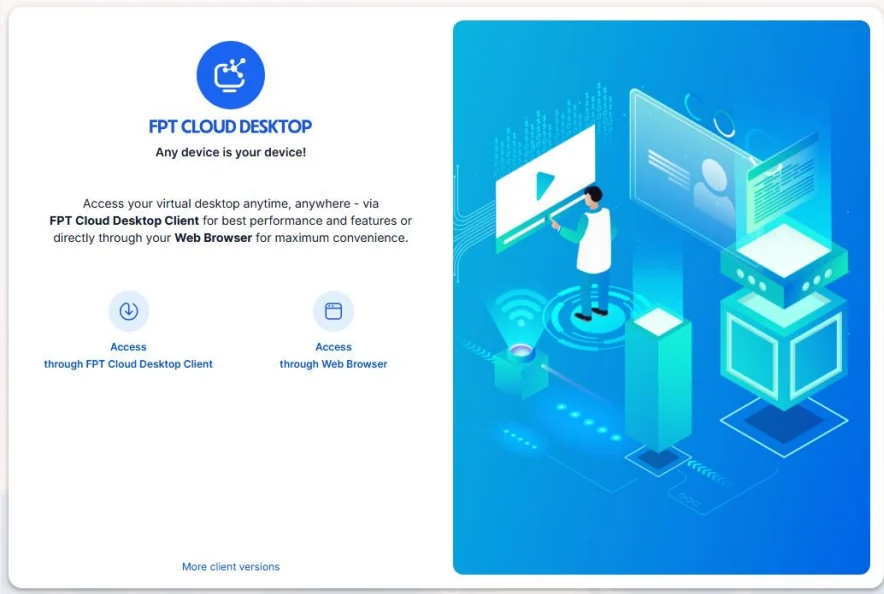
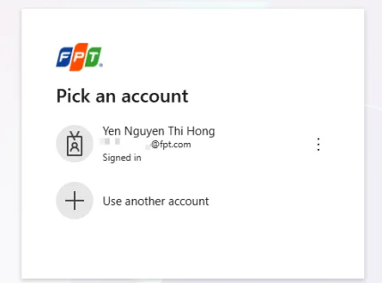

Access via web browser

For users who want quick access to a virtual machine without installing FCDClient.

**1. Access the service homepage with the appropriate URL**

Valid URL formats:

  * The company/organization's dedicated URL for FCD (provided to users by the customer administrator)
  * A URL that already contains a valid authentication code (format: code.domain). Example: pil783454741.pilotfcd.online
  * The default service URL

**This URL is provided by the customer administrator**

Open the service link in a web browser and select **Access through FPT Cloud Desktop Client**.

**2. Log in to the appropriate Authenticator (Server)**

1. If the user **accesses via a URL that already contains a valid authentication code** (example of a URL with a valid code: pil783454741.pilotfcd.online):

  * Simply log in with the corresponding SSO account (for example, log in with a Microsoft account), enter the corresponding OTP for the SSO => Authenticator (Server) login successful. 

2. If the user **accesses from the default service URL:**

  * Enter the Authentication Code (managed by the customer administrator). (Example of a valid Authentication Code: pil783454741) 

  * Log in with your SSO account (for example, log in with a Microsoft account), enter the corresponding OTP for the SSO => Authenticator (Server) login successful.

**3: Access the virtual machine**

On the virtual machine list screen, select the virtual machine you want to access.

Enter the virtual machine login credentials if prompted by the system => Virtual machine access successful.
