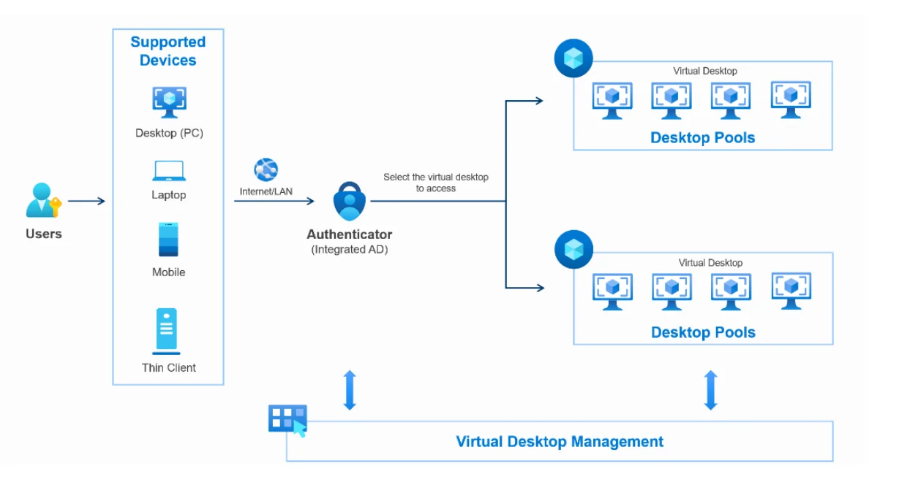

Detailed introduction

## Advantages over traditional PCs

  * Data security: Encrypted storage, centralized management, and restricted access
  * Continuous security patch updates: Applied centrally and consistently; saves resources and time
  * Data integrity in the event of an incident: Automatic backup combined with disaster recovery solutions
  * Fast and flexible resource scaling: Provision thousands of virtual machines within just a few hours

## Concept

**Supported connection devices**

  * Desktop / PC / Laptop
  * Mobile (Smartphone) or Tablet
  * ThinClient or FPT MiniPC

**Access methods**

  * Native FCDClient (Recommended): Allows direct access to virtual machines via the application, providing the smoothest and most stable experience.
  * Web Browser: A quick and lightweight access method via a browser, with no installation required.

## Terms & definitions

Terms (English) | Terms (Vietnamese) | Abbreviations | Definitions
---|---|---|---
**Virtual Desktop** | Máy ảo / Máy tính ảo | VD | - A virtual machine that provides software functionality and performance similar to a standard physical computer
- Virtual machines share the FPT Cloud infrastructure
- Each user can be provisioned with and use multiple virtual machines simultaneously with different configurations and operating systems
**Desktop Pool** | Nhóm máy ảo | Pool | - A group of multiple virtual machines sharing common Cloud processing and storage infrastructure
- Typically used to group virtual machines by department, function, usage time slot, etc.
**Operating System** | Hệ điều hành | OS | Example: Microsoft Windows, macOS
**End-User / User** | Người dùng cuối | N/A | End users of FCD virtual machines. Users can:
- Log in to the FCD User Portal
- Access their provisioned virtual machines
- Use the virtual machine like a standard physical computer
**Supported Device** | Thiết bị hỗ trợ | N/A | A device that can access and use the provisioned virtual machines
**Local Device** | Thiết bị kết nối | N/A | The device used to establish a connection to the virtual machine
**Local Area Network** | Mạng nội bộ | LAN | A network system used to connect computers within an organization's premises
**Authenticator App** | Phần mềm xác thực | N/A | An application that generates a 6-digit random verification code used for account login, valid for 30 seconds
**Active Directory** | Quản lý thư mục và xác thực | AD | A centralized user management system
