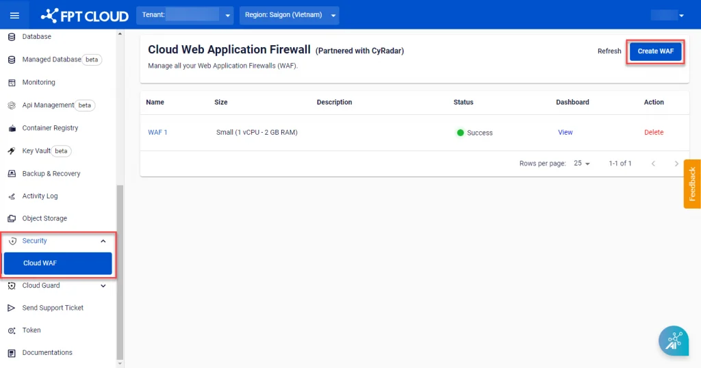
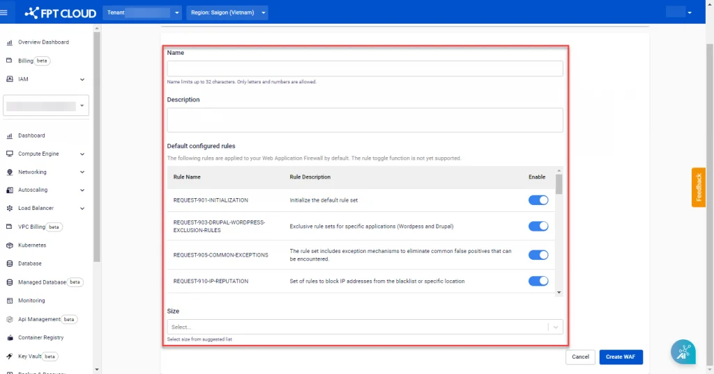

Create a new WAF server

**Step 1:** In the menu, select **Security > Cloud WAF**, then select **Create WAF.**

**Step 2:** Enter the **WAF** information and select the appropriate size.

**Field** | **Description** | **Value**
---|---|---
**Name** | Enter the WAF server name | Accepts letters, numbers, and spaces only
**Description** | Enter a detailed description of the WAF |
**Default configured rules** | List of default rule sets available on the WAF server upon creation |
**Size** | Select the WAF server size based on your requirements | 3 WAF sizes with different configurations: Small, Medium, Large

You can refer to the specific configuration for each size in the table below:

|  |  |
---|---|---|---
**Size** | **Basic configuration** | **Network bandwidth** | **Requests/second supported**
**Small** | 2vCPU – 4GB RAM – 150GB storage | 100 Mbps | 50
**Medium** | 4vCPU – 8GB RAM – 300GB storage | 200 Mbps | 150
**Large** | 8vCPU – 16GB RAM – 500GB storage | 500 Mbps | 500

**Step 3:** Select **Create WAF** to create the WAF server with the selected information and configuration. The processing progress will be updated in the Status field on the **Cloud Web Application Firewall Management** screen.
