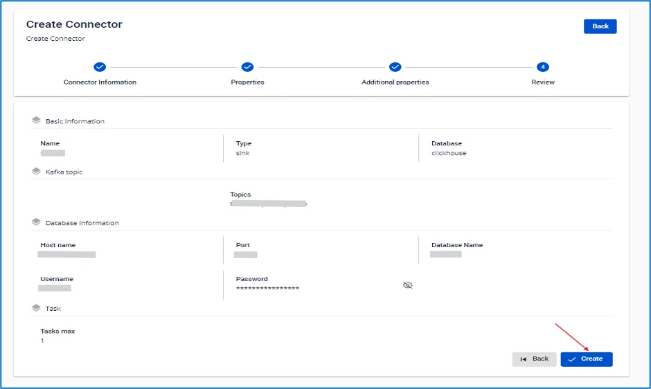

# ClickHouse (Logs) Sink Connector

**Create a connector with Type: sink, Database: ClickHouse**

**Pre-condition:** CDC service status is healthy

## Steps to create a connector:

**Step 1:** From the menu bar, select **Data Platform** > select **Workspace Management** > select the Workspace name

**Step 2:** Under **My services**, select **CDC service**

  * Note: You can also navigate directly to the CDC service by: selecting Data Platform from the menu bar > selecting CDC service > clicking a CDC service name

**Step 3:** On the **CDC service** detail screen > Select the **Connectors** tab > click **Create a connector** 

**Step 4:** In the connector creation form, fill in the **Connector Information** screen:

  * **Name** (required): connector name

Note: The connector name may contain lowercase letters a-z or digits 0-9. Spaces are not allowed; use "-" as a separator instead.

  * **Type** (required): select sink

  * **Database** (required): select ClickHouse(log) 

**Step 5:** Click **Next** to proceed to the **Properties** screen

Enter the following information:

  * When **Manual configuration** is selected — fill in:

    * **Host Name** (required): Hostname or IP of ClickHouse

    * **Port** (required): ClickHouse server port, default: `8123`.

    * **Database name** (required): Target database the Connector will sink data into

    * **Username** (required): Username used by the Connector

    * **Password** (required): Password used by the Connector

    * **Topics** (required): List of topics the Connector will consume and sink data into ClickHouse, separated by "," 

  * When *_From FPT Database Engine_ is selected — fill in:

    * **Database** (required): Select Database

    * **Host Name** (required): Hostname or IP of ClickHouse

    * **Port** (required): ClickHouse server port, default: `8123`.

    * **Database name** (required): Target database the Connector will sink data into

    * **Username** (required): Username used by the Connector

    * **Password** (required): Password used by the Connector

    * **Topics** (required): List of topics the Connector will consume and sink data into ClickHouse, separated by ","

Click **Test Connection** to verify the connection from Workspace to the entered Database

  * **Converter**

    * **Converter key**: select the key value for the converter

    * **Converter key schema enable**: select whether to use schema in the Converter key

    * **Converter value**: select the value for the converter

    * **Converter value schema enable**: select whether to use schema in the Converter value

**Step 6:** Click **Next** in the top-right corner to proceed to the **Additional Properties** screen

Fill in the following information:

  * **Tasks max** (required): Maximum number of tasks for the connection

  * **Topic 1:** name of the topic the Connector will consume and sink data into ClickHouse

  * **Table 1:** name of the table listening for data changes from PostgreSQL

  * **Mode** (required): Connector behavior when a message cannot be processed

    * **None**: The Connector will skip messages that cannot be sinked into the database

    * **All**: Error messages will be sent to the specified topic 

**Step 7**: Click **Next** to proceed to the **Review** screen 

**Step 8:** Review the information and click **Create** to complete the connector creation. 
