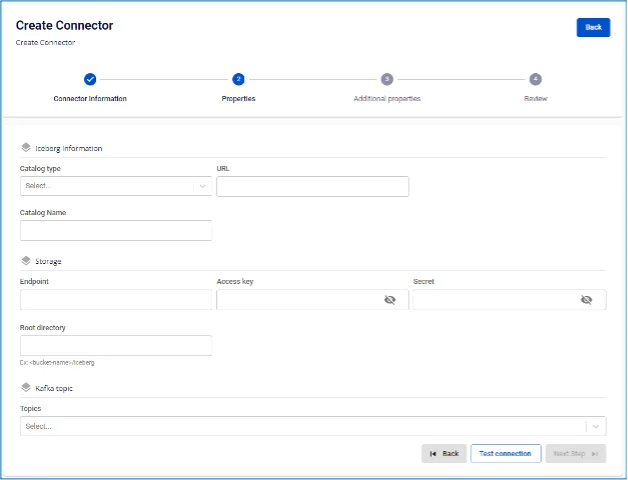

# Iceberg (logs) Sink Connector

**Create a connector with Type: sink, Database: Iceberg (logs)**

**Pre-condition:** CDC service status is healthy

## Steps to create a connector:

**Step 1:** From the menu bar, select **Data Platform** > select **Workspace Management** > select **Workspace name**

**Step 2:** Under **My services**, select **CDC service**

**Step 3:** On the **CDC service** detail screen > Select the **Connectors** tab > click **Create a connector** 

**Step 4:** Fill in the **Connector Information** screen:

  * **Name** (required): connector name

Note: The connector name may contain lowercase letters a-z or digits 0-9. Spaces are not allowed; use "-" as a separator instead.

  * **Type** (required): select **sink**

  * **Database** (required): select **Iceberg (logs)** 

**Step 5**: Click **Next** to proceed to the **Properties** screen

Enter the following information:

  * **Catalog type** (required): select the catalog type

  * **URL** (required): enter the URL path

  * **Catalog Name** (required): catalog name

  * **Endpoint** (required): endpoint address to S3

  * **Access key** (required): access key

  * **Secret** (required): password for connecting to the endpoint

  * **Root directory** (required): root directory in S3

  * **Topics** (required): select the topics whose data is sent from the source connector 

Click **Test connection** to verify the connection from Workspace to the entered Database

  * **Converter**

    * **Converter key**: select the key value for the converter

    * **Converter key schema enable**: select whether to use schema in the Converter key

    * **Converter value**: select the value for the converter

    * **Converter value schema enable**: select whether to use schema in the Converter value

**Step 6:** Click **Next** to proceed to the **Additional Properties** screen

Enter the following information:

  * **Number of tasks**: maximum number of tasks that can run in parallel

  * **Max poll record**: maximum poll record count

  * **Type**: select the DB source type

  * **Namespace**: select namespace

  * **File format**: select the file format

  * **Topic 1**: list of topics the Connector will consume and sink data into the target database, separated by ","

  * **Table 1**: table name in the Database

  * **Mode**: Connector behavior when a message cannot be processed

    * **None**: the connector will stop processing if an error is encountered 

**Step 7:** Click **Next** to proceed to the **Review** screen 

**Step 8:** Review the information and click **Create** to complete the connector creation
