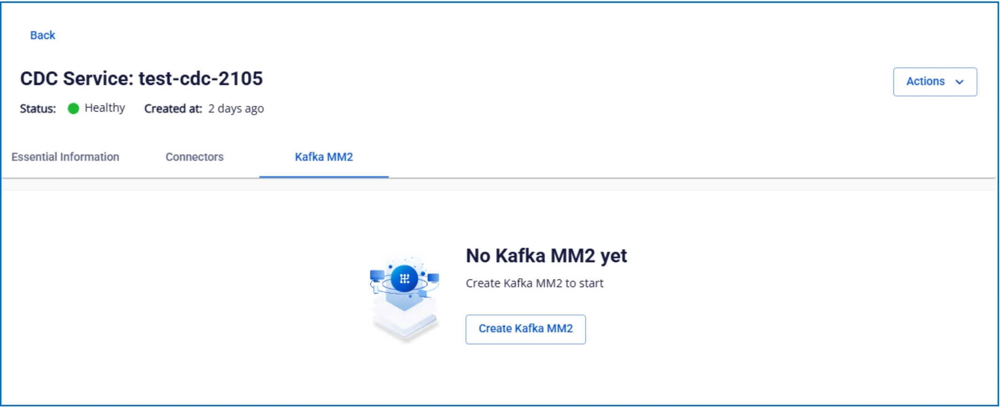
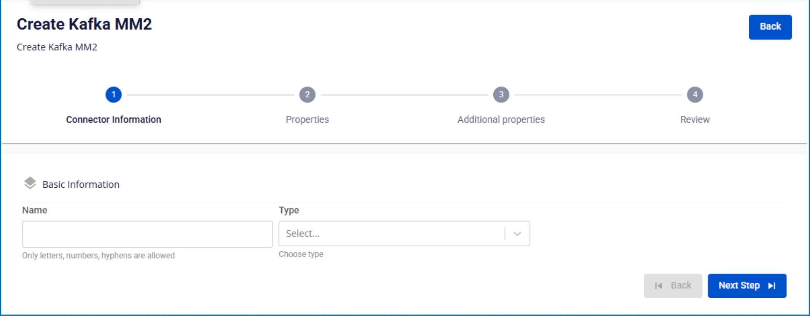
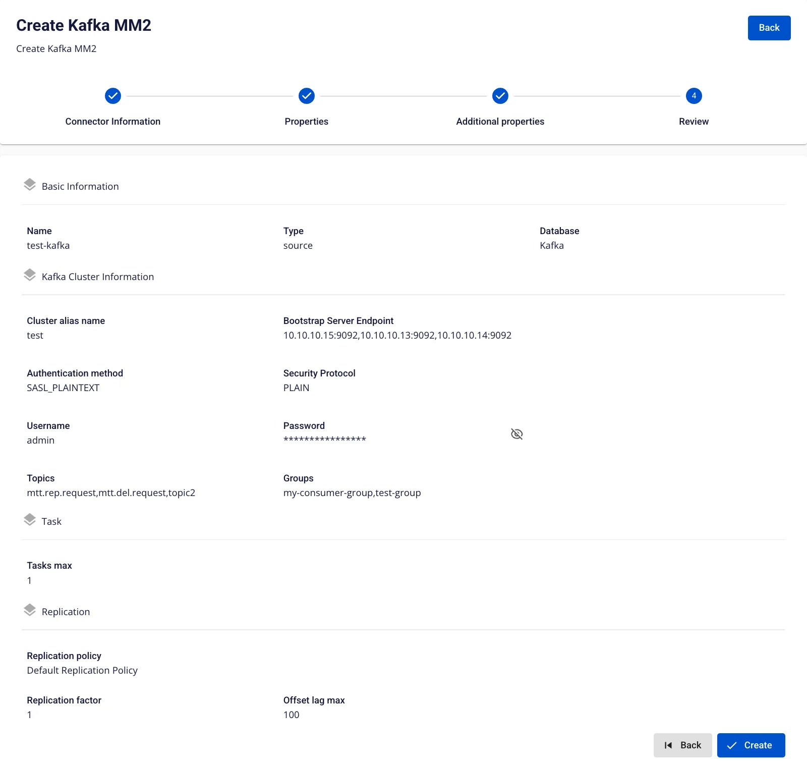

# Kafka MM2

**Kafka MM2 (MirrorMaker 2)** is a tool used to **synchronize data between different Kafka clusters** (multi-cluster replication)

### 1\. Create Kafka MM2 source

Creating a Kafka MM2 with Type: source

Pre-condition: CDC service status is healthy

**Step 1:** From the menu bar, select **Data Platform** > select **Workspace Management** > select **Workspace name**

**Step 2:** Under **My services**, select **CDC service**

**Step 3:** On the **CDC service** detail screen > Select the **Kafka MM2** tab > click **Create a Kafka MM2**

**Step 4:** Fill in the **Connector Information** screen:

  * **Name** (required): connector name

Note: The connector name may contain lowercase letters a-z or digits 0-9. Spaces are not allowed; use "-" as a separator instead.

  * **Type** (required): select **source**

**Step 5**: Click **Next** to proceed to the **Properties** screen

Enter the following information:

  * **Kafka cluster information**

    * **Cluster alias name** (required): enter the cluster identifier name

    * **Bootstrap server endpoint** (required): enter the Kafka connection address

    * **Security protocol** (required): select the security protocol

    * **SASL Mechanism** (optional): depends on the selected security protocol

    * **Username** (required): username

    * **Password** (required): password

Click **Test connection** to verify the connection from Workspace to the entered **Cluster**

  * **Topics**

    * **Topic** (required): select the data topics from the above Kafka source
  * **Group**

    * **Group** (required): select the consumer groups to replicate

**Step 6:** Click **Next** to proceed to the **Additional Properties** screen

Enter the following information:

  * **Number of tasks**: maximum number of tasks that can run in parallel

  * **Replication policy**: choose to prepend a prefix to the topic name or keep the original topic name after replication

  * **Replication factor**: number of replicas for each topic after replication

  * **Offset lag max**: maximum offset lag between source and target

**Step 7:** Click **Next** to proceed to the **Review** screen

**Step 8:** Review the information and click **Create** to complete the Kafka MM2 source creation

### 2\. Edit Kafka MM2 source

To edit a **Kafka MM2 source**, follow these steps:

**Step 1:** From the menu bar, select **Data Platform** > select **Workspace Management** > select **Workspace name**

**Step 2:** Under **My services**, select **CDC service**

**Step 3:** On the **CDC service** detail screen > Select the **Kafka MM2 source** tab > select the **Kafka MM2 name**

**Step 4**: **Edit Kafka MM2 source information**

  * **Kafka Cluster Information**

    * On the Kafka MM2 detail screen, click the edit icon in the Kafka Cluster Information section.

    * The Update Database Info popup appears, allowing you to modify:

    * **Security protocol** (required): select the security protocol

    * **SASL Mechanism** (optional): depends on the selected security protocol

    * **Username** (required): username

    * **Password** (required): password

    * Click Test connection to verify the connection.

    * If OK → click Save to save.

    * To exit → click Cancel.

  * **Task**

    * On the Kafka MM2 detail screen, click the edit icon in the Task section.

    * The Update Number of Tasks popup appears, allowing you to modify:

    * **Number of tasks**: maximum number of tasks that can run in parallel

    * If OK → click Save to save.

    * To exit → click Cancel.

  * **Replication**

    * On the Kafka MM2 detail screen, click the edit icon in the Replication section.

    * The Update Replication popup appears, allowing you to modify:

    * **Replication policy**: choose to prepend a prefix to the topic name or keep the original topic name after replication

    * **Replication factor**: number of replicas for each topic after replication

    * **Offset lag max**: maximum offset lag between source and target

    * If OK → click Save to save.

    * To exit → click Cancel.

### 3\. Delete Kafka MM2 source

To delete a **Kafka MM2 source**, follow these steps:

**Step 1:** From the menu bar, select **Data Platform** > select **Workspace Management** > select **Workspace name**

**Step 2:** Under **My services**, select **CDC service**

**Step 3:** On the **CDC service** detail screen > Select the **Kafka MM2 source** tab > select the **Kafka MM2 name** > select **Action** > select **Delete**

**Step 4:** The **Delete Kafka MM2** dialog appears > enter Delete > click **Confirm** to delete the **Kafka MM2 source**, or click **Cancel** to cancel the operation. 
