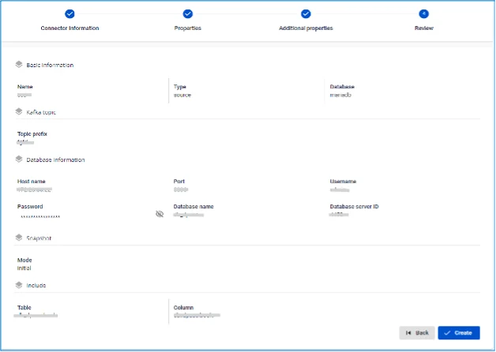

# MariaDB Source Connector

**Create a connector with Type: source, Database: MariaDB**

**Pre-condition:** CDC service status: _healthy_

The MariaDB Source connector uses the binary log of MariaDB to perform CDC. However, MariaDB is configured to purge binlogs after a period of time. Therefore, when the MariaDB connector is initialized, it will perform an initial consistent snapshot before starting to read from the binlogs to ensure data consistency. Supported MariaDB topologies

  * **1.** **Standalone:** binlogs must be enabled beforehand.

  * **2.** **Primary and replica:** Supports reading binlogs from one of the servers (if binlog is enabled), but the connector can only detect changes on that server.

  * **3.** **High available**

## MariaDB Configuration

**1.** Create a **MariaDB user**:

```
CREATE USER '<USERNAME>'@'%' IDENTIFIED BY '<PASSWORD>';
```

**2.** The MariaDB source connector requires the following permissions

```
SHOW DATABASES: GLOBAL PRIVILEGES
```

```
SELECT: DATABASES PRIVILEGES
```

```
RELOAD: GLOBAL PRIVILEGES
```

```
REPLICATION SLAVE: GLOBAL PRIVILEGES
```

```
REPLICATION CLIENT: GLOBAL PRIVILEGES
```

  * Grant permissions on all databases:

```
GRANT SELECT, RELOAD, SHOW DATABASES, REPLICATION SLAVE, REPLICATION CLIENT ON *.* TO '<USERNAME>'@'%';
          FLUSH PRIVILEGES;
```

  * Or on a specific database:

```
GRANT SHOW DATABSASES, RELOAD, REPLICATION SLAVE, REPLICATION CLIENT ON *.* TO '<USERNAME>'@'%';
          GRANT SELECT ON <DATABASE-NAME>.* TO '<USERNAME>'@'%';
          FLUSH PRIVILEGES;
```

**3.** Enable binlog: Note: For FPTCloud services, these tasks do not need to be performed.

  * Check if binlog is already enabled:

```
SELECT variable_value as "BINARY LOGGING STATUS (log-bin) ::"
          FROM performance_schema.global_variables WHERE
          variable_name='log_bin';
```

  * Or

```
SHOW GLOBAL VARIABLES LIKE "log_bin";
```

  * If log_bin is OFF, please change the value in the configuration file:

```
server-id = <CHANGE_ME> #result of query SHOW VARIABLES LIKE "server_id";
          log_bin = MariaDB-bin
          binlog_format               = ROW
          binlog_row_image            = FULL
          binlog_expire_logs_seconds  = 864000
```

  * Or:

```
SET @@global.binlog_format="ROW";
          SET @@global.binlog_row_image="FULL";
          SET @@global.binlog_expire_logs_seconds=864000;
```

**4.** Enable GTIDs:

Note: For FPTCloud services, these tasks do not need to be performed.

  * Check if gtid_mode is already enabled

```
SHOW GLOBAL VARIABLES LIKE "gtid_mode";
```

  * Check if enforce_gtid_consistency is already enabled

```
SHOW GLOBAL VARIABLES LIKE "enforce_gtid_consistency";
```

  * If both gtid_mode and enforce_gtid_consistency are OFF, please change the value in the configuration file:

```
gtid_mode                   = ON
        enforce_gtid_consistency    = ON
```

    * Or

```
SET @@global.gtid_mode="ON";
          SET @@global.enforce_gtid_consistency="ON";
```

**5.** Configure `binlog_row_value_options` to allow the connector to listen to UPDATE events:

Note: For FPTCloud services, these tasks do not need to be performed.

  * Check the value of binlog_row_value_options

```
SHOW GLOBAL VARIABLES LIKE "binlog_row_value_options";
```

  * Change the value of binlog_row_value_options to ""

```
SET @@global.binlog_row_value_options="" ;
```

## Steps to create a connector:

To create a connector, follow these steps:

**Step 1:** From the menu bar, select **Data Platform** > select **Workspace Management** > select **Workspace name**

**Step 2:** Under **My services**, select **CDC service**

**Step 3:** On the **CDC service** detail screen > Select the **Connectors** tab > click **Create** a connector 

**Step 4:** Fill in the **Connector Information** screen:

  * **Name (required):** connector name

Note: The connector name may contain lowercase letters a-z or digits 0-9. Spaces are not allowed; use "-" as a separator instead.

  * **Type (required):** select source

  * **Database (required):** select **SQLserver** 

**Step 5:** Click Next to proceed to the **Properties** screen

Fill in the **Properties** screen information

  * When **Manual configuration** is selected — fill in:

    * **Host name (required):** Hostname or IP of MariaDB

    * **Port (required):** MariaDB server port, default: `3306`.

    * **Database name (required):** Target database the Connector will sink data into

    * **Username (required):** Username used by the Connector

    * **Password (required):** Password used by the Connector

    * **Topics (required):** List of topics the Connector will consume and sink data into the target database, separated by "," 

  * When **From Database Engine** is selected — fill in:

    * **Database name (required):** Database name

    * **Host name (required):** Hostname or IP of MariaDB

    * **Port (required):** MariaDB server port, default: `3306`.

    * **Database name (required):** Target database the Connector will sink data into

    * **Username (required):** Username used by the Connector

    * **Password (required):** Password used by the Connector

    * **Database server ID (required):** Database server ID

Note: The Database server ID must be a number greater than 1000 and less than 9999.

    * **Topics (required):** List of topics the Connector will consume and sink data into the target database, separated by "," 

    * **Enable incremental snapshot** (optional): Checkbox to enable the incremental snapshot feature for the Connector

      * Only displayed for source connectors: **MySQL, MariaDB, PostgreSQL**
      * When this checkbox is checked and "Test connection" is clicked, the system will verify:
      * Whether the database has sufficient permissions to perform a snapshot (INSERT, CREATE TABLE permissions required for PostgreSQL/MySQL)
      * If the database lacks permissions, a detailed error message will be displayed
      * If the database has sufficient permissions, "Test connection successfully" will be displayed
      * After successfully creating the Connector with this checkbox checked:
      * The Connector will have incremental snapshot management functionality
      * The "Snapshot Status" column will be displayed in the Connector List screen
      * The following operations can be performed: Execute, Pause, Resume, Stop snapshot via the Actions menu

Click Test connection to verify the connection from Workspace to the entered Database

**Step 6:** Click Next to proceed to the Additional Properties screen

Enter the following information:

  * **Mode (required):** Connector behavior

Select one of the following modes:

    * **Initial (default):** The Connector will snapshot all existing data in the tables, then continue to capture data changes on those tables

    * **Initial_only:** The Connector will only snapshot all existing data in the tables, then stop listening to data change events on the tables

    * **Never:** The Connector will not snapshot existing data in the tables but will only listen to data change events on the tables

    * **Table (optional):** name of a table in the database connected in the previous screen

    * **Column (optional):** name of a data column to retrieve from the table 

**Step 7:** Click **Next** to proceed to the **Review** screen 

**Step 8:** Review the information and click **Create** to complete the connector creation
